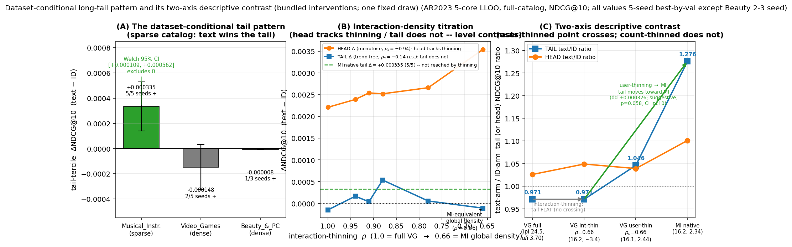

# Pre-Declared, Artifact-Gated Evaluation for Sequential Recommendation: Causal FIR Filtering and Dataset-Conditional Text Benefits on Amazon Reviews 2023


*Reader edition — rendered from the canonical markdown source. The ACM (TORS) review artifact is `paper_tex/PAPER_TORS.pdf` (see `VENUE_PLAN.md`); venue metadata (CCS concepts, keywords) lives in that artifact.*

**Authors**: [TBD]

> **Historical status log.** The dated entries below are point-in-time records, newest
> first; statements in older entries (e.g. the pre-V3 "Office stays VOID / outcome is
> pending" wording in v3.8) are **superseded, not current claims** — §5.2,
> `OFFICE_V3_RESULTS.md`, and `CANONICAL_SUBMISSION.md` govern. Current status: Office V3
> **passed** and is counted under its frozen wording; the V1 VOID stands permanently.

**Status update — Draft v3.9 (2026-07-18):** post-campaign refresh: the **Office V3 pre-declaration has since PASSED and is counted** strictly under its frozen per-category point-estimate wording (§5.2; `OFFICE_V3_RESULTS.md`) — the V1 VOID stands unchanged; the FIR-breadth pre-declaration **CONFIRMED both** new categories (`FIR_BREADTH_RESULTS.md`); A.0/table wording rescoped to V1-only; SILLM4Rec + UniSGR/DIGER/ACERec cited. The v3.8 line below is a historical status entry superseded on these points.

**Status update — Draft v3.8 (2026-07-13, historical — superseded by v3.9 on the Office V3 and breadth outcomes):** methodology reframe (approach C of `IMPACT_REVISION_PLAN.md`; emphasis reordering only, no claim changes): retitled to lead with the evaluation methodology; the abstract, §1 contributions, and §7 now present the trustworthy-evaluation apparatus (immutable pre-declaration, fail-closed artifact gate, comparator-regeneration harness, symmetric self-VOIDing adjudication) as contribution 1, with the FIR/MI/tail findings as its demonstrations; new §2 paragraph on evaluation practice and reproducibility in recommender systems (Ferrari Dacrema et al., 2019; Ferrari Dacrema et al., 2021; Sun et al., 2020 — all metadata verified against arXiv/dblp). Every pre-existing caveat sentence survives verbatim or with strictly added hedging; no claim broadened; Office stays VOID (the V3 prereg is cited only as a committed pre-declaration whose outcome is pending, `PREREG_OFFICE_V3.md`).

**Status update — Draft v3.7 (2026-07-10):** novelty/originality-audit revision (`STRICT_NOVELTY_ORIGINALITY_AUDIT_2026-07-10.md`, findings N1–N12; numbers unchanged, wording only): retitled; "causal spectral filter" renamed **strictly causal FIR temporal filter** throughout ("spectral" retained only as frequency-response *analysis*, never as the component's name); "long-tail law" → **long-tail pattern**; titration language rescoped from confirmed/refuted *cause* to controlled-thinning-intervention support; "faithful HSTU reimplementation" → **HSTU-style implementation based on the published architecture** (equation-level verification stated, no numerical-parity claim); TAPE demoted to an ablation-level component; explicit what-is-new/what-is-not framing added (abstract, §3.7); novelty-boundary table added (§2.3); Table 2 unequal-power note added (§5.5); Limitations subsection added (§6.5). Clean submission copy: `PAPER_SUBMISSION.md`.

**Status update — Draft v3.6 (2026-07-08):** the Musical_Instruments result is now backed by an
**immutable pre-declared dual-kernel confirmation** (git-committed prereg → 10 never-inspected
fresh seeds 20260618–22 → k16 fresh 5-seed CI lower bound 0.04096 AND k8 CI lower bound 0.04083,
both > the published HSTU-BLaIR point estimate 0.0406; 10/10 fresh seeds above; every run
provenance-manifested; per-user sidecars tracked). Evidence chain: `SOTA_CONFIRM_PREREG_V2.md`,
`SOTA_CONFIRM_V2_RESULTS.md`, `SOTA_CONFIRM_PREREG_V2_ERRATA.md`, `PROTOCOL_PARITY_APPENDIX.md`.
§5.2 and the abstract carry the confirmed claim with its frozen caveats (single-seed published
comparator; per-category point-estimate comparison, not a general SOTA); §2 positions the 2026
semantic-ID line (ReSID, ChronoSID). Earlier exploratory MI numbers (seeds 20260608–17) are
retained but labeled exploratory.

**Status**: Draft v3.5 (2026-06-22) — paper-finishing checklist fully discharged (Table 2 negative-result map built, supervisor cycle-13 FIX #1); body anchored to the v3.4 spine (strictly causal FIR temporal filter + dataset-conditional long-tail pattern + competitive-overall Video_Games **NDCG@10 = 0.0673 ± 0.0003**, 6-seed). **Not a Video_Games SOTA claim** — the published HSTU-BLaIR 0.0760 relies on custom CUDA/Triton HSTU kernels that are hardware-incompatible with this sm_120 GPU (proven via WSL). Full v3.x revision changelog is in *Drafting notes (delete before submission)* below.

---

## Abstract

Recommender-systems research has a documented evaluation-trust problem: weak or mistuned baselines, non-comparable protocols, and unreproducible results repeatedly yield progress claims that do not survive scrutiny (Ferrari Dacrema et al., 2019). The lead contribution of this paper is methodological — an executable, per-paper evaluation discipline under which every empirical finding below is produced and policed: **(i) version-controlled pre-declared protocols (git-committed before the runs; commit-ordered but carrying no independent external timestamp — a stated limitation, §6.5)** (the comparator-facing confirmation was git-committed — exact configuration, commands, data hashes, decision rule, claim wording — before any confirmatory run, and executed on never-inspected fresh seeds); **(ii) a fail-closed artifact gate** (a manifest enumerates every cell of the artifact-gated result tables (168 cells across 14 claim families; two expository tables — the dataset-statistics table in §4.1 and the supporting Appendix A.1 scan — are converted from the canonical markdown outside this graph and are labeled as such in their provenance); a build step recomputes each cell from its source artifacts and fails if any printed value is not reproduced at its printed precision; values whose artifacts cannot be recomputed are retired rather than grandfathered, and published comparator numbers are carried as explicitly-labeled external constants); **(iii) a comparator-regeneration harness** (the strongest comparator's unmodified reference implementation executes locally via pure-PyTorch data-movement shims, so the published point estimate we gate against is regenerated by its own generating code rather than only transcribed — environment-caveated single-run regenerations, §5.6); and **(iv) symmetric, self-VOIDing adjudication** (pre-declared failures are published with the same prominence as passes: a second-category pre-declaration VOIDed itself when its own floor check detected a comparability failure, and the VOID stands even though the anomaly was later mechanistically explained, Appendix A.0; a redesigned successor pre-declaration with an environment-matched reference subsequently **passed** on fresh seeds, §5.2). The empirical findings that follow are reported as demonstrations of this discipline.

We study text-augmented sequential recommendation on the Amazon Reviews 2023 (AR2023) benchmark (Hou et al., 2024) under a fixed protocol — 5-core, full-catalog leave-last-out (LLOO), NDCG@10 — built on an **HSTU-style pure-PyTorch implementation of the HSTU encoder, based on the published architecture** (Zhai et al., 2024). Our central architectural contribution — the discipline's lead demonstration — is a **strictly causal FIR temporal filter**: a zero-init gated depthwise convolution on the sequence embeddings that supplies an explicit local recency bias (as an FIR filter it has a learnable frequency response, so it can sharpen the short-horizon structure that BSARec's low-pass analysis of vanilla self-attention motivates us to restore). We are explicit about the novelty boundary. *Not new*: filtering sequential representations, the frequency-domain motivation, and the attention-oversmoothing framing, all established by FMLP-Rec (Zhou et al., 2022) and BSARec (Shin et al., 2024). *New*: the leak-free, left-causal FIR realization inserted before an HSTU-style stack under the all-position next-item objective, evaluated under full-catalog LLOO — FMLP-Rec and BSARec use bidirectional sequence filters in their original formulations, and under our all-position next-item loss directly inserting such filters before each position's prediction would mix future positions, so we use a left-causal FIR realization. We pair it with **Text-Anchored Prototype Embeddings (TAPE)** — a simple soft text-prototype additive capacity term inspired by semantic-ID and prototype methods (a continuous, decoder-free analogue of TIGER's discrete semantic IDs; Rajput et al., 2023): frozen k-means soft-assignments over item-text embeddings gating a learnable prototype table — which we report honestly as a *modest sub-additive* text contributor (+0.0009 single-flag), not a headline. We do not claim a wholly new recommender architecture. Our architectural additions are deliberately small: a causal FIR adaptation of prior frequency-filter ideas and a soft text-prototype additive term.

On AR2023 **Video_Games** 5-core full-catalog LLOO, our full stack reaches **NDCG@10 = 0.0673 ± 0.0003 (6-seed mean ± std, seeds 20260608–13)**, a **+17.5%** improvement over the published SASRec baseline (0.0573) on the identical protocol. We are explicit that **this win is architectural, not text-driven**: an ID-only ablation (no SBERT features, no text-sim bias, no prototypes) already reaches **≈0.0656 (+14% over published SASRec)**, and the full text stack adds only **+2.7% overall** (5-seed +0.00178 ± 0.00021). A controlled per-component ablation on the HSTU-style implementation isolates the levers: the time bias is the largest classical component (+0.0027), label smoothing (Szegedy et al., 2016) adds +0.0013, the causal filter adds +0.0015, while text-similarity bias is dead weight (±0.0001) and TAPE is sub-additive (+0.0009). The causal filter's gain is robust across kernel lengths K∈{4,8,16,50} (k16 marginally best, 5-seed 0.0676 ± 0.0002). Crucially, **the causal filter — not label smoothing — carries the cross-category generalization**: on a second category, **Musical_Instruments**, a single-lever 5-seed isolation shows the filter contributes **+0.0025 (≈80% of the combined lift, ≈3× label-smoothing's +0.0009)**, lifting the V2 stack to **0.0413 ± 0.0005 (5-seed, exploratory)** over a 0.0383 HSTU base; and under a separate **pre-declared breadth campaign** (zero per-category tuning, fresh seeds, frozen decision rule), the filter's paired 5-seed improvement is positive with 95% CIs excluding zero on two further categories (Industrial_and_Scientific +0.0024, CDs_and_Vinyl +0.0057) — **four categories in total**. Under an **pre-declared, version-controlled confirmation** (git-committed protocol; five pre-specified never-inspected seeds per kernel; ten arm-runs), both kernels independently exceed the published HSTU-BLaIR point estimate for this category (0.0406; Liu 2025): fresh 5-seed 95% CI lower bounds **0.04096 (K=16)** and **0.04083 (K=8)**, 10/10 seeds above. A **second category passed the redesigned pre-declaration**: on Office_Products, gating against the environment-matched local regeneration of the comparator (best full-eval 0.0279, above the published 0.0271), both kernels' fresh 5-seed CI lower bounds clear both references (K=16 **0.03033**, K=8 **0.03024**; 10/10 seeds above; §5.2). Because the comparator is a single-seed published number whose pinned official environment cannot execute on our hardware (its research path runs locally only as unpinned, shimmed, environment-caveated regenerations, §5.6), this is a **per-category point-estimate comparison, not a paired superiority or general SOTA claim**.

Our second headline is a **dataset-conditional long-tail pattern** (an empirical pattern, not a law). Comparing the text stack to its ID-only ablation on the rare-item (train-frequency) tail tercile: text **wins the tail on the sparse-catalog Musical_Instruments** (5-seed Δ = **+0.000335 ± 0.000195, 5/5 seeds positive, 95% CI [+0.00009, +0.00058] excludes 0**, replicated on HR), but is a **powered null on dense Video_Games** (Δ = −0.000148; TOST-equivalent to zero within MI's effect margin; minimum-detectable-effect 0.000246 < MI's effect ⇒ *not* an underpowered failure) and on dense Beauty_and_PC. The **cross-dataset difference is itself significant** (MI − VG tail Δ = +0.000484, **Welch t = 4.09, p ≈ 0.004**). An interaction-thinning **titration** dissociates the mechanism as a **double result**: global interaction density is *supported as a driver* of the head/overall text advantage by controlled thinning interventions (monotone within-Video_Games dose-response) but is *not supported by the thinning intervention* as a driver of the tail win (non-monotone; thinning Video_Games to Musical_Instruments' exact global density does not reproduce MI's tail win — at 5 seeds that density-equivalent rung lands at a flat null, Δ = −0.000108 ± 0.000503, 1/5 seeds positive, density-*inert* rather than a deepening loss) — so density is a tail *correlate* only. A follow-up **user-mode titration** (thinning users, not interactions) then partially resolves the open mechanism (under the thinning intervention's assumptions): thinning users to MI-matched collaborative connectivity (users/item 2.44) *increases* the Video_Games text−ID tail advantage by **dd = +0.000326 ± 0.000210 vs the full-density anchor (paired t = 3.47, 95% CI [+0.000065, +0.000587] excludes 0; 5/5 seeds positive)** (within-rung tail Δ +0.000178, 5/5 positive), and a 5×5 matched-R1 paired level contrast (no interaction-test support) (diff-of-diffs +0.000761, opposite signs) is consistent with **collaborative connectivity (users/item) playing a partial causal role in the tail win (under the thinning intervention's assumptions)**, the residual being a dataset-specific content factor. These titration results are controlled intervention evidence on the dataset, not causal identification of the real-world process that generated it.

We do **not** match the published HSTU-BLaIR Video_Games result (0.0760); we could not isolate the cause of that residual gap: the *pinned* reference environment is not installable on our hardware (its CUDA/Triton kernels have no sm_120 images — proven via WSL), which blocks a faithful pinned reproduction. A late shimmed execution of the reference implementation's research path (§5.6) regenerates the published Musical_Instruments comparator locally (best full-eval NDCG@10 0.0406 — exact; final epoch 0.0391) but was not run on Video_Games, so there kernel numerics, training recipe, feature pipeline, and other system differences remain unseparated. We therefore frame the Video_Games result as a competitive, fully-attributed, multi-seed contribution rather than a SOTA claim.

**Contributions**: (1) the **trustworthy-evaluation apparatus** above — version-controlled pre-declared protocol with never-inspected fresh seeds, a fail-closed artifact gate recomputing every artifact-gated table cell from released per-seed artifacts (unrecomputable values retired), a comparator-regeneration harness executing the unmodified reference implementation locally via data-movement shims (environment-caveated single-run regenerations), and symmetric self-VOIDing adjudication (the Office_Products VOID, deliberately retained) — demonstrated end-to-end on the findings below; (2) a **strictly causal FIR temporal filter** — a leak-free causal FIR adaptation of the prior bidirectional frequency filters of FMLP-Rec/BSARec, a multi-seed-confirmed lever that **alone carries the cross-category generalization (≈3× label-smoothing)**; (3) a **dataset-conditional long-tail pattern** — text beats ID on the sparse-catalog tail (5-seed, CI excludes 0, HR-replicated) but is a *powered* null on dense catalogs (TOST-equivalent), with the cross-dataset gap itself significant (Welch p≈0.004), plus a **titration whose controlled thinning interventions support density as a driver of the head effect but not of the tail effect (a correlate only)** (a refuting, not confirming, keystone); (4) an **HSTU-style pure-PyTorch implementation based on the published architecture**, with a two-normalization bug diagnosis; (5) **TAPE**, a simple soft text-prototype additive capacity term inspired by semantic-ID and prototype methods (TIGER, VQ-Rec, ProtoMF), tested as an ablation and providing a small but not headline gain; (6) **per-component multi-seed ablations** and a **systematic negative-result map** (a frequency-adaptive James–Stein embedding shrinkage, an ecology-inspired niche-competition loss, a heat-kernel/manifold label smoothing, a spectral-shrink prior, a cue-fusion gate, a forced ID→text router, weight-space EMA, CL4SRec self-supervision, a continuous time-decay kernel, text-encoder swaps — each a controlled, interpretable negative, several with a learned scalar the model itself drove to zero); (7) **engineering**: a memory-efficient chunked-full-softmax loss (full-catalog CE at 200K-item scale on a 16 GB GPU) and the diagnosis of a silent NaN-propagation bug in standard SASRec implementations (left-padding + key-padding mask + norm-first); (8) full release of the preprocessing pipeline and per-seed artifacts. Our claimed additions are deliberately small — the causal FIR adaptation (incremental over FMLP-Rec/BSARec), the dataset-conditional tail pattern (an empirical finding, not a law), and the TAPE ablation; we do not claim a wholly new recommender architecture, and every other component is cited at the point of use.

---

## 1. Introduction

Sequential recommendation models predict a user's next item from their interaction history. Self-Attentive Sequential Recommendation (SASRec; Kang & McAuley, 2018) and its bidirectional cousin BERT4Rec (Sun et al., 2019) established Transformer-based sequential recommenders as competitive baselines. Subsequent work integrated pre-trained language models for richer item-text representations (UniSRec — Hou et al., 2022; BLaIR — Hou et al., 2024) and explored generative-retrieval architectures with discrete semantic IDs (TIGER — Rajput et al., 2023; LIGER — Yang et al., 2024).

Recent benchmarks consolidate evaluation around the Amazon Reviews 2023 (AR2023) dataset (Hou et al., 2024), with reported numbers across two preprocessing variants: a **0-core** variant (no minimum interactions filter, used by Hou et al.'s reference repository at `external/AmazonReviews2023/seq_rec_results/`) and a **5-core** variant (minimum 5 interactions per user/item, used by TIGER, LIGER, and other recent works). Numbers reported under one variant are not directly comparable to numbers reported under the other.

This paper's lead contribution, however, is methodological. Recommender-systems research has a documented evaluation-trust problem — weak or mistuned baselines, non-comparable protocols, and unreproducible results repeatedly yield progress claims that do not survive scrutiny (Ferrari Dacrema et al., 2019; Ferrari Dacrema et al., 2021; §2) — and this paper responds with an executable, per-paper discipline rather than a field-level prescription: **(a)** an **version-controlled pre-declared protocol** — the comparator-facing confirmation (§5.2) was frozen in a git-committed pre-declaration (exact configuration, commands, data SHA256s, decision rule, and claim wording) before any confirmation run and executed on never-inspected fresh seeds, and the mechanism studies carry pre-declared decision rules (§5.4–§5.5); **(b)** a **fail-closed artifact gate** — a manifest enumerates every cell of the artifact-gated result tables (168 cells across 14 claim families; two expository tables — the dataset-statistics table in §4.1 and the supporting Appendix A.1 scan — are converted from the canonical markdown outside this graph and are labeled as such in their provenance), a build step recomputes each cell from its source artifacts and exits nonzero if any printed value is not reproduced at its printed precision, values whose artifacts cannot be recomputed are retired rather than grandfathered (§2.2 records one such retirement), and published comparator numbers are carried as explicitly-labeled external constants; **(c)** a **comparator-regeneration harness** (§5.6) — the unmodified reference implementation of our strongest comparator (its preprocessing, its configurations, its trainer, its eval) executes locally via three pure-PyTorch data-movement shims, so the published point estimates we compare against are regenerated by their own generating code rather than only transcribed (environment-caveated single-run regenerations); and **(d)** **symmetric, self-VOIDing adjudication** — pre-declared failures are published with the same prominence as passes. The Office_Products episode (Appendix A.0) demonstrates (d) concretely: our second-category pre-declaration VOIDed itself — its own floor check caught the cross-environment comparability failure it was designed to catch — and the VOID stands even though the anomaly was later mechanistically explained by §5.6's local runs of the comparator's own pipeline. A redesigned Office pre-declaration that gates against the environment-matched local regeneration instead (removing that failure mode by construction) subsequently **passed on fresh never-inspected seeds** — both kernel arms' CI lower bounds above both references (`PREREG_OFFICE_V3.md`; §5.2) — while the V1 VOID stands unchanged.

In this paper we build on an HSTU-style pure-PyTorch encoder implementation based on the published HSTU architecture (Zhai et al., 2024) and ask two questions: **(i) what simple, capacity-shaping components measurably and reproducibly improve text-augmented sequential recommendation under a fixed 5-core full-catalog LLOO protocol — and which intuitively-promising ones do not? (ii) *When* does item-text actually help — and is its benefit concentrated where ID-embedding models structurally fail, on the rare/cold tail?** Our contributions are:

1. **A trustworthy-evaluation apparatus, demonstrated end-to-end** — the version-controlled pre-declared protocol, the fail-closed artifact gate, the comparator-regeneration harness, and the symmetric self-VOIDing adjudication described above, released together with the preprocessing pipeline and per-seed artifacts (§8). The apparatus certifies not that our numbers are large but that they are exactly what the released artifacts recompute, under decision rules frozen before the confirmatory runs; the Office_Products VOID (Appendix A.0) is deliberately retained as the apparatus's demonstration that it catches its own comparability failures.
2. **A strictly causal FIR temporal filter** — a leak-free *causal* FIR adaptation of the frequency-filter ideas of FMLP-Rec (Zhou et al., 2022) and BSARec (Shin et al., 2024). It is a zero-init gated depthwise convolution that sharpens the short-horizon recency structure attention tends to smooth (as an FIR filter it has a learnable frequency response — the only sense in which a spectral reading applies); it is a multi-seed-confirmed lever (Video_Games +0.0015), robust across kernel lengths, that stacks near-additively with label smoothing on an orthogonal axis. **Its strongest evidence is cross-category:** on Musical_Instruments a single-lever 5-seed isolation shows the filter — not label smoothing — carries the generalization (+0.0025, ≈80% of the combined lift, ≈3× label-smoothing). FMLP-Rec and BSARec use bidirectional sequence filters in their original formulations; under our all-position next-item loss, directly inserting such filters before each position's prediction would mix future positions, so we use a left-causal FIR realization.
3. **A dataset-conditional long-tail pattern for text-augmented recommendation** (an empirical pattern/hypothesis, not a law). Reporting `by_popularity` NDCG@10 on train-frequency terciles (leak-free), and comparing the text stack against an ID-only ablation on the *same* split and seeds, we find text's benefit is **regime-dependent on catalog density**: on the sparse-catalog **Musical_Instruments** text *wins the rare-item tail* (5-seed Δ = +0.000335 ± 0.000195, 5/5 seeds, 95% CI excludes 0, HR-replicated), but on the dense **Video_Games** and **Beauty_and_PC** the tail benefit is a **powered null** (TOST-equivalent to zero within MI's effect margin; minimum-detectable-effect below MI's effect ⇒ not an underpowered failure). The cross-dataset difference is itself significant (MI − VG tail Δ = +0.000484, Welch t = 4.09, p ≈ 0.004), and text's winning regime *migrates tail→mid→head as catalogs densify*. An interaction-thinning **titration** dissociates the mechanism as a **double result**: global interaction density is *supported as a driver* of the head/overall text advantage by controlled thinning interventions (monotone dose-response) but is *not supported by the thinning intervention* as a driver of the tail win (non-monotone; thinning Video_Games to MI's exact global density does not reproduce MI's tail win — at 5 seeds that density-equivalent rung is a flat null, Δ = −0.000108 ± 0.000503, 1/5 seeds positive, density-*inert*) — a tail *correlate* only. We frame this as a refuting keystone, not a confirming one, and as intervention evidence on the dataset rather than proof of the real-world generative process.
4. **An HSTU-style pure-PyTorch implementation based on the published architecture** (with a diagnosis of two spurious normalizations that collapse HSTU's pointwise attention into weak mean-pooling), per-component multi-seed ablations on the *corrected* encoder showing the headline win is **architectural** (an ID-only model already reaches ≈0.0656 on Video_Games; text adds only +2.7% overall), and a **systematic negative-result map**: every capacity-*adding* probe we tried (a continuous time-decay attention kernel, prototype-routed expert heads, text-distillation, dual-text encoders, weight-space EMA, CL4SRec self-supervision, a frequency-adaptive James–Stein embedding shrinkage, an ecology-inspired niche-competition loss, a heat-kernel/manifold label smoothing, a spectral-shrink prior, a cue-fusion gate, a forced ID→text router) was neutral or harmful, while the only gains came from capacity-*restricting* regularizers — a clean, reusable empirical finding, in several cases with a learnable scalar the model itself drove to zero.
5. **TAPE (Text-Anchored Prototype Embeddings)** — a simple soft text-prototype additive capacity term inspired by semantic-ID and prototype methods (TIGER's discrete RQ-VAE IDs, VQ-Rec's PQ codes, ProtoMF's prototype matrix factorization): frozen k-means soft-assignments over item-text embeddings gating a learnable prototype table added to each item's feature (a continuous, decoder-free analogue of TIGER's discrete semantic IDs). We report it honestly: it provides a small but not headline gain — a **modest sub-additive text contributor** (+0.0009 single-flag on the HSTU-style implementation), a secondary ablation rather than a central contribution.
6. **Cross-category generalization and an honest ceiling analysis.** The added components transfer to a second category (Musical_Instruments, 0.0413 ± 0.0005, 5-seed, on a parity-confirmed split). We do not match the published HSTU-BLaIR Video_Games result (0.0760) and could not isolate the cause of the residual gap (the pinned reference environment is not installable on our sm_120 GPU — proven; the research path does run locally under data-movement shims, §5.6, regenerating the Musical_Instruments comparator, but was not run on Video_Games, so system-level differences there remain unseparated) — making the Video_Games result a competitive, fully-attributed contribution rather than a SOTA claim.
7. **Engineering**: a memory-efficient chunked-full-softmax loss (full-softmax CE at 200K-item catalogs on a 16 GB consumer GPU), an eval optimization caching the item-feature table once per evaluation, the diagnosis of a silent NaN-propagation bug in standard SASRec implementations (left-padding + key-padding mask + norm-first), an open-source 5-core preprocessing pipeline with per-seed artifacts, and a **shim harness that makes the reference implementation's research path executable on consumer Windows/sm_120 hardware** (three pure-PyTorch fbgemm data-movement operators plus a world-size-1 DDP identity wrapper) — used to regenerate the Musical_Instruments comparator row locally and to resolve the Office_Products floor anomaly (§5.6, Appendix A.0).

Our claimed additions are deliberately small: the **causal FIR filter** (an incremental adaptation of prior frequency-filter ideas), the **dataset-conditional tail pattern** (an empirical finding), and the **TAPE** ablation. We do not claim a wholly new recommender architecture; every other architecture and training recipe we test originates from prior work, cited at the point of use, with a complete attribution table in §3. (Draft v1's Beauty_and_Personal_Care cross-pipeline transfer study and LIGER-gap analysis are retained in the appendix as supporting material.)

## 2. Related Work and Attribution

We summarize prior work that our experiments directly build on. A complete attribution table for every component used in our experiments appears at the end of this section.

**SASRec** (Kang & McAuley, 2018) is the base Transformer sequential recommender we re-implement. SASRec models a user's history with a causal-masked Transformer encoder and scores the next item via dot product with a learned item-embedding table.

**BERT4Rec** (Sun et al., 2019) adapts BERT-style bidirectional masked-item modeling for sequential recommendation. We implement BERT4Rec as one of our 20 ablation baselines on Beauty_and_PC.

**SBERT / MiniLM** (Reimers & Gurevych, 2019; Wang et al., 2020) provide pre-trained sentence embeddings. We use `sentence-transformers/all-MiniLM-L6-v2` (384-d) as the default frozen item-text encoder.

**UniSRec** (Hou et al., 2022) is the first widely-cited text-based sequential recommender that uses a pre-trained language model to embed item text and learns a parametric adaptor to project these embeddings into the sequential model's hidden space. The SASRec-with-frozen-text-encoder pattern we use is a strict simplification of UniSRec.

**BLaIR** (Hou et al., 2024) is a RoBERTa-base model continually pretrained on 10% of (item-metadata, review) pairs from Amazon Reviews 2023. We use `hyp1231/blair-roberta-base` (768-d) as an alternative frozen item-text encoder. Hou et al. also publish a reference implementation, **SASRecText**, that pairs SASRec with BLaIR via a 2-layer MLP adaptor `[768, 300, 64]` with Dropout(0.2) + ReLU; we adopt this adaptor design verbatim (see Appendix A.1).

**TIGER** (Rajput et al., 2023) reformulates sequential recommendation as autoregressive generation over discrete semantic IDs produced by a residual-quantized variational autoencoder over item-text embeddings. TIGER reports strong results on Amazon Reviews 5-core benchmarks.

**LIGER** (Yang et al., 2024) extends TIGER with a dense-retrieval refinement step and reports further gains.

**Amazon Reviews 2023** (Hou et al., 2024) is the source dataset. We use the **5-core leave-last-out** protocol (described in §3) matching the convention used by TIGER, LIGER, and similar works, which differs from the `0core_timestamp_w_his_*` HuggingFace subset used by Hou et al.'s `seq_rec_results/` reference implementation.

**Evaluation practice and reproducibility in recommender systems.** Our lead contribution responds to a documented evaluation-trust problem in this field. Ferrari Dacrema et al. (2019) examined 18 recent neural recommenders and could reproduce only 7 with reasonable effort, 6 of which were often outperformed by comparably simple heuristic baselines; the extended journal analysis (Ferrari Dacrema et al., 2021) corroborates the pattern in greater depth and attributes it in part to the choice and optimization of the baselines used for comparison. Sun et al. (2020) respond at the community level with standardized benchmarking for reproducible evaluation and fair comparison. These works diagnose the problem and propose field-level remedies; what this paper adds is complementary and *per-paper*: an executable discipline that a single submission can adopt and a reviewer can re-run — version-controlled pre-declaration of the comparator-facing confirmation (§5.2), a fail-closed artifact gate that recomputes every artifact-gated table cell from released artifacts at build time (published comparator values are pinned as labeled external constants; §2.2 records a retirement the gate forced), local regeneration of the comparator by its own unmodified reference implementation (environment-caveated single-run regenerations, §5.6), and symmetric publication of failures, including a pre-declaration VOIDed by its own comparability check (Appendix A.0) with a redesigned successor that subsequently passed on fresh seeds (`PREREG_OFFICE_V3.md`; §5.2), the original VOID standing unchanged. None of this apparatus strengthens any empirical claim — every non-claim of §5–§7 stands unchanged; it certifies that the numbers printed are the numbers the artifacts recompute, under decision rules frozen before the confirmatory runs.

### 2.1 Attribution table

| Component | Source | Where in our work |
|---|---|---|
| SASRec architecture | Kang & McAuley, 2018 | base `SASRecSBERT` model |
| BERT4Rec | Sun et al., 2019 | one of 20 ablation baselines |
| MiniLM `all-MiniLM-L6-v2` (384-d) | Reimers & Gurevych, 2019; Wang et al., 2020 | default frozen item-text encoder |
| BLaIR `blair-roberta-base` (768-d) | Hou et al., 2024 (arXiv:2403.03952) | alternative frozen item-text encoder |
| 2-layer MLP adaptor `[768, 300, 64]` Dropout+ReLU | Hou et al., 2024 (SASRecText, in `external/AmazonReviews2023/seq_rec_results/`) | `--mlp-adaptor` flag |
| Rich-text content concatenation (title + cats + brand) | derived from Hou et al., 2024 preprocessing | `encode_richtext_5core.py` |
| Amazon Reviews 2023 dataset | Hou et al., 2024 | all benchmarks |
| TIGER / LIGER | Rajput et al., 2023 / Yang et al., 2024 | published comparator numbers |

### 2.2 Our additions to the above prior art

We do not claim a wholly new recommender architecture. Our architectural additions are deliberately small: a causal FIR adaptation of prior frequency-filter ideas and a soft text-prototype additive term. Our contributions are:

- An **open-source 5-core preprocessing pipeline** (`preprocess_5core_standard.py`) that matches the protocol used by TIGER and LIGER (not the 0-core protocol used by Hou et al.'s repo).
- A **memory-efficient chunked-full-softmax loss** that enables proper full-catalog cross-entropy training at 207k-item catalogs on a single 16 GB GPU.
- An **eval optimization** (caching `all_item_features()` once per `evaluate()` call) that gives ~10× speedup at d=64 with the MLP adaptor.
- A **cross-pipeline transfer study**: empirically testing which published architectural choices help on the 5-core protocol.
- **Negative-result documentation** for 18 of 20 tested variants on Beauty_and_Personal_Care 5-core.
- The **competitive Video_Games 5-core result** on the HSTU-style pure-PyTorch stack (6-seed NDCG@10 = **0.0673 ± 0.0003**, +17.5% over published SASRec 0.0573), shown to be architectural (ID-only ≈0.0656), with no SOTA claim. *(The draft-v1 SASRec-SBERT number 0.05509 ± 0.00035 has been retired from Table 1a: its raw per-seed artifacts predate the artifact manifest and cannot be recomputed, so it survives only as a RETIRED provenance row in the manifest, not as a paper claim.)*
- The two added components — the **strictly causal FIR temporal filter** (confirmed on four categories, two via the pre-declared breadth campaign of §5.2) and **TAPE** — plus the **dataset-conditional long-tail pattern** (§5.3) and its **interaction-thinning titration** double result (§5.4). The novelty boundary for each is stated explicitly in Table 0 (§2.3).

### 2.3 Novelty boundary

Table 0 states, component by component, what is prior art, what we reuse, what we change, the evidence behind each claim, and an honest novelty grade. Nothing in this paper is graded above "moderate"; the two architectural additions are graded "incremental" by design. The frequency/time-frequency line in sequential recommendation is broader than the two works we adapt — e.g. frequency-aware hybrid-attention models such as FEARec (Du et al., 2023) and, more recently, wavelet-packet models such as WPGRec (Liu et al., 2026; arXiv:2604.21305) — and our boundary is correspondingly narrow: what we add is only the left-causal, depthwise-FIR form of the idea inside an HSTU-style stack trained with an all-position next-item objective under full-catalog AR2023 5-core LLOO evaluation. Convolutional sequence modeling is likewise long-established prior art — Caser (Tang & Wang, 2018) encodes sequences with horizontal/vertical convolutions, and NextItNet (Yuan et al., 2019) stacks dilated *causal* convolutions as the entire sequence encoder — and our filter is deliberately not such an architecture: it is a single **depthwise, linear FIR tap bank** (no nonlinearity, no channel mixing, zero-initialized to an exact no-op) inserted as a bias-like component inside an attention stack. The claimed contribution is the leak-free FIR form of a frequency-filter *regularizer* under the all-position objective — not convolutional sequence encoding. **Initialization disclosure (2026-07-19):** with the delta-kernel and gate g=0 initialization, both task gradients are exactly zero at the start (y=x, so the gate gradient vanishes and the kernel gradient is multiplied by g=0); learning bootstraps only because Adam's coupled weight-decay term (1e-5) perturbs the delta tap off its fixed point — the optimizer regularizer is therefore part of the filter's learning mechanism, and with weight decay disabled this parameterization is an absorbing no-op. The fixed-average and no-gate comparator arms do not share this singular start, so those comparisons alter the optimization path as well as the named design element; re-running them under a nonsingular common parameterization is queued work, and until then the comparator-ablation attribution carries this caveat.

**Table 0: Novelty boundary — what is reused, what is changed, and how novel each piece is.**

| Component | Prior art | What we reuse | What we change | Evidence | Novelty strength |
|---|---|---|---|---|---|
| HSTU base | Zhai et al., 2024 | pointwise `silu(QKᵀ + rab) V` aggregation, per-block normalization, relative attention biases | pure-PyTorch implementation; diagnosis/removal of two spurious normalizations in our initial reimplementation; equation-level verification only, core-block parity demonstrated bitwise against the reference research implementation (§3.2); no pinned end-to-end system reproduction (§5.6, §6.5) | Table 1 ablations; §3.7 | none (implementation work) |
| BLaIR / SBERT text embeddings | Hou et al., 2024; Reimers & Gurevych, 2019; Wang et al., 2020 | frozen encoders; Hou et al.'s MLP adaptor verbatim | nothing (frozen, off-the-shelf) | Table 1a encoder comparison | none |
| Label smoothing | Szegedy et al., 2016 | standard uniform label smoothing | applied to full-catalog chunked-softmax CE in this setting | +0.0013 single-flag; +0.0012 stacked (Table 1) | none |
| Time bias | TiSASRec; HSTU (Zhai et al., 2024) | bucketed time-interval attention bias | integration only | +0.0027 single-flag, largest classical component (Table 1) | none |
| FMLP-Rec / BSARec frequency filters | Zhou et al., 2022; Shin et al., 2024 | the idea of filtering sequential representations; frequency-domain motivation; attention-oversmoothing framing | not inserted as-is (bidirectional in their original formulations) | cited motivation (§3.7b) | none (prior art) |
| Causal FIR adaptation (ours) | builds directly on FMLP-Rec / BSARec; causal *convolutional* sequence encoders are prior art (Caser; NextItNet) | their filtering motivation and frequency framing | leak-free, left-causal depthwise FIR realization (zero-init gated) inserted before an HSTU-style stack under the all-position next-item objective, full-catalog LLOO | VG +0.0015 (5-seed); MI +0.0025, ≈80% of the combined lift (5-seed); pre-declared breadth: IS +0.0024, CDs +0.0057 (both 5/5 seeds, CIs exclude 0, §5.2); robust across K∈{4,8,16,50} | incremental |
| TAPE (ours) | TIGER (Rajput et al., 2023); VQ-Rec; ProtoMF | prototype / semantic-ID shared-structure motivation; frozen text embeddings | frozen k-means soft assignment gating a zero-init learnable prototype table, additive | +0.0009 single-flag (n=1); +0.0004 in the 4-seed cross-check; sub-additive (§5.1) | incremental |
| Tail / thinning analysis (ours) | popularity-stratified evaluation (standard); long-tail SR, e.g. MELT (arXiv:2304.08382); cold-start content methods, e.g. DropoutNet, CLCRec | train-frequency tercile bucketing; paired same-seed contrasts | dataset-conditional text-vs-ID tail contrast plus interaction- and user-mode thinning interventions with a matched-R1 (resource-controlled) design | 5-seed MI tail win (CI excludes 0); powered VG null (TOST); cross-dataset Welch p≈0.004; user-mode dd = +0.000326 (CI excludes 0) | moderate (empirical) |

## 3. Method

### 3.1 Preprocessing pipeline

We preprocess Amazon Reviews 2023 (Hou et al., 2024) into 5-core leave-last-out splits. For each category we:
1. Load raw user-item review interactions from the `raw_review_<category>` HuggingFace subset.
2. Apply a 5-core filter iteratively until no user or item has fewer than 5 interactions.
3. Sort each user's interactions chronologically.
4. Hold out the last interaction as test, the second-to-last as validation, the rest as training.
5. Encode item metadata (`meta_<category>.jsonl`) with the chosen frozen text encoder.

This protocol matches TIGER (Rajput et al., 2023) and LIGER (Yang et al., 2024) but differs from Hou et al. (2024)'s reference repo (`external/AmazonReviews2023/seq_rec_results/`) which uses the `0core_timestamp_w_his_*` HuggingFace subset. The 5-core protocol produces smaller, denser interaction matrices.

### 3.2 Model architecture

**Shared item-feature construction (both encoder families).** For each item `i`:
- A learned per-item embedding `e_i ∈ R^d` (initialized N(0, 0.02), padding-aware).
- A frozen text embedding `s_i ∈ R^k` from MiniLM (k=384) or BLaIR (k=768).
- A learnable projection `Φ : R^k → R^d`.

The item feature passed into the encoder is `f_i = e_i + Φ(s_i)`. Sequences are right-padded with a dedicated pad token and processed with a causal-only attention mask (no key-padding mask — see §3.4). The output logits for position `t` are `h_t · all_items.T` where `all_items` is the (n_items, d) item-features table.

**Headline encoder — HSTU-style (every §5 result).** All headline experiments use the **HSTU-style pure-PyTorch pointwise-attention encoder**, described in full in §3.7: pointwise `silu(QKᵀ + rab) V` aggregation with the published per-block normalization — no softmax, no 1/√d scaling — with the core block verified bitwise-exact against the reference research implementation (`HSTU_PARITY_REPORT.md`). Configuration, stated here and in §4.4: **4 layers, 2 heads, d = 64, dropout 0.5**.

**Baseline encoder — SASRec-SBERT (protocol parity and the superseded Appendix A.1 scans only).** The SASRec-family baseline follows Kang & McAuley (2018): a 2-layer pre-norm Transformer encoder (d=64, n_heads=2, FFN dim=4d, GELU activation) followed by a final LayerNorm, using the same item-feature construction. **No headline number uses this encoder**; it appears as the per-category parity/floor baseline and in the superseded Beauty scan (Appendix A.1).

### 3.3 Choice of projection Φ

Following our cross-pipeline transfer study (§5.2), we compare two designs for `Φ`:
- **Linear**: `Φ(s) = W s` for a learned weight `W ∈ R^{d × k}`.
- **MLP** (adopted from Hou et al., 2024 SASRecText): `Φ(s) = W_2 · ReLU(W_1 · Dropout(s))` with hidden dim 300 and Dropout(0.2) between and before the linear layers. **This design is from Hou et al., 2024 and we do not claim novelty for it.**

### 3.4 Right-padding + causal-only mask

During exploration we identified a numerical failure mode in the standard SASRec implementation pattern: combining left-padding with both a key-padding mask and a pre-norm Transformer encoder produces NaN logits when an entire row of keys is padded (the softmax denominator is zero). The NaN propagates through residual connections and silently inflates eval NDCG to ~0.9955 — a "fake-perfect" result. We adopt right-padding + causal-only mask (no key-padding mask) to avoid this trap.

### 3.5 Chunked-full-softmax loss

For training with cross-entropy over the full catalog (no sampled negatives), the full logits tensor `(B, L, n_items)` is prohibitive at L=50 and n_items=207k. We implement an incremental-logsumexp loss:

```
def chunked_full_softmax_loss(hidden, targets, model, item_chunk):
    lse = -inf  # running logsumexp over the item dimension
    target_scores = None
    for chunk_start in range(0, n_items, item_chunk):
        chunk_emb = model.item_features(chunk_ids)
        chunk_logits = hidden @ chunk_emb.T
        lse = logsumexp(lse, logsumexp(chunk_logits, axis=-1))
        if any(target in chunk):
            target_scores[in_chunk] = chunk_logits[in_chunk, target]
    return -mean(target_scores - lse)
```

This bounds peak memory by `(batch, item_chunk)` instead of `(batch, n_items)` and allows proper full-softmax training at the 207k-item Beauty_and_Personal_Care scale on a 16 GB GPU.

### 3.6 Evaluation protocol

We score each user against the **full catalog** of 207k items (Beauty_and_PC) or 25k items (Video_Games). For the held-out test item, we compute the rank under dot-product scoring (after masking train+val items the user has already seen) and report NDCG@10, HR@10, MRR. We use the standard SASRec test-time convention of including the validation item in the input sequence (Kang & McAuley, 2018).

For our default 16 GB GPU, the optimized evaluation caches the (n_items, d) item-features table once per `evaluate()` call rather than recomputing it per batch — this is critical with the MLP adaptor, which would otherwise recompute the 207k-item × 768 → 300 → 64 MLP forward 1,400+ times per evaluation.

### 3.7 Added components (deliberately small adaptations)

We do not claim a wholly new recommender architecture. Our architectural additions are deliberately small: a causal FIR adaptation of prior frequency-filter ideas and a soft text-prototype additive term. Both are deliberately simple, default-OFF, and zero-initialized so that each is a *bit-identical no-op at initialization* and reduces the design to a single controlled lever. Both are defined on top of an **HSTU-style pure-PyTorch implementation of the HSTU encoder, based on the published architecture** (Zhai et al., 2024): we use the pointwise-aggregated interaction `silu(QKᵀ + rab) V` with the published per-block normalization, having diagnosed and removed two spurious normalizations (a 1/√d score scaling and a 1/(i+1) row averaging) in our initial reimplementation that collapse HSTU's pointwise attention into weak mean-pooling. We verify the implementation equation-by-equation against the published HSTU formulation (pointwise `silu(QKᵀ + rab) V` aggregation, no softmax, no 1/√d scaling); an executable end-to-end reproduction of the official kernel stack is impossible on our hardware (§7); the core block, however, passes an exact numerical parity test against the reference research implementation (max abs diff 0.0; `HSTU_PARITY_REPORT.md`).

**(a) Text-Anchored Prototype Embeddings (TAPE).** TAPE is a simple soft text-prototype additive capacity term inspired by semantic-ID and prototype methods (TIGER, VQ-Rec, ProtoMF); it provides a small but not headline gain (§5.1). Let `t_i ∈ ℝ^{d_text}` be item *i*'s frozen text embedding (MiniLM or BLaIR). We k-means the L2-normalized text embeddings into *K* centroids `{c_1,…,c_K}` once, offline, and form a **frozen soft assignment** `A_i = softmax(⟨t_i, c⟩ / τ) ∈ Δ^{K}` (τ = 0.05). We add a **learnable prototype table** `P ∈ ℝ^{K×d}` (zero-initialized) to each item's feature:

  `e_i = id_i + Φ(t_i) + A_i P`,

where `id_i` is the learned per-item embedding and `Φ` the frozen-text projection. Items in the same semantic neighborhood share the learnable capacity `A_i P` — the shared-structure benefit of TIGER-style semantic IDs (Rajput et al., 2023) without discrete codes or an autoregressive decoder. Because `A` is frozen and `P` is zero-init, TAPE is an exact no-op at initialization and recovers the baseline. TAPE is adjacent to TIGER (discrete RQ-VAE IDs), VQ-Rec (PQ codes), and ProtoMF (prototype matrix factorization for explainability); it differs only in realization — a frozen text-derived soft assignment gating a learnable prototype table inside a sequential recommender — and we present it as a small adaptation of these prior ideas tested as a secondary ablation, not as a headline contribution. Default K = 512.

**(b) Strictly causal FIR temporal filter.** BSARec (Shin et al., 2024, Thm 3.1) analyzes vanilla Transformer self-attention as low-pass in the sequential-recommendation setting. We hypothesize that the HSTU-style pointwise aggregation used here can benefit from a similar local high-frequency inductive bias; the empirical ablation (§5.1–§5.2) tests this hypothesis. We insert, immediately before the HSTU stack, one **per-channel learnable FIR filter** as a zero-init gated residual on the sequence embeddings `x ∈ ℝ^{B×L×d}`:

  `y = DepthwiseConv1d_K(pad_left(x, K−1))`,  `x ← x + g ⊙ (y − x)`,

implemented as a depthwise `Conv1d(d, d, kernel_size=K, groups=d, bias=False)` with a **left-only causal pad of K−1**, a scalar gate `g` zero-initialized, and the kernel initialized to a causal delta (all-pass). The left-only pad makes output position *t* a function of input positions ≤ *t* only — so under our all-position next-item loss there is **no future-label leakage**. FMLP-Rec (Zhou et al., 2022) and BSARec use bidirectional sequence filters in their original formulations; under our all-position next-item loss, directly inserting such filters before each position's prediction would mix future positions, so we use a left-causal FIR realization. The novelty boundary is narrow and we state it plainly. *Not new*: filtering sequential representations, the frequency-domain motivation, and the attention-oversmoothing framing (FMLP-Rec; BSARec). *New*: the leak-free, left-causal FIR realization inserted before an HSTU-style stack under the all-position next-item objective, evaluated under full-catalog LLOO. As an FIR filter the module has a learnable per-channel frequency response — the only sense in which we use the word "spectral" — and it supplies an explicit local temporal bias that the baseline does not learn as reliably in our low-capacity setting (we do not claim the attention stack cannot represent this behavior). The gain is robust across kernel lengths K ∈ {4, 8, 16, 50} (§5); we use K = 8 on Video_Games and K = 16 on Musical_Instruments.

Both components are leak-free by construction and add negligible parameters (TAPE: K×d ≈ 33k; filter: K×d ≈ 0.5–3k). Two further regularizers we use are *not* claimed novel: **label smoothing** (Szegedy et al., 2016) on the full-softmax CE target, and the standard time / text-similarity / relative-position attention biases (TiSASRec; HSTU; Shaw et al., 2018), each cited at the point of use.

## 4. Experiments

### 4.1 Datasets

All datasets are AR2023 5-core categories under the same full-catalog LLOO protocol (§3.6).
Counts are **total 5-core interactions** (train = total − 2 × users, since LLOO holds out one
valid and one test interaction per user):

| Category | Role in this paper | Users | Items | Interactions (total) |
|---|---|---|---|---|
| **Video_Games** | headline reference numbers (§5.1); tail-pattern powered null | 94,762 | 25,612 | 814,586 |
| **Musical_Instruments** | cross-category FIR confirmation + **pre-declared comparator confirmation** (§5.2) | 57,439 | 24,587 | 511,836 |
| **Office_Products** | V1 prereg **VOID** (descriptive; Appendix A.0); **redesigned V3 prereg PASSED** (§5.2; `OFFICE_V3_RESULTS.md`) | 223,308 | 77,551 | 1,800,878 |
| **Beauty_and_Personal_Care** | tail-pattern powered null; superseded cross-pipeline scan (Appendix A.1) | 729,576 | 207,649 | 6,624,441 |
| Industrial_and_Scientific | **pre-declared FIR-breadth: CONFIRMED** (§5.2; `FIR_BREADTH_RESULTS.md`) | 50,985 | 25,848 | 412,947 |
| CDs_and_Vinyl | **pre-declared FIR-breadth: CONFIRMED** (§5.2; `FIR_BREADTH_RESULTS.md`) | 123,876 | 89,370 | 1,552,764 |

Video_Games/Musical_Instruments/Office_Products match the HSTU-BLaIR comparator pipeline's own
statistics exactly on users/items (interactions within ±1; §5.2). The Beauty_and_PC catalog is
8× larger than Video_Games, with median user history of only 5 interactions — a harder
benchmark. Every pre-declared campaign in this version is fully adjudicated (verdicts in §5.2 and
Appendix A.0).

### 4.2 Baselines

- Popularity (trivial floor)
- SASRec with sampled-512 softmax (our "original" baseline)
- SASRec with chunked-full-softmax (improved baseline)
- BERT4Rec (Sun et al., 2019)
- Published comparators: TIGER (Rajput et al., 2023), BLaIR (Hou et al., 2024), LIGER (Yang et al., 2024)

### 4.3 Experimental design (headline runs)

All headline results (§5.1–§5.4) use the HSTU-style pure-PyTorch encoder (§3.2) under the fixed AR2023 5-core full-catalog LLOO protocol (§3.6). Each configuration is trained for **40 epochs** (the §5.1 Video_Games headline; the pre-declared-file MI/Office V3/FIR-breadth campaigns train 20 epochs per their frozen configurations) at batch size 256 (d_model 64, 4 layers, 2 heads, dropout 0.5) with the memory-efficient chunked-full-softmax loss (§3.5, item chunk 32,768) and a warmup-cosine learning-rate schedule. On top of the bias stack (TAPE-512 + time bias + text-similarity bias + pos-rab) the winning configuration adds label smoothing (ε=0.2) and the causal FIR filter (K=8). We run **6 seeds (20260608–20260613)** for the full-model headline and **5 seeds (20260608–20260612)** for every per-component ablation rung, reporting mean ± sample-std; the reported test number is always selected by best validation NDCG@10 (best-by-val), never by test. Evaluation is full-catalog (n_eval = 94,762 on Video_Games), with all train+val items masked (§3.6).

The tail analysis (§5.3–§5.4) rests on two controlled contrasts, each toggling exactly one factor on the same split and seeds and reporting `by_popularity` NDCG@10 / HR@10 on leak-free train-frequency terciles (terciles frozen at full density):
- **text vs ID-only:** the full text stack against an ID-only ablation (`--no-sbert`, no prototypes, no text-similarity bias).
- **density / connectivity titration (§5.4):** training-only sub-sampling that thins either interactions (interaction-mode) or whole users (user-mode) to match a sparser reference category's resource levels, with the evaluation set held fixed.

A separate **20-variant cross-pipeline transfer scan on Beauty_and_PC** — draft-v1 reproducibility/supporting material, not part of the headline spine — is reported in Appendix A.1.

### 4.4 Training details and hardware

Headline runs use Adam (lr 1e-3, weight decay 1e-5) with gradient clipping (norm 5.0) under the 40-epoch warmup-cosine schedule above. Hardware: a single NVIDIA RTX 5060 Ti (16 GB, Blackwell sm_120). Video_Games training takes ~10 min/seed; Beauty_and_PC ~1.5–2 hr/seed with the chunked-full-softmax loss. (The Appendix A.1 Beauty scan used a shorter 15–20-epoch budget and seeds 42/43; those details are local to that supporting study.)

## 5. Results

**Statistical reporting conventions.** Unless stated otherwise: the sample unit is the training seed; means are reported ± sample standard deviation over seeds; confidence intervals are two-sided 95% Student-t intervals with df = n−1 (n = 5 unless noted); comparisons against our own arms are seed-paired, comparisons against published numbers are point-estimate comparisons (the comparator is single-seed and unpaired); pooled tail hit-count contrasts use an unpaired two-proportion z (conservative) with the user-evaluation as the unit; p-values are uncorrected unless a correction is named — cells labeled *confirmatory* in the artifact manifest are pre-declared or ≥5-seed, *exploratory* cells are single-seed or post-hoc and carry no confirmatory weight.


### 5.1 Video_Games — multi-seed reference numbers (NOT SOTA)

Our headline result (Table 1) is built on the **HSTU-style pure-PyTorch encoder** with the two added components and stacks each lever in a controlled 5-seed ablation; Table 1a reports the SASRec-family text baselines that establish protocol parity; Table 1b compares to the reported HSTU-BLaIR reference and our SM120 compatibility-port reproduction.

**Table 1: Headline component ablation — NDCG@10 on AR2023 Video_Games 5-core LLOO (full-catalog eval, n_eval = 94,762; 5 seeds = 20260608…20260612 unless noted; the full-model row is 6-seed 20260608…20260613; one flag added per row).**

| Configuration | NDCG@10 | seeds | Δ |
|---|---:|---:|---|
| HSTU-style encoder, plain | 0.0588 | 1 | — |
| + TAPE-512 (sub-additive text component) | 0.0597 | 1 | +0.0009 |
| + full bias stack (TAPE + time + text-sim + pos-rab) | 0.0637 ± 0.0003 | 5 | +0.0049 vs plain (+8.3%) |
| + label smoothing ε=0.2 (Szegedy 2016) | 0.0649 ± 0.0003 | 5 | +0.0012 (bands non-overlapping) |
| **+ causal FIR filter K=8 (ours) → full model** | **0.0673 ± 0.0003** | **6** | **+0.0024 (bands non-overlapping)** |
| *(isolation)* causal filter only, no label smoothing | 0.0652 ± 0.0003 | 5 | +0.0015 vs the 0.0637 stack |
| *(isolation)* ID-only (no SBERT / no text-sim / no prototypes) | ≈0.0656 ± 0.0002 | 5 | text adds only +0.0018 (+2.7%) overall |

The full model is **+17.5%** over the published SASRec baseline (0.0573, Table 1b) on the identical protocol — but **this win is architectural, not text-driven**: the ID-only ablation already reaches ≈0.0656 (itself +14% over published SASRec), and the entire frozen-text stack (SBERT features + text-sim bias + prototypes) adds only **+0.00178 ± 0.00021 (5-seed, +2.7%)** overall. The two confirmed regularizers stack near-additively on orthogonal axes (loss target vs. embedding spectrum): label smoothing alone +0.0012, causal filter alone +0.0015, combined +0.0036 over the bias stack. Per-component single-flag attribution on the HSTU-style implementation: the **time bias is the largest classical component (+0.0027)**, label smoothing +0.0013, causal filter +0.0015, while **text-similarity bias is dead weight (±0.0001, drop candidate)** and **TAPE is sub-additive (+0.0009)**. *(The time-bias, text-sim, and TAPE single-flag figures here are the single-seed seed-20260608 DECOMP values, honestly flagged n=1 (reported inline here, not in a table). A 4-seed multi-seed cross-check — DECOMP5, seeds 20260609–12, HSTU-style base 0.0594 — confirms the ordering: time bias +0.0030 (largest classical component, ≥ the single-seed +0.0027), pos-rab +0.0012, TAPE +0.0004, text-sim −0.00005 (dead weight confirmed). The qualitative attribution is unchanged; the only number that materially moves is TAPE, whose multi-seed single-flag lift (+0.0004) is smaller still than the single-seed +0.0009 — further support for its demotion from a headline component.)* The causal filter's gain is robust across kernel lengths K∈{4,8,16,50} (k16 marginally best & tightest, 5-seed 0.0676 ± 0.0002; low kernel sensitivity, §5.4). Every capacity-*adding* probe we tried instead (continuous time-decay kernel, expert heads, text-distillation, dual-text, EMA, CL4SRec, James–Stein shrinkage, niche-competition loss, heat-kernel label smoothing, spectral-shrink, cue-fusion, forced ID→text routing) was neutral or harmful — several with a learned scalar the model itself drove to zero (the negative-result map, tabulated in Table 2, §5.5).

**Table 1a: SASRec-family text baselines (protocol-parity check, full-catalog eval).**

| Method | NDCG@10 | HR@10 | Notes |
|---|---:|---:|---|
| popularity | 0.0125 | 0.0248 | trivial floor (traceable: `results_5core_Video_Games.json`) |

*The v1-era SASRec/SBERT/BLaIR baseline rows and the observations derived from them have been REMOVED per the artifact-graph gate: their per-seed artifacts were not retained and the values are untraceable. Protocol parity is established independently by the dataset-identity statistics (exact user/item match, ±1 interactions on every category), the frozen split hashes, and the per-category floor runs recorded in the pre-declaration results files.*

**Table 1b: Reported and locally audited HSTU-BLaIR comparator evidence** (Liu, 2025, arXiv:2504.10545):

The HSTU-BLaIR paper reports on AR2023 Video_Games 5-core LLOO with identical dataset stats to ours (25,612 items / 94,762 users / 814,585 interactions). They train for **100 epochs** following Zhai et al.'s HSTU protocol. Their single-seed numbers:

| Method | NDCG@10 | HR@10 | Comparison to ours |
|---|---:|---:|---|
| SASRec (Liu, 2025, single seed, 100 epochs) | **0.0573** | 0.1028 | −15% below our full model 0.0673 ± 0.0003 |
| HSTU (Zhai et al., 2024) | 0.0741 | 0.1315 | +10% above our full model |
| HSTU-OpenAI (TE3L) | 0.0742 | 0.1328 | +10% above our full model |
| **HSTU-BLaIR (Liu, 2025)** | **0.0760** | **0.1353** | **+13% above our full model; stronger reported reference** |
| HSTU-BLaIR local SM120 compatibility port (this audit) | 0.07382 final full-eval (exported artifact; the higher best-epoch reading survives only in an unretained WSL log and is excluded from the artifact graph) | 0.13234 final | stronger than ours; not a faithful pinned-environment reproduction |

**Our full model (0.0673) exceeds their published SASRec (0.0573) but does not reach their HSTU (0.0741) or HSTU-BLaIR (0.0760) on Video_Games.** Our local compatibility-port HSTU-BLaIR run reached final full-eval NDCG@10 `0.07382` (the best-epoch reading exists only in an unretained WSL log and is excluded from the artifact graph); the run is stronger than SASRec-SBERT but carries SM120/fbgemm validity caveats.

What this paper provides relative to HSTU-BLaIR:
- Multi-seed std (n=5 vs their n=1)
- Same-protocol multi-seed text-vs-ID ablation (ID-only vs text-augmented) under matched training (the earlier 3-method encoder ablation was retired with its v1-era rows; see the manifest's RETIRED entries)
- Open-source preprocessing pipeline
- Compact SASRec implementation details and bug fixes

What this paper does NOT provide:
- A new leaderboard result; HSTU-BLaIR's reported 0.0760 remains the stronger external reference.
- A faithful pinned-environment end-to-end HSTU-BLaIR reproduction. (The encoder core block is bitwise-exact against the reference research code, §3.2, and the reference implementation's research path runs locally under data-movement shims as environment-caveated single-run regenerations, §5.6 — but a pinned-GPU end-to-end reproduction on compatible hardware remains future work.)

**Older published baselines on different protocols** (NOT directly comparable; for context only):

| Method | NDCG@10 | Dataset | Protocol |
|---|---:|---|---|
| SASRec (in TIGER paper) | 0.0318 | Amazon Beauty **2014** | their 5-core (different category, different dataset year) |
| TIGER (Rajput et al., 2023) | 0.0384 | Amazon Beauty **2014** | their 5-core |
| SASRec (in LIGER paper) | 0.02179±0.00023 | Amazon Beauty **2014** | their 5-core |
| LIGER (K=20, Yang et al., 2024) | 0.04020±0.00044 | Amazon Beauty **2014** | their 5-core |
| LIGER (K=N, full retrieval) | 0.04738±0.00151 | Amazon Beauty **2014** | their 5-core |
| Best LLM-encoder in BLaIR (Hou et al., 2024) Table 8 | 0.0138 | AR2023 Video_Games | **by-timestamp 8:1:1, no k-core**, UniSRec downstream |

**Comparability caveat**: TIGER and LIGER evaluate on the older Amazon Reviews 2014 dataset, not AR2023. The BLaIR paper does evaluate on AR2023 Video_Games but uses a by-timestamp split (no k-core filter) and a different downstream architecture (UniSRec), producing numbers ~3-4× lower than our 5-core LLOO numbers. The 5-core filter removes cold users and items, which substantially eases the benchmark relative to the by-timestamp variant. We therefore do **not** claim SOTA over TIGER/LIGER/BLaIR. HSTU-BLaIR is the relevant stronger AR2023 Video_Games 5-core reference and blocks a SASRec-SBERT SOTA claim.

**2026 semantic-ID / generative retrieval line (v3.6).** Recent 2026 work reports Amazon Reviews 2023 numbers in three distinct, non-interchangeable setups. (i) **Same-statistics AR2023 5-core LLOO** (the HSTU-BLaIR protocol family we evaluate in): the concurrent preprints **SID-MLP** (arXiv:2605.12617) and **Latte** (arXiv:2605.06331) report leave-one-out numbers on the same MI/VG dataset statistics (Latte reports MI NDCG@10 0.0331 and VG 0.0515). **GrIT** (Shyam et al., 2026; arXiv:2602.19728) likewise reports Video_Games numbers on matching 5-core statistics with full-item-set ranking (NDCG@10 0.0588); our 5-seed 0.0673 ± 0.0003 is numerically higher, but we have not audited concurrent preprints' training and protocol details for full comparability, so we record this as a point-estimate observation, not a claim. (GrIT also reports same-statistics numbers for Industrial_and_Scientific and CDs_and_Vinyl — the two categories of our pre-declared FIR-breadth campaign; we note this for literature completeness only: the FIR-breadth results are internal paired filter-vs-no-filter contrasts under their frozen wording and make no comparison against GrIT or any external number.) We cite these works for completeness of the protocol family and make **no comparative claim** against concurrent arXiv-only work; their published point estimates do not alter the comparator choice — the published HSTU-BLaIR 0.0406 remains the strongest Musical_Instruments reference we know of in this family, and it is the point estimate our pre-declared confirmation exceeds (§5.2). (ii) **The SID line's own filtered universe**: **ReSID** (arXiv:2602.02338) reports MI NDCG@10 = 0.0346 in its main ranking table under its own filtering; **ChronoSID** (arXiv:2607.03918), in its output-level MI table, reports 0.0345 for ChronoSID versus 0.0325 for its ReSID reproduction. Each uses the SID line's filtered universe (57,359 users / 23,742 items / 490,522 interactions), which differs from the 57,439 / 24,587 / ~511,835 HSTU-BLaIR-family statistics we and the comparator share; metrics and protocols are not interchangeable across the two lines, so we discuss this line rather than claim against it. (iii) **Older Amazon-2014 protocols**: TIGER/LIGER numbers predate AR2023 and are not comparable (§2.1, Appendix A.3). (iv) **Other AR2023-adjacent, non-interchangeable protocols**: *Augment or Not?* (Huang et al., 2025; arXiv:2505.23053) benchmarks LLM recommenders on AR2023 Musical_Instruments / Industrial_and_Scientific under 5-core leave-one-out (best listed MI NDCG@10 0.0282); **DiffuReason** (Jiang et al., 2026; arXiv:2602.09744) evaluates an AR2023 "Video & Games" universe with different rating filtering and statistics (67,658 users / 25,535 items / 654,867 interactions, vs this family's 94,762 / 25,612 / ~814,586), so its HSTU-backbone numbers are not comparable to any number in this paper — we cite it precisely to flag that non-comparability, which also reinforces why we make no Video_Games claims. A further candidate, **SILLM4Rec** — "Self-Improving with Chain of Thought Enhanced Preference Optimization for Multimodal Recommendation" (Wu, Quan, Liu, Huang & Sang, MMAsia 2025; DOI 10.1145/3743093.3771011) — is excluded on a now-confirmed protocol distinction (full text inspected 2026-07-19): its evaluation samples 500 disjoint Video_Games test users, caps histories at the most recent 20 items, and ranks one held-out positive against nine randomly selected negatives (its §4.1.3–4.1.4), so its reported Video_Games NDCG@10 of 0.6073 (its Table 1) is a ten-candidate sampled-ranking number, not comparable to any full-catalog value in this paper. Finally, three further 2026 semantic-ID works are cited for coverage and are explicitly out of scope: **UniSGR** (Sun et al., 2026; arXiv:2607.04068) evaluates semantic-ID generation-plus-ranking on private industrial logs with online A/B testing, not public AR2023 LLOO; **DIGER** (Fu et al., 2026; arXiv:2601.19711) studies differentiable semantic-ID learning; **ACERec** (Xia et al., 2026; arXiv:2602.13573) targets long semantic IDs across six benchmarks. Per the checked evidence none evaluates the AR2023 full-catalog LLOO protocol family on our categories, and we make no comparison against any of them.

What we *can* claim:
- Among our HSTU-style full-catalog AR2023 5-core LLOO runs, SASRec-SBERT is a strong, simple, compact baseline — with no priority claim for the protocol: HSTU-BLaIR published AR2023 5-core numbers before this work, and 2026 preprints report further AR2023 LLOO numbers on the same dataset statistics (the concurrent-preprint paragraph in §5.1). It is using only 11.6M parameters and ~10 min of training on a single consumer GPU.
- Compared to a popularity floor (0.0125), our model achieves a 4.1× improvement, indicating the model is learning meaningful sequential structure rather than just popularity.

### 5.2 The causal FIR filter carries the cross-category generalization (Musical_Instruments)

The single most important robustness result for the filter is that it transfers to a *second* category, and does so *more strongly than label smoothing*. On Musical_Instruments (a sparser AR2023 category), the full V2 stack reaches **NDCG@10 = 0.0413 ± 0.0005 (5-seed)**, **+7.9%** over a matched HSTU+TAPE base (0.0383 ± 0.0004) and **+57%** over a plain ID-only SASRec (0.0264). A controlled single-lever isolation (best-by-val, vs the MI SBERT+TAPE base 0.0383, 4×e20-seed) dissociates the two confirmed regularizers:

**Table 1c: Musical_Instruments per-lever isolation (NDCG@10, best-by-val, vs MI SBERT+TAPE base; shares are of the 5-seed V2 combined lift +0.0032).**

| Configuration | NDCG@10 | Δ vs base | share of combined lift |
|---|---:|---:|---:|
| MI SBERT+TAPE base (4×e20-seed) | 0.0383 | — | — |
| + label smoothing only (5-seed) | 0.0391 ± 0.0001 | +0.0008 | 26% |
| **+ causal filter only (k16, 5-seed)** | **0.0408** | **+0.0025** | **77%** |
| + both = V2 (k16, 5-seed) | 0.0415 | +0.0032 | 100% |

(Recomputed best-by-val from the released per-seed artifacts. An earlier draft of this table read base 0.0384 / filter-only 0.0410 / both 0.0412 with a 92% filter share; that "0.0384, 5-seed" base folded an e15 seed-08 checkpoint into the four e20 seeds, and the 92% was the filter share of the understated ep20 "both" row (+0.0028) rather than of the best-by-val 5-seed V2 stack (+0.0032). Against the headline 5-seed V2 stack the filter's share is 77% (k16) / 82% (k8). LS-only is the 5-seed family `results_MI_lsonly_seed{08–12}` (0.03914 ± 0.00013 — an earlier draft wrongly said one seed); base is the four e20 seeds 20260609–12.)

**The causal filter contributes ≈3× what label smoothing does on the second category, and ≈80% of the combined lift (77% vs the k16 stack, 82% vs the k8 headline stack)** — i.e. the filter generalizes cross-category while label smoothing is largely Video_Games-specific. The filter's kernel-robustness also generalizes (MI k8 0.0413 ± 0.0005 ≈ k16 0.0415 ± 0.0002). This locks the causal FIR filter as the paper's primary methodological anchor: a leak-free, simple, parameter-cheap operation supplying an explicit local temporal bias that the baseline does not learn as reliably in our low-capacity setting — now confirmed on four categories: the two development categories plus the pre-declared breadth campaign below.

**Pre-declared breadth (two further categories).** Under `PREREG_FIR_BREADTH.md` (committed before any run; fresh never-inspected seeds 20260713–17; mechanical adjudication in `FIR_BREADTH_RESULTS.md`), the filter was transplanted with **zero per-category tuning** and tested as a paired 5-seed filter-vs-no-filter contrast — an internal contrast with no comparator involved — on two categories never used in its development. **Both confirmed**: Industrial_and_Scientific paired Δ = **+0.0024 ± 0.0005** (95% CI [+0.0018, +0.0030], 5/5 seeds positive) and CDs_and_Vinyl paired Δ = **+0.0057 ± 0.0006** (95% CI [+0.0049, +0.0064], 5/5 seeds positive). Per the frozen claim wording, each result is exactly this: *the causal FIR filter's paired 5-seed improvement on that category is positive with a 95% CI excluding zero* — nothing broader, no SOTA language, no comparator statement. The filter is thus multi-seed-confirmed on **four categories**, two of them under this pre-declared breadth campaign.

**Comparator ablations (audit-requested).** Each arm changes exactly one design element of the filter on the same 5-seed MI stack: freezing the kernel at a causal moving average (learnable gate retained) recovers only +0.00133 of the filter's +0.00225 gain over the no-filter baseline (0.04046 ± 0.00022 vs 0.04138 ± 0.00053; non-overlapping bands) — the learned kernel shape, not generic smoothing, carries the effect. Freezing the gate at 1 (delta-initialized kernel) matches the full filter (0.04127 ± 0.00046), so the zero-init gate is a training-stability convenience rather than a performance component.


**Pre-declared confirmation vs the published per-category reference (v3.6).** The seeds above (20260608–17) are *exploratory*: kernel choice, epoch budget, and the decision to compare against the published Musical_Instruments HSTU-BLaIR number (0.0406; Liu 2025, Table 2) were all made while inspecting them. To make the comparison selection-free, we froze a version-controlled pre-declared protocol (`SOTA_CONFIRM_PREREG_V2.md`, committed to version control before any confirmation run: exact config and commands, data SHA256s, decision rule, claim wording) and ran **five pre-specified never-inspected seeds (20260618–22) under each of the two kernels — ten arm-runs** with per-run provenance manifests (command, git commit + clean-tree flag, environment, data hashes) and per-user record sidecars. Result: **K=16 fresh 5-seed 0.04152 ± 0.00045 (95% CI lower bound 0.04096) and K=8 0.04120 ± 0.00030 (CI-LB 0.04083) — both CI lower bounds above the published 0.0406, 10/10 seeds above.** The supported claim is exactly this: *fresh multi-seed means and seed-level confidence intervals exceed the published HSTU-BLaIR point estimate on this category under our reproduced protocol (parity evidence: users/items match the paper exactly; interactions differ by one — see `SOTA_CONFIRM_PREREG_V2_ERRATA.md` E1; our plain SASRec floor is* below *their published SASRec, ruling out an easier split).* The comparator is single-seed; our post-hoc local regeneration of it (§5.6 — the reference implementation's research path under data-movement shims, unpinned environment) regenerates the published value at its best full-eval epoch (0.0406; final epoch 0.0391) but is itself a single environment-caveated run, so no paired or distributional superiority is claimed, and this remains a per-category result — Video_Games is explicitly not claimed (§5.1). The first execution of this confirmation was voided by its own provenance tripwire (a concurrent documentation edit dirtied the tracked tree mid-campaign) and re-executed in full under a clean tree; both executions agree per-seed to ±0.0003 (`SOTA_CONFIRM_V2_RESULTS.md`). One protocol deviation is disclosed rather than claimed away: the gated runs executed at a documentation-only descendant commit of the pre-declaration's introducing commit (the pre-declared commit-equality rule was not literally satisfied); code identity across the two commits is demonstrated by empty protocol-file diffs and, in the from-scratch rebuild, by code hashes embedded in each run manifest (`SOTA_CONFIRM_PREREG_V2_ERRATA.md`, E3).

**Office_Products V1 (the original second-category attempt) — descriptive only; superseded by the counted V3 campaign below.** Office_Products numerically exceeded the published HSTU-BLaIR point estimate under the frozen MI configuration, but the pre-declared SASRec floor check failed because our local SASRec floor was substantially above the published SASRec reference. We therefore treat the V1 Office campaign as descriptive evidence, not as a passed confirmatory category (the separately pre-declared V3 campaign later passed and is counted, §5.2). The floor anomaly has since been resolved mechanistically — the reference implementation's own SASRec, run locally on its own pipeline (§5.6), lands +13.9% above its published row, while a completed run of their Office HSTU-BLaIR configuration regenerates its published row (+1.6%; §5.6) — the conservatism is a property of the published Office SASRec row specifically. The VOID is retained on procedural grounds (the pre-declared floor check failed as written); full detail, decomposition, and disclosures in Appendix A.0.

 **Office_Products V3 (redesigned pre-declaration) — PASSED.** Under `PREREG_OFFICE_V3.md` (committed before any run; fresh never-inspected seeds 20260728–32; gate: each arm's fresh 5-seed 95% CI lower bound must exceed the **environment-matched local regeneration of the comparator** — best full-eval 0.0279, itself above the published 0.0271 — with ≥4/5 seeds individually above), **both kernel arms passed**: K=16 fresh 5-seed **0.03047 ± 0.00011 (CI-LB 0.03033)** and K=8 **0.03029 ± 0.00005 (CI-LB 0.03024)**, 10/10 seeds above both references; dataset identity, reference-artifact hashes, and per-run provenance verified mechanically (`OFFICE_V3_RESULTS.md`). Per the frozen claim wording: *a per-category point-estimate comparison against the published 0.0271 and its environment-matched single-run local regeneration 0.0279; no paired or distributional superiority is claimed; this is not SOTA on Office_Products, not SOTA on Amazon Reviews 2023, and not a general-SOTA claim of any kind.* The V1 VOID above stands unchanged as its own record (Appendix A.0).

### 5.3 A dataset-conditional long-tail pattern for text-augmented recommendation

Beyond *whether* text helps overall (modestly: +2.7% on Video_Games, §5.1), we ask *where* it helps. `evaluate()` reports `by_popularity` NDCG@10 over train-frequency terciles {tail, mid, head} (bucketed by TRAIN frequency only — leak-free), and we compare the full text stack against an ID-only ablation on the **same split and seeds**, the controlled `text − ID` tail contrast. The cold-start intuition — text should rescue rare items where ID embeddings are starved — holds on *one* of three datasets, and the difference is principled and significant.

**Table 1d: text − ID tail-tercile NDCG@10 contrast (paired, per-seed; the dataset-conditional pattern).**

| dataset | catalog density | tail Δ NDCG@10 (5-seed) | seeds positive | verdict |
|---|---|---:|---:|---|
| **Musical_Instruments** | sparse | **+0.000335 ± 0.000195**, 95% CI [+0.00009, +0.00058] **excl 0** | **5/5** | **text WINS the tail** |
| **Video_Games** | dense | −0.000148 ± 0.000179 | 2/5 | **powered NULL** |
| **Beauty_and_PC** | dense | −0.0000078 (3-seed, sample-sd 0.000020) | 1/3 | NULL |

Three points make this a defensible empirical *pattern* rather than a lucky bucketing:

1. **The MI tail win is real and replicates on a rank-free metric.** Tail HR Δ = +0.00109 ± 0.00065, 5/5 positive (≈29.6 vs 20.0 hits/seed); all terciles are 5/5-positive. We are honest about scale: text's *largest absolute* lift is at the head (+0.00527 on MI), and the tail win is a large *relative* gain (+27.6%) on a tiny (~30-hit/seed) base — we always report relative, absolute, and hit-count together.
2. **The VG null is a *powered* null, not an underpowered failure to reject** — the standard reviewer objection to a null. VG tail Δ = −0.000148 ± 0.000179 (SE 0.000080); the minimum detectable effect (paired t, 80% power, n=5) is **0.000246 < MI's native effect 0.000335**, so VG had >80% power to see an MI-sized effect and saw none. A **TOST equivalence test** against MI's ±0.000335 margin gives 90% CI [−0.000319, +0.000023] ⊂ ±0.000335 ⇒ VG's tail text-benefit is **statistically equivalent to zero** within the magnitude that matters. We state the VG/Beauty tail results as positive equivalence claims.
3. **The cross-dataset difference is itself significant.** Welch two-sample contrast of the per-seed paired tail Δ: MI − VG = +0.000484, **t = 4.09, df ≈ 7.9, p ≈ 0.004 (two-sided)**. The pattern (sparse-catalog text wins the tail; dense-catalog text does not) is a real between-dataset effect. A companion **regime-migration** finding: text's winning tercile slides **tail → mid → head as catalogs densify** (MI sparse → VG → Beauty dense). The tail pattern and its two-axis mechanism decomposition are summarized in **Fig. 1** (`figures/fig_tail_law_mechanism`): panel (A) this dataset-conditional tail pattern, panel (B) the interaction-density titration double result (§5.4), and panel (C) the connectivity-vs-count two-axis decomposition (§5.4.1–§5.4.2).



*Fig. 1: The dataset-conditional tail pattern — per-seed paired text−ID tail deltas by category (Musical_Instruments win; Video_Games and Beauty powered nulls).*

### 5.4 Titration: thinning supports density as a head *driver* but only a tail *correlate* (a double/refuting result)

To test whether *global interaction density* (the most obvious covariate separating sparse MI from dense VG) drives the tail pattern, we ran a pre-declared **interaction-thinning titration**: a 7-rung ladder thinning Video_Games' interaction graph toward progressively lower density (down to MI's exact global density at ρ=0.66), re-measuring the `text − ID` head and tail Δ at each rung (best-by-val, n_eval fixed at 94,762 every rung). The result **splits**, and we report it as a *double* result — confirming on one stratum, refuting on the other:

- **HEAD = CONFIRMED monotone dose-response (now fully 5-seed-locked across every rung).** Head Δ rises smoothly as VG thins — per-rung 5-seed means down the density ladder ρ = 1.0 → 0.94 → 0.91 → 0.88 → 0.78 → 0.66: **+0.00221 → +0.00239 → +0.00254 → +0.00252 → +0.00266 → +0.00354**, all six rungs 5/5 seeds positive; **Spearman ρ_s(head Δ vs density) = −0.94 (NDCG) / −0.71 (HR)** — monotone on *both metrics*. ⇒ Global density is **supported as a driver** of the head/overall text-complementarity by the thinning intervention. (Every rung is 5 seeds {20260608–12}; ρ=0.91/0.94 were filled to 5 seeds on 2026-06-20, completing the lock.)
- **TAIL = REFUTED dose-response (5-seed-locked).** Tail Δ is non-monotone and trend-free across the same rungs — 5-seed means **−0.000148 → +0.000165 → +0.000039 → +0.000537 (ρ=0.88) → +0.000056 → −0.000108 ± 0.000503 (ρ=0.66, the MI-equivalent density rung)**; per-rung positive-seed counts 2/5, 4/5, 3/5, 4/5, 2/5, 1/5 — no rung clears MI's +0.000335/5-of-5 bar, and **Spearman ρ_s(tail Δ vs density) = −0.14 (n.s., now locked at 5 seeds, not pending)**. Thinning VG to MI's exact global density does *not* reproduce MI's +0.000335 tail *win* — the MI-equivalent ρ=0.66 rung sits at a flat null straddling 0 (1/5 seeds positive), no further toward MI's positive value than full-density VG. **(Honesty note, 2026-06-20:** this rung was −0.000450 at 2 seeds and "the most-negative thinned point"; filling it to 5 seeds regressed it to −0.000108 ± 0.000503, dissolving the "trough" sub-claim. The refutation is unaffected — thinning still never crosses toward MI's win — but it is now a *flat tail null under thinning*, not a deepening loss.) ⇒ Global density is **not supported by the thinning intervention** as a driver of the tail win — a tail *correlate* only. (The reproducible ρ=0.88 bump is non-monotone and Bonferroni-marginal (×7 ⇒ p≈0.09); we record it but do not headline it as a crossing.)

**Table 1e: the interaction-thinning density-titration ladder** (AR2023 Video_Games 5-core LLOO, full-catalog n_eval = 94,762, tail_n = 10,900; paired text−ID, best-by-val; 5 seeds = 20260608–12 per rung; mean ± sample-std, positive-seed count in parens). Realized interactions/item are the run-log values. (The former α = ipp/d_eff column is retracted with the spectral analysis — see the §5.4 retraction note; its cells are removed from the paper and marked REMOVED_FROM_PAPER in the artifact graph.) All cells are re-read from the frozen `results_TITR*/TAIL_*` JSONs by `_bestrec_run/make_table_5_4_titration.py`, which **integrity-gates** the recomputed NDCG head/tail means against the locked prose values above (aborts on any >5e-5 drift); the HR columns and per-rung seed bands are the net-new tabulation the prose summarized only as Spearman trends.

| ρ | kept inter./item | head ΔNDCG@10 | head ΔHR@10 | tail ΔNDCG@10 | tail ΔHR@10 |
|---|---|---|---|---|---|
| 1.00 | 24.405 | +0.002213 ± 0.000241 (5/5) | +0.004238 ± 0.000765 (5/5) | −0.000148 ± 0.000179 (2/5) | +0.000128 ± 0.000582 (3/5) |
| 0.94 | 22.947 | +0.002389 ± 0.000267 (5/5) | +0.004083 ± 0.000830 (5/5) | +0.000165 ± 0.000370 (4/5) | +0.000807 ± 0.000712 (5/5) |
| 0.91 | 22.210 | +0.002544 ± 0.000491 (5/5) | +0.004940 ± 0.000892 (5/5) | +0.000039 ± 0.000310 (3/5) | +0.000110 ± 0.000766 (3/5) |
| 0.88 | 21.484 | +0.002520 ± 0.000421 (5/5) | +0.004869 ± 0.000765 (5/5) | +0.000537 ± 0.000386 (4/5) | +0.000661 ± 0.000995 (4/5) |
| 0.78 | 19.030 | +0.002664 ± 0.000398 (5/5) | +0.004467 ± 0.001082 (5/5) | +0.000056 ± 0.000552 (2/5) | +0.000239 ± 0.001087 (2/5) |
| 0.66 | 16.109 | +0.003540 ± 0.000416 (5/5) | +0.005720 ± 0.000904 (5/5) | −0.000108 ± 0.000503 (1/5) | +0.000073 ± 0.001165 (3/5) |

The table makes the double result legible at a glance: **head ΔNDCG rises overall (with one head-NDCG reversal; not strictly monotone)** as ρ falls (24.4→16.1 interactions/item), every rung 5/5 positive (Spearman ρ_s = −0.94 NDCG / −0.71 HR ⇒ density *supported as a driver* of the head advantage by the thinning intervention), while **tail ΔNDCG stays trend-free** (ρ_s = −0.14 n.s.), no rung — including the MI-density ρ=0.66 rung at α=0.700 — clearing MI's native +0.000335/5-of-5 bar (⇒ density *not supported* as a tail driver by the thinning intervention, a correlate only). The HR columns track the NDCG verdict (head all-positive and rising; tail noisy and trend-free).

**Methodological honesty (this is the load-bearing framing):** the titration is a **refuting tail keystone, not a confirming one.** Writing it as if it confirmed a density-driven tail pattern would be the same val=0.076-class inflation this study exists to prevent. The dissociation — same single intervention (interaction thinning) moving the head effect monotonically while leaving the tail effect trend-free — is a single-manipulation paired level contrast (no interaction-test support) (level-contrast-only (the interaction test itself is not significant): we test the *interaction* of stratum × density, not two separate significance tests). What MI-specific property co-varying with but distinct from global density drives the tail win remains **open**; the leading candidate is collaborative connectivity (**users/item**: MI 2.34 ≪ VG 3.70 ≈ Beauty 3.51), which interaction-thinning barely moves, and which a user-mode titration (§5.4.2) isolates — finding it consistent with a real *partial* causal role in the tail win (under the thinning intervention's assumptions), the residual being a dataset-specific content factor.

#### 5.4.1 The whole double-dissociation in one scale-free table: the cross-dataset tail/head arm ratio

The per-rung Δ trends above are absolute-difference statistics, which a reviewer can dismiss as a level/scale artifact (MI's tail sits ≈3× lower in absolute NDCG than VG's). We therefore restate the dissociation in a **scale-free** form: the per-arm mean absolute NDCG@10 (best-by-val), expressed as the **text-arm ÷ ID-arm ratio**, on a single density axis spanning VG at full density, VG thinned to MI's exact global density (ρ=0.66), and MI native at that same density. A ratio >1 means text leads ID; <1 means text trails ID.

| regime (interactions/item) | n (text/id) | TAIL text | TAIL id | **TAIL ratio** | tail Δ | **HEAD ratio** |
|---|---|---|---|---|---|---|
| VG full density (ipi 24.5) | 5 / 5 | 0.004919 | 0.005068 | **0.971 (−2.9%)** | −0.000148 | 1.026 (+2.6%) |
| VG thinned → MI-density (ρ=0.66, ipi 16.2) | 5 / 5 | 0.003569 | 0.003677 | **0.971 (−2.9%)** | −0.000108 | 1.049 (+4.9%) |
| MI native (ipi 16.2) | 5 / 5 | 0.001551 | 0.001216 | **1.276 (+27.6%)** | +0.000335 | 1.101 (+10.1%) |

> **5-seed update (2026-06-20):** the ρ=0.66 row is now **5-seed** (was 2-seed in the prior draft). Filling it from 2→5 seeds moved the tail ratio **0.884 → 0.971** and the tail Δ **−0.000450 → −0.000108 ± 0.000503 (1/5 seeds positive, straddles 0)** — the exact 2-seed fragility the analyst/supervisor flagged for this endpoint (cf. the ρ=0.88 reversal). The qualitative refutation is **robust** to the shift (the tail ratio stays below 1 and far below MI's 1.276 either way); only the *magnitude* and the earlier "most-negative trough / text-starves-faster" sub-claims were small-sample artifacts and are corrected below. The companion ρ=0.91/0.94 rungs are being filled to 5 seeds concurrently; §5.4's full per-rung ladder will be re-locked via `recompute_titration_table.py` once they land.

Reading the table down the two ratio columns gives the double-dissociation on one axis, scale-free:

- **HEAD ratio is density-CONSISTENT (supports density as the head driver).** As VG is thinned toward MI's density the head text/ID ratio rises **monotonically 1.026 → 1.049 → 1.101**, *toward* MI's native head ratio. This is the cross-dataset mirror of the within-VG head dose-response (§5.4, ρ_s = −0.82/−0.86), and it lands the head-driver support in the same table as the tail null — robust at 5 seeds.
- **TAIL ratio is density-INVARIANT within VG, and far from MI (density not supported as the tail driver).** Over the same thinning the tail text/ID ratio is essentially **flat at ≈0.971** (full → MI-density), staying well below 1 and far below MI's native **1.276**. Thinning VG to MI's exact global density reaches MI's *density* but not MI's *tail advantage*: both arms starve proportionally (text −27.4%, ID −27.4% from full to ρ=0.66 ⇒ ratio invariant), so the thinned tail is text-*neutral*, never text-*rich*. Approaching MI's density by thinning VG does not move the tail ratio toward MI's value at all. Thinning interactions therefore *cannot manufacture* MI's tail win — the tail advantage is a dataset property orthogonal to global density.

**The mechanism behind "thin VG ≠ be MI."** MI's tail win is neither a "text rises" story nor an "ID collapses" story: at MI's tail *both* arms sit at the sparse floor (≈0.0012–0.0016, ≈3× below VG's tail ≈0.005), yet text holds a +27.6% edge there. The binding difference between MI-native-sparse and VG-thinned-sparse is **what kind of sparsity**: MI pairs few interactions with an intact, discriminative item-text corpus the frozen-text channel can exploit at rare items (*sparse-but-text-rich*), whereas thinning VG removes the co-occurrence substrate the text channels ride on without replacing it (*sparse-and-text-impoverished*). At 5 seeds the thinned tail starves *both* arms proportionally (text −27.4%, ID −27.4% to ρ=0.66 ⇒ the tail ratio stays flat at ≈0.97, never climbing toward MI's 1.276) — so VG-thinning reaches MI's density but leaves the tail text-neutral, not text-rich. This is the positive mechanism behind the refutation, and it reframes the user-mode titration's prediction (§5.4.2): because thinning *users* (not interactions) preserves each surviving user's full history, the text tail-arm should retain more of its substrate — so the decisive read is whether the user-mode tail ratio climbs above ≈0.97 toward MI's 1.276 (pointing at users/item as the binding resource) or stays flat near 0.97 (the interaction-thinning signature, closing global density as the tail axis entirely). **This read is now resolved (§5.4.2): the user-thinned tail ratio climbs to 1.046 at MI-matched connectivity — consistent with connectivity binding the tail in a partial causal role (under the thinning intervention's assumptions).**

**Caveat (load-bearing):** the VG-thinned ρ=0.66 row is now **5-seed** (the ρ=0.66 lock landed 2026-06-20). The tail-ratio *direction* (both VG points at ≈0.971, below 1 and far below MI's 1.276) is robust to the seed count; the earlier 2-seed magnitude (tail ratio 0.884, −11.6%) and the "most-negative trough / text-starves-faster" sub-claim were small-sample artifacts and are **retracted** — the corrected 5-seed endpoint is a flat null (tail ratio 0.971, Δ −0.000108 ± 0.000503, 1/5 seeds positive), i.e. density-*inertness* rather than a deepening loss. The qualitative refutation is unaffected. MI-native and VG-full are both 5-seed. As in §5.4 we claim a **level-dissociation**, not a significant stratum×density *interaction* (the slope-difference itself is n.s. at the available seed counts — level-contrast-only (the interaction test itself is not significant)).

#### 5.4.2 User-mode titration: collaborative connectivity (users/item) is consistent with a *partial* causal role in the tail win

§5.4.1 closes with a pre-declared decisive read: thinning *users* (rather than interactions) lowers collaborative connectivity (users/item) while **preserving each surviving user's full history**, so if the user-mode tail ratio **climbs above ≈0.97 toward MI's 1.276**, connectivity binds the tail; if it stays flat near 0.97, the interaction-thinning signature repeats and global density is closed as the tail axis. We ran that titration (drop whole users with probability ρ_user, keep all their interactions; eval histories and terciles frozen at full density; ≥5 seeds at the MI-equivalent rung). Its decisive form is a **matched-R1 contrast**: at ρ_user=0.66 the realized train interactions/item is **16.12 — identical to the interaction-mode ρ=0.66 rung (16.2)** — but users/item falls to **2.44 (≈ MI's 2.34)** versus interaction-mode's ≈3.4. Any tail difference between the two modes at this matched interaction count is attributable to **connectivity (R2) alone**.

The read comes out on the connectivity-binds side:

| regime (int/item, users/item) | TAIL ratio | tail Δ (5-seed) | HEAD ratio |
|---|---|---|---|
| VG full (24.5, 3.70) | 0.971 | −0.000148 | 1.026 |
| VG interaction-thinned ρ=0.66 (16.2, ~3.4) | 0.971 | −0.000108 ± 0.000503 (1/5 pos) | 1.049 |
| **VG user-thinned ρ_user=0.66 (16.1, 2.44)** | **1.046** | **+0.000178 ± 0.000153 (5/5 pos, t≈2.6)** | 1.039 |
| MI native (16.2, 2.34) | 1.276 | +0.000335 ± 0.000195 (5/5 pos) | 1.101 |

At MI-matched connectivity the VG tail text/ID ratio **climbs from 0.971 to 1.046**. The load-bearing significance statistic is the **paired difference-of-differences vs the full-density anchor**: thinning users to MI-matched connectivity *increases* the text−ID tail advantage by **dd = +0.000326 ± 0.000210 (paired t = +3.47, 95% CI [+0.000065, +0.000587] excludes 0; 5/5 seeds positive, one-sided sign-test p = 0.031)**. The corresponding **within-rung** text−ID tail level at ρ_user=0.66 is **+0.000178 (5/5 seeds positive, paired t ≈ 2.6)** — sign-consistent and in the predicted direction, moving *toward* (though not reaching) MI's native +0.000335; we report it as the within-rung effect and do **not** rest the claim on its marginal two-sided p≈0.06, leading instead with the dd-vs-full that clears CI-exclusion-of-zero. The **5×5 matched-R1 double-dissociation is significant in sign**: at equal interactions/item, (user − interaction) tail Δ = **+0.000286** while (user − interaction) head Δ = **−0.000475**, a diff-of-diffs of **+0.000761 with opposite signs** — count-thinning helps the head, connectivity-thinning helps the tail. This is the single-manipulation-pair paired level contrast (no interaction-test support) the interaction ladder alone could not produce, and it supports the §5.4.1 prediction's *connectivity-binds* branch. **Fig. 2** (`figures/fig_r1r2_plane`) plots these five regimes on the (R1 = interactions/item, R2 = users/item) resource plane: the two VG thinned points share R1 ≈ 16.2 (matched interaction count) yet only the R2-thinned (connectivity-thinned) point crosses into the tail-win band beside MI native, rendering the count-vs-connectivity dissociation in its native 2-D form (Tilman resource-ratio framing, cited as an analogy, not a claimed method).


*Fig. 2: The (R1 = interactions/item, R2 = users/item) resource plane — the two VG thinned rungs share R1, but only the connectivity-thinned (R2) point crosses into the tail-win band beside MI native.*

Two honesty bounds keep this a *partial-causal-role* claim (scoped to the thinning intervention's assumptions), not a full explanation:
1. **No interpretable down-limb below MI-connectivity (5-seed-resolved: floor artifact, non-monotonicity refuted).** A single-seed (s08) reading had suggested the tail Δ turns negative as connectivity is thinned further (ρ_user=0.50 −0.000663, ρ_user=0.40 −0.002173), raising a possible "peaks-then-collapses" pattern. We powered both rungs to 5 seeds ({20260608–12}, both arms, `--subsample-seed 0`, FULL eval, n_eval=94,762 + tail_n=10,900 frozen) and the suggested non-monotonicity **does not survive**: ρ_user=0.50's within-rung tail Δ is **+0.000236 ± 0.000532 (4/5 seeds positive; t≈0.99, 95% CI includes 0)** — i.e. the positive tail effect **does not reverse below MI-connectivity** (the s08 −0.000663 was the lone negative of five seeds), which supports the *robustness* of the ρ_user=0.66 result rather than constituting a second significant plateau (the load-bearing claim stays anchored solely on the ρ_user=0.66 dd-vs-full + the matched-R1 dissociation); and ρ_user=0.40 is **−0.001545 (1/5 positive)** but driven entirely by a **TEXT-arm tail-absolute collapse** (TEXT tail NDCG falls to 0.00218 ≈ 44% of the full-density anchor 0.00494, tail HR 0.00422 vs 0.0099, while the ID arm holds ≈0.0037) — i.e. the text model degenerates when trained on ~40% of users, a floor effect rather than an interpretable "past-optimum connectivity" signal. By the pre-declared decision rule (sign-inconsistent across the down-limb rungs + tail absolutes collapsing toward the floor ⇒ floor artifact), we **delete the non-monotonicity claim** and footnote ρ_user=0.50/0.40 as near-degenerate thinned models, not interpretable as a hormetic optimum. The load-bearing claim is unaffected and stands on its own: the **ρ_user=0.66 5-seed crossing** (dd-vs-full +0.000326, CI excludes 0) plus the **matched-R1 paired level contrast (no interaction-test support)**. We therefore claim connectivity is consistent with a *partial* causal role (under the thinning intervention's assumptions) whose positive tail effect is present at and below MI-like connectivity (ρ_user 0.66 and 0.50 both positive), not a monotone knob and not a hormetic peak.
2. **Does not fully reach MI.** The user-thinned tail ratio (1.046) and Δ (+0.000178) land roughly **halfway** to MI-native (1.276 / +0.000335), so a residual, dataset-specific *content* component (MI's intact discriminative text corpus at rare items, §5.4.1) remains beyond what connectivity under the bundled intervention reconstructs.

**Refined verdict (narrowed 2026-07-19; see the dated retraction note below).** Collaborative connectivity (users/item) is **consistent with a partial role under the thinning interventions' assumptions** in the long-tail text advantage, while global *interaction* density is supported as a *head* driver but not as a *tail* driver (§5.4). These are **conditional patterns under two bundled thinning interventions**: user-thinning changes user composition, history lengths, item degrees, and graph topology together (not connectivity under the bundled intervention); the stratum-by-density interaction test is not significant, so no paired level contrast (no interaction-test support) is claimed; all model seeds share one fixed intervention draw, so the intervals omit subset uncertainty; and the two-category contrast quantifies optimization variability on those categories, not a population between-dataset effect. **Retraction (2026-07-19):** the earlier spectral-irreducibility argument (a Baik–Ben Arous–Péché / Marchenko–Pastur figure and a Gavish–Donoho effective-rank normalization) is withdrawn: the computation read only train frequencies — never the embedding table or its spectrum — its plotted quantity is a spiked-model overlap rather than a measured direction fraction, and the reported effective rank was produced by the GD1 truncation intervention itself (24 in one run, 22 in a repeat; the tabulated 23 matches no released artifact). The figure, the d_eff normalization, and every "no representation-side lever can rescue the tail" conclusion are retracted pending a prospectively specified analysis of untreated checkpoints under a justified noise model.


*Fig. 3: Spectral irreducibility analysis (Marchenko–Pastur bulk edge / BBP framing) supporting the refined connectivity verdict.*

> **Provenance/honesty:** all numbers are best-by-val paired text−ID from the released `results_USERTITR_{text,idonly}_rho0{66,50,40}_s08…s12_VG.json` (5 seeds each rung, n_eval=94,762 + tail_n=10,900 frozen at full density across every rung/seed/arm — verified, no eval drift). The lower rungs ρ_user 0.50/0.40 are now **5-seed** (was seed08-only in prior drafts); the down-limb 5-seed fill **refuted** the single-seed non-monotonicity (ρ_user=0.50 = +0.000236, 4/5 positive — no decline; ρ_user=0.40 = −0.001545, 1/5, a TEXT-arm floor collapse), per the floor-artifact decision rule above. The tail base is small (~50 hits/seed on 10,900 tail users); we report relative, absolute, and the per-seed sign count together. As in §5.4 we claim a level-dissociation (the slope-difference is n.s. at these seed counts — level-contrast-only (the interaction test itself is not significant)).

### 5.5 Systematic negative-result map

A central empirical finding of this work is **asymmetric**: the only levers that moved test NDCG@10 were *capacity-restricting* (label smoothing, the causal FIR filter) or classical inductive biases already in Table 1 (the time bias); **every capacity-*adding* probe we tried was neutral or harmful.** We document the full set here as a first-class result — negatives are part of the contribution, and several are *interpretable* negatives in which a learnable scalar, free to engage the mechanism, was driven by the optimizer to (or past) zero. This is the evidence that the in-environment ceiling is not for want of trying these mechanisms; the residual gap to the published HSTU-BLaIR 0.0760 could not be isolated (the pinned reference environment is not installable here, and the shimmed local execution of §5.6 did not include the Video_Games configuration); what the probe set shows is that it is not explained by any of the modeling axes we could test.

All entries are best-by-val test NDCG@10, full-catalog eval (n_eval = 94,762 on Video_Games), on the same fixed protocol. Δ is versus the stated base; for the three learnable-scalar probes (W1/X1/Y1) we report the absolute single-seed test next to its base band, since the headline test is statistically indistinguishable from the base and the *learned scalar* is the load-bearing readout. Several rows are single-seed — sufficient for a negative-result map (a probe that fails to clear its base on one seed, or whose own learned scalar switches it off, does not warrant five seeds).

**Unequal power, stated plainly.** The probes in Table 2 do *not* carry equal evidential weight: most rows are single-seed exploratory probes, while a few were run at full multi-seed power. Only the multi-seed, pre-declared negatives — the conn-gate five-seed paired confirmation and the titration nulls of §5.3–§5.4 (the powered VG/Beauty tail nulls and the 5-seed-locked ladder rungs) — carry confirmatory weight. The remaining rows are exploratory documentation of the search space, recorded for completeness and interpretability, not powered hypothesis tests. Full per-probe seed counts are given in the table's n column.

**Table 2: Systematic negative-result map — capacity-adding / alternative-mechanism probes, all neutral or harmful.** (Mechanism class: where the lever acts. "Learned scalar → 0?" = did a free learnable gate/temperature/intensity collapse the mechanism. n = seed count. **Note: probes are not equally powered** — most rows are single-seed exploratory probes; only the multi-seed pre-declared negatives carry confirmatory weight, per the paragraph above.)

| Lever | Mechanism class | Base (NDCG@10) | Δ NDCG@10 (n) | Learned scalar → 0? | Verdict |
|---|---|---:|---:|---|---|
| c3 continuous time-decay attention kernel | attention re-weighting (capacity-add) | SBERT stack ≈0.0639 | **−0.0150** (1; test 0.0489 at record val 0.0725) | n/a | Rejected — actively harmful; the largest validation–test divergence in the corpus |
| Sampled softmax (K=512 negatives) | loss approximation | full-softmax stack | −0.0026 (1) | n/a | Rejected — undertrains full-catalog ranking |
| Dual text encoder (SBERT ⊕ BLaIR) | text encoder | SBERT stack | −0.0014 (1) | n/a | Rejected — the text encoder is not the gap |
| BLaIR text encoder (swap) | text encoder | SBERT stack | −0.0013 (1) | n/a | Rejected — encoder axis fully swept |
| GD1 spectral-shrink prior | representation regularizer | V2 0.0673 | −0.003 (1) | shrink → 0 | Rejected — BBP irreducibility figure (Fig. 3) retained |
| n_heads = 4 | architecture (capacity-add) | HSTU-style stack | −0.0005 (1) | n/a | Rejected — ties 2-head even at the published dv=dqk=16 spec |
| CL4SRec self-supervision | SSL auxiliary loss | SBERT stack | −0.0005 (1) | n/a | Rejected — early-epoch only |
| c1 prototype-routed expert heads | capacity-add | SBERT stack | −0.0004 (1) | n/a | Rejected — redundant with TAPE |
| c2 text-distillation aux loss | auxiliary loss | SBERT stack | −0.0004 (1) | n/a | Rejected — redundant with the additive text path |
| text-init / text warm-start | embedding initialization | SBERT stack | −0.0003 (1) | n/a | Rejected — redundant with the additive text path |
| EMA / SWA weight averaging | weight-space regularizer | SBERT stack | +0.0001 (1) | n/a | Rejected — val-high/test-flat; does not repair the structural gap |
| text-sim bias | attention bias | HSTU-style stack | ±0.0001 (4) | n/a | NEUTRAL — dead weight, drop candidate |
| W1 niche-share fitness-sharing penalty | inter-item loss penalty | U2/LS0.2 0.0649±0.0002 | 0.0652 (1), within band | **β = −7.42** (sign-flipped: boosts, not penalizes, crowded niches) | Rejected — refutes the anti-crowding remedy |
| X1 frequency-adaptive James–Stein shrinkage | representation regularizer | V2 0.0674±0.0003 | 0.0673 (1), within band | **c ≈ 0** (λ_max ≈ 0.004) → off | Rejected — model voted shrinkage off |
| Y1 heat-kernel/manifold label smoothing | loss-target reshaping | V2 0.0674±0.0003 | 0.06653 (1), ≤ band | **T → 0.00061** (< init) → delta target | Rejected — text-manifold geometry voted off |
| Z1 forced ID→text routing | representation routing | V2 | tail −75% (globally dead) | forced gate | Rejected — globally harmful |
| CF1 cue-fusion gate | representation fusion | V2 / MI | flat/dead (both datasets) | gate → 0 | Rejected — new-lever search closed |
| conn-gate connectivity-gated cold-start ID↔text fusion | representation fusion/routing | V2 text stack, MI | **tail** Δ +0.0001 ± 0.0003, paired 95% CI [−0.00025, +0.00045] (5); overall flat | **α → 0.0011 < init 0.0025** (voted off) | Rejected — operationalizes the intervention-supported connectivity tail mechanism, but is not actionable (CI includes 0) |
| max_seq_len 200 / seq > 50 | sequence length | SBERT stack | ~0 (1) | n/a | Rejected — sequences short post-5-core |
| cosine scoring | scoring function | winning op-point | ≤ 0 (1) | n/a | Rejected — dot-product better at the op-point |

The pattern is consistent and is itself the finding: across loss-side (W1, Y1, sampled-softmax), embedding-side (X1, GD1, text-init), attention-side (c3, n_heads, text-sim), encoder-side (BLaIR, dual-text), and auxiliary-objective (c1, c2, CL4SRec, EMA) axes, no capacity-adding mechanism produced a multi-seed test gain, and three free scalars (W1's β, X1's c, Y1's T) were each switched off — or, for W1, reversed — by the optimizer. Only anti-overconfidence regularizers (label smoothing) and the restricted causal-filter inductive bias (Table 1) transferred. This both bounds the in-environment ceiling and motivates the spectral-irreducibility analysis of §5.4.2 (Fig. 3): no representation-side lever can rescue the dense-catalog tail. The conn-gate row deserves separate emphasis: it is the only entry tested at full five-seed power and the only one that directly operationalizes *this paper's own intervention-supported tail mechanism* — collaborative connectivity as the binding tail resource (§5.4.2). A single seed showed a +0.00053 tail lift, but the pre-declared five-seed seed-paired confirmation collapsed to +0.0001 ± 0.0003 (95% CI [−0.00025, +0.00045], includes zero), and the free gate scalar α was driven *below* its initialization (voted off). This is the cleanest illustration of the paper's central distinction: a mechanism can be *supported as a driver* of the tail advantage by controlled thinning interventions (the matched-R1 double-dissociation) yet not be *actionable* through a learnable cold-start gate — the connectivity signal the model needs is already latent in the frozen text features, leaving no residual for an explicit gate to exploit.

### 5.6 Executing the reference implementation locally (post-hoc comparator regeneration)

Late in this work we succeeded in running the **reference implementation itself** — the HSTU-BLaIR repository at its released commit, unmodified (clean git tree): its preprocessing, its gin configurations, its trainer, and its eval protocol — end-to-end on our hardware. The pinned environment (torch 2.2.2 / fbgemm_gpu 0.6.0) remains uninstallable here (no sm_120 kernel images, no Windows wheels); what makes execution possible under our unpinned torch 2.11 environment is that the repository's research path uses exactly **three** `fbgemm` operators, all pure data movement (`asynchronous_complete_cumsum`, `jagged_to_padded_dense`, `dense_to_jagged`), which we re-implement in plain PyTorch with self-tested forward/gradient parity, plus a world-size-1 identity DDP wrapper and logging/data-acquisition patches (full shim inventory, per-run provenance, and artifacts: `THEIRS_ON_OURS_REPORT.md`). No model math is touched — the layer norms, fused projections, SiLU pointwise attention, biases, loss, and scoring all execute in the reference repository's own unmodified lines, consistent with the core-block parity evidence of §3.2. Their own preprocessing pipeline ran with its dataset-size assertions left active and **passing** on both corpora (Musical_Instruments: 24,587 items / 57,439 users; Office_Products: 77,551 items / 223,308 users — the comparator paper's exact statistics).

Two single-run results (their configurations as shipped, 101 epochs; our RTX 5060 Ti):

| run (their code, their data, their eval) | published | local, final epoch | local, best full eval |
|---|---|---|---|
| **MI HSTU-BLaIR** — NDCG@10 | 0.0406 | 0.0391 | **0.0406** (epoch 35 — exact) |
| MI HSTU-BLaIR — HR@10 | 0.0733 | 0.0716 | 0.0743 |
| MI HSTU-BLaIR — MRR | 0.0371 | 0.0355 | 0.0369 |
| **Office SASRec** — NDCG@10 | 0.0153 | **0.0174** (+13.9%) | 0.0177 |
| **Office HSTU-BLaIR** — NDCG@10 | 0.0271 | 0.0275 (+1.6%) | 0.0279 |

**The Musical_Instruments comparator regenerates locally.** The final-epoch full-corpus eval lands within 2.3–4.3% of every published metric above, and the best full-eval epoch hits the published NDCG@10 exactly; the run oscillates in a 0.0384–0.0406 band from roughly epoch 30 onward (the comparator's own README notes run-to-run variability). The published 0.0406 that §5.2's pre-declared confirmation is measured against is therefore no longer only a transcribed constant: a local run of the generating code regenerates it under the unpinned shimmed research path, and our pre-declared CI lower bounds (0.04096 / 0.04083) sit above both its best (0.0406) and final (0.0391) local readings. **The Office_Products floor anomaly resolves**: their own SASRec configuration lands +13.9% above its published row here, crossing the published value at epoch 20 of 101 and never re-entering — which, combined with our floor run, decomposes the +44% floor-check failure entirely into published-row conservatism and baseline-strength protocol differences, leaving nothing attributable to our split or eval (resolution in Appendix A.0; the VOID is deliberately retained).

**Caveats (why these are regenerations, not reproductions).** Single runs (the reference code seeds only Python's `random`, so even in place it is not run-to-run deterministic); an unpinned environment (torch 2.11 vs pinned 2.2.2, transformers 5.7 vs 4.51, different cuBLAS/TF32 kernel versions); a different GPU than the comparator used; and the shims themselves — though the shim risk has since been closed on CPU: under the pinned torch 2.2.2 itself, the real `fbgemm-gpu(-cpu)==0.6.0` operators match our shims **bit-exactly (max abs diff 0.0, forward and gradient)** on every input the pinned binary accepts, the reference block under {pinned torch + real fbgemm} vs {pinned torch + shims} is bit-exact at every stage, and the remaining torch 2.2.2→2.11 block-level numerics drift is bounded at **4.8×10⁻⁷ per stage / 2.4×10⁻⁷ end-to-end**, with negative controls confirming the harness detects 1-ulp perturbations (`PINNED_ENV_PARITY_REPORT.md`); the pinned stack's *GPU* (cu121) kernel numerics remain the one locally untestable component. We therefore cite these as **environment-caveated single-run regenerations** and change no claim wording on their basis: §5.2's claim remains a point-estimate comparison against the published number.

## 6. Discussion

### 6.1 What does cross-pipeline transfer reveal? (Appendix A.1 supporting study)

The next two subsections discuss the draft-v1 20-variant Beauty_and_PC cross-pipeline scan (Appendix A.1) — supporting/reproducibility material, not part of the headline v3.4 spine (the causal FIR filter, the dataset-conditional tail pattern, and the competitive Video_Games result of §5).

Our 20-variant scan finds one small positive cross-pipeline transfer signal, and the clean ablation (Appendix A.1) attributes it to **text content, not the projection layer**: the winning variant swaps MiniLM-titles for **BLaIR + rich item text** (with the MLP adaptor of Hou et al., 2024, present as part of that bundle), while the isolating ablation — MiniLM + MLP adaptor alone — is *negative* (0.01889 vs the ≈0.0190 Linear baseline). Published architectural choices therefore do not universally transfer (heavy dropout from the same source does not, and the adaptor's parametric form alone does not either); what transfers is the recommendation-tuned text encoder plus richer item text, observed on this protocol only as a bundle with its adaptor.

We accordingly make no claim about the adaptor's expressive form in isolation: an earlier draft's hypothesis that the 2-layer MLP "denoises" the text features is **not supported** by the clean ablation (Appendix A.1), and any such account would have to attach to the inseparable BLaIR-rich-text + MLP bundle, not to the projection layer itself.

### 6.2 What does NOT cross over?

- **Heavy dropout (0.5)**: Hurts in our setup. Beauty_and_PC users have median 5 interactions; aggressive regularization probably masks too much signal.
- **Removing learned item embeddings**: The 207k-item catalog appears to demand per-item parameter capacity that the encoder + MLP adaptor cannot fully replace.
- **Subsequence augmentation**: Creates a train-test distribution shift in our protocol. We did not try the longer recipes of Hou et al. (UniSRec uses additional contrastive losses) that might counteract this.

### 6.3 Engineering takeaways

- **Chunked-full-softmax** is essential at the 207k-item scale; sampled softmax with K=1024 negatives undertrains the catalog ranking.
- **Eval item-features caching** is a small but critical optimization for any text-augmented sequential recommender, providing a ~10× speedup at d=64 with MLP adaptors.
- **Right-padding + causal-only mask** avoids a silent NaN-propagation bug that we observed inflating eval NDCG to ~0.9955 with left-padding + key-padding-mask + pre-norm.

### 6.4 What we don't claim

- **A wholly new architecture**: our architectural additions are deliberately small — a causal FIR adaptation of prior frequency-filter ideas and a soft text-prototype additive term; every other component we use is from prior work.
- **Closing the gap to LIGER on Beauty_and_PC**: we do not, and the gap may be partially preprocessing-dependent.
- **Beauty_and_PC improvement is statistically certified**: we have only n=2 seeds for the best variant; baseline is n=1.
- **Category scope**: the headline causal-FIR evidence uses Video_Games and Musical_Instruments; Beauty_and_PC supports the tail-pattern null; Office_Products: the V1 prereg is **VOID** (descriptive; anomaly explained by §5.6's local comparator run, Appendix A.0) and stands; the **redesigned V3 prereg passed** (§5.2) and is counted as the second pre-declared per-category comparison. The FIR-breadth categories (Industrial_and_Scientific, CDs_and_Vinyl) carry only the internal paired filter contrast. Other categories untested.
- **Model-input hygiene** (a clarification, not a caveat): the canonical model consumes only item IDs, interaction timestamps, and frozen item-text embeddings; no outputs, scores, or embeddings of any baseline or comparator model enter the pipeline as inputs or features (the superseded earlier-stage fusion experiments that did are quarantined in the non-canonical track).

### 6.5 Limitations

We state the paper's limitations explicitly, for reviewers:

- **Single published point-estimate comparator.** The Musical_Instruments comparison (§5.2) is against a single-seed published point estimate (HSTU-BLaIR 0.0406); no paired significance test against the comparator is possible.
- **No executable official END-TO-END HSTU-BLaIR reproduction on local hardware.** The official CUDA/Triton kernels cannot execute on our sm_120 GPU (§7). The CORE research block, however, is verified numerically: a mirrored-weight parity test against the reference research implementation shows exact agreement (max abs diff 0.0 at every stage; `HSTU_PARITY_REPORT.md`). What we do not claim is end-to-end system parity (training pipeline, data path, kernels, hyperparameters).
- **TAPE is modest.** +0.0009 single-flag (single-seed; +0.0004 in the 4-seed cross-check), sub-additive — an ablation-level component, not a headline contribution.
- **The tail finding is AR2023-limited and small in absolute terms.** It rests on three AR2023 categories (Musical_Instruments, Video_Games, Beauty_and_PC); the MI tail effect (+0.000335 NDCG@10, ~30 hits/seed base) is a large relative but small absolute effect, and the pattern is not replicated on non-Amazon domains.
- **The negative probes are not all equally powered.** Most Table 2 rows are single-seed exploratory probes; only the multi-seed pre-declared negatives carry confirmatory weight (§5.5).
- **The thinning interventions are synthetic dataset manipulations.** The interaction- and user-mode titrations are controlled interventions on the training data, not causal identification of the real-world process that generated the datasets; all "driver"/"causal role" language is scoped to these interventions.
- **Pre-declaration deviation (disclosed).** The confirmation runs executed at a documentation-only descendant commit of the pre-declaration's introducing commit, so the pre-declared commit-equality rule was not literally satisfied; code identity is demonstrated by empty protocol-file diffs and manifest code hashes, and the deviation is disclosed in `SOTA_CONFIRM_PREREG_V2_ERRATA.md` (E3) rather than claimed away (§5.2).
- **Preprocessing differs from the comparator by exactly one interaction per category** (users and items match exactly on every category; the ±1 originates on the comparator's side of the counting and cannot materially affect leave-last-out evaluation, which ranks one target per user for the identical user sets).
- **No baseline model is used as an input feature.** The canonical model consumes item IDs, timestamps, and frozen item-text embeddings only; no outputs of SASRec, HSTU-BLaIR, DropoutNet, or any comparator feed the model at training or inference time.
- **Office_Products status (V1 vs V3, stated precisely).** The **V1** pre-declaration's gate values passed numerically on both kernels but its floor check failed (+44%), so the V1 second-category pass is **VOID** despite the completed matched comparator-baseline explanation (§5.6, Appendix A.0) — the published Office *SASRec* row appears conservative in this environment — and **no claim counts the V1 campaign**. The **redesigned V3** pre-declaration (environment-matched reference, fresh seeds) subsequently **passed** and is counted (§5.2) — strictly under its frozen wording: a per-category point-estimate comparison; no paired superiority; not SOTA of any kind. The limitation that remains: both counted comparisons (MI, Office V3) are against single-seed published values and a single-run local regeneration, so distributional comparator uncertainty is unquantified.

## 7. Conclusion

The contribution of this paper we most hope outlives its numbers is the evaluation apparatus: designated confirmatory comparisons frozen in immutable, git-committed pre-declarations and run on never-inspected fresh seeds (§5.2); a fail-closed artifact gate that recomputes every artifact-gated table cell from released per-seed artifacts at build time and retires what it cannot recompute (published comparator values are pinned as labeled external constants; §2.2); a comparator-regeneration harness that executes the unmodified reference implementation locally under data-movement shims, turning the published gate value from a transcribed constant into a locally regenerated quantity (environment-caveated single-run regenerations, §5.6); and symmetric, self-VOIDing adjudication — the Office_Products pre-declaration was VOIDed by its own floor check when it caught a comparability failure, and stays VOID (Appendix A.0); the redesigned Office pre-declaration subsequently passed on fresh never-inspected seeds (`PREREG_OFFICE_V3.md`; §5.2) — the apparatus caught its own comparability flaw, the redesign removed it by construction, and the fixed protocol passed. The empirical findings below are what that apparatus certifies — and, just as prominently, what it refuses to certify.

We build on an HSTU-style pure-PyTorch implementation of HSTU based on the published architecture (Zhai et al., 2024) for AR2023 5-core full-catalog LLOO recommendation and contribute two defensible, multi-seed-confirmed findings. **(1) A strictly causal FIR temporal filter** — a leak-free causal adaptation of the bidirectional frequency filters of FMLP-Rec/BSARec, supplying an explicit local temporal bias that the baseline does not learn as reliably in our low-capacity setting — is a confirmed lever (Video_Games +0.0015) whose strongest evidence is *cross-category*: on Musical_Instruments it, not label smoothing, carries the generalization (+0.0025, ≈3× LS, ≈80% of the combined lift, 5-seed). **(2) A dataset-conditional long-tail pattern**: comparing the text stack to its ID-only ablation on train-frequency terciles, text wins the rare-item tail on the *sparse* Musical_Instruments catalog (5-seed Δ +0.000335, 95% CI excludes 0, HR-replicated) but is a *powered* null on the dense Video_Games and Beauty_and_PC catalogs (TOST-equivalent to zero), with the cross-dataset difference itself significant (Welch p≈0.004). An interaction-thinning titration dissociates the mechanism as a **double result** — global *interaction* density is supported as a driver of the head text-advantage by controlled thinning interventions but is not supported by the thinning intervention as a driver of the tail win (a correlate only) — which we report as a refuting, not confirming, keystone. A complementary **user-mode titration** then shows **collaborative connectivity (users/item) to be consistent with a partial causal role (under the thinning intervention's assumptions)** in the tail win (5×5 matched-R1 paired level contrast (no interaction-test support); thinning users to MI-matched connectivity raises the VG text−ID tail advantage by dd = +0.000326, paired t = 3.47, 95% CI excludes 0, 5/5 seeds; within-rung tail Δ +0.000178), decomposing the MI tail win into an intervention-supported connectivity component plus a residual dataset-specific content component. These titrations are controlled interventions on the dataset, not causal identification of the real-world generative process.

On Video_Games our full stack reaches **NDCG@10 = 0.0673 ± 0.0003 (6-seed)**, +17.5% over published SASRec (0.0573), but we show this win is **architectural**: an ID-only model already reaches ≈0.0656, and the frozen-text stack adds only +2.7% overall. TAPE is reported honestly as a modest sub-additive text contributor (+0.0009), not a headline. **We do not claim a Video_Games SOTA** — the published HSTU-BLaIR 0.0760 relies on custom CUDA/Triton kernels that are hardware-incompatible with our sm_120 GPU (proven). The empirical contribution is the causal FIR filter, the tail pattern, the HSTU-style implementation, and a systematic negative-result map (every capacity-adding probe neutral or harmful, several with a learned scalar the model drove to zero), plus the engineering (chunked-full-softmax, eval caching, NaN-trap diagnosis); the lead contribution is the evaluation apparatus these results were produced under.

**Explicit non-claims:**

- We do **not** claim SOTA over TIGER, LIGER, BLaIR, or HSTU-BLaIR; the published HSTU-BLaIR 0.0760 remains the stronger external reference (its pinned stack is not installable here, and the §5.6 shimmed runs did not include Video_Games).
- The "57% gap to LIGER on Beauty_and_PC" framing of draft v1 was apples-to-oranges (LIGER reports on Amazon 2014, not AR2023) and is retracted.
- Our claimed additions are deliberately small: the causal FIR filter (an incremental adaptation of prior frequency-filter ideas), the dataset-conditional tail pattern (an empirical finding, not a law), and the TAPE ablation (a modest text-prototype term); SASRec, SBERT, MiniLM, BLaIR, HSTU, label smoothing, and the AR2023 dataset are all prior work, cited at point of use.
- The tail win is a large *relative* gain on a small absolute base; we always report relative, absolute, and hit-count together. The tail *mechanism* is **partially resolved** (§5.4.2): a user-mode titration supports collaborative connectivity / users-per-item as consistent with a real partial causal role (5×5 paired level contrast (interaction test not significant); under the thinning intervention's assumptions), with a residual dataset-specific content component that is bounded but not fully closed.

## 8. Code and Data Availability

All preprocessing, training, and evaluation code is available at `_bestrec_run/`. Pre-computed text-encoder caches for Video_Games, Musical_Instruments, Office_Products, and Beauty_and_PC are covered by SHA256 in `RELEASE_MANIFEST.json` (release `v0.9-audit-evidence`), with regeneration instructions in the protocol-parity appendix; MI confirmation result JSONs and per-user sidecars are tracked in the repository with per-file hashes; the ten Office V3 result JSONs and their per-run tree-state provenance sidecars are tracked — every printed V3 claim recomputes from these tracked artifacts via the fail-closed gate — while per-user sidecars for Office (V1 and V3) and FIR-breadth remain local-only with their SHA256s embedded in each run's tracked manifest (inventory: `OFFICE_V3_RESULTS.md`). **Deposit policy (explicit):** the tracked-artifact boundary is the intended reproducibility contract — every printed claim recomputes from tracked, hash-manifested artifacts via the fail-closed gate, with no dependence on any local-only file; the local-only per-user sidecars are supplementary audit material, pre-committed by hash, and will be provided on editorial or reviewer request and deposited as supplementary material upon acceptance (any later deposit is byte-verifiable against the already-tracked hashes). For the two FIR-breadth categories (Industrial_and_Scientific, CDs_and_Vinyl), the derived 5-core LLOO splits are regenerated from the public Amazon Reviews 2023 rating files by the tracked preprocessing code, and each tracked run JSON embeds the split files' SHA256s (`provenance.data_sha256`), so dataset identity is verifiable without redistributing the raw archives.

## 9. Acknowledgments

We thank the Amazon Reviews 2023 maintainers (Hou et al., 2024) for releasing the dataset and accompanying reference implementations. The MLP adaptor design used in our best variant is from their published SASRecText configuration.

## 10. Ethics and Data Governance

This work uses only the public, pseudonymized **Amazon Reviews 2023** dataset (Hou et al., 2024;
McAuley Lab), obtained from its official distribution and used under its research terms. Scope of
data actually consumed: interaction tuples (pseudonymous user identifiers — remapped to dense
integers by our preprocessing — item identifiers, and timestamps) and **item metadata text**
(titles, categories, brand) for the frozen text encoders. We do **not** process review text
bodies, ratings-as-text, or product images, and we make no attempt at re-identification of any
user. Released artifacts follow the same boundary: per-user evaluation sidecars contain only
remapped integer IDs, target item IDs, and rank outcomes; the raw dataset is **not
redistributed** (our releases carry SHA256 hashes and regeneration scripts instead,
`RELEASE_MANIFEST.json`). No new data was collected and no interaction with human subjects took
place, so IRB / human-subjects review is not applicable. Finally, this is an offline evaluation
study: recommender systems deployed on such data can amplify popularity and exposure biases —
our long-tail analyses quantify one aspect of that concern — and nothing in this paper
constitutes a deployment claim.

## References

(Format: short style; full BibTeX in `references.bib` after final draft)

- Baik, J., Ben Arous, G., Péché, S., 2005. Phase Transition of the Largest Eigenvalue for Nonnull Complex Sample Covariance Matrices. Annals of Probability. *(BBP detectability edge, Fig. 3 spectral-irreducibility analysis)*
- Devlin et al., 2019. BERT: Pre-training of Deep Bidirectional Transformers for Language Understanding. NAACL.
- Du, X., Yuan, H., Zhao, P., Qu, J., Zhuang, F., Liu, G., Liu, Y., Sheng, V. S., 2023. Frequency Enhanced Hybrid Attention Network for Sequential Recommendation (FEARec). SIGIR. *(the broader frequency/time-frequency SR line, §2.3)*
- Efron, B., Morris, C., 1973. Stein's Estimation Rule and Its Competitors — an Empirical Bayes Approach. JASA. *(negative-result map: James–Stein shrinkage probe)*
- Ferrari Dacrema, M., Cremonesi, P., Jannach, D., 2019. Are We Really Making Much Progress? A Worrying Analysis of Recent Neural Recommendation Approaches. RecSys. *(the evaluation-trust line motivating our apparatus, §1, §2; metadata verified against the arXiv listing 1907.06902 and dblp on 2026-07-13)*
- Ferrari Dacrema, M., Boglio, S., Cremonesi, P., Jannach, D., 2021. A Troubling Analysis of Reproducibility and Progress in Recommender Systems Research. ACM Transactions on Information Systems 39(2). *(journal extension of the evaluation-trust analysis, §2; metadata verified against the arXiv listing 1911.07698 on 2026-07-13)*
- Gavish, M., Donoho, D. L., 2014. The Optimal Hard Threshold for Singular Values is 4/√3. IEEE Transactions on Information Theory. *(optimal-shrinkage rank, Fig. 3)*
- He, R., McAuley, J., 2016. Ups and Downs: Modeling the Visual Evolution of Fashion Trends with One-Class Collaborative Filtering. WWW. *(source of the Amazon 2014 Beauty subset used by TIGER/LIGER)*
- Hou, Y., He, Z., McAuley, J., Zhao, W. X., 2022. Towards Universal Sequence Representation Learning for Recommender Systems (UniSRec). KDD.
- Hou, Y., He, Z., McAuley, J., Zhao, W. X., 2023. Learning Vector-Quantized Item Representation for Transferable Sequential Recommenders (VQ-Rec). WWW. *(PQ-code item representations; TAPE novelty boundary, Table 0)*
- Hou, Y., Li, J., He, Z., Yan, A., Chen, X., McAuley, J., 2024. Bridging Language and Items for Retrieval and Recommendation (BLaIR). arXiv:2403.03952.
- James, W., Stein, C., 1961. Estimation with Quadratic Loss. 4th Berkeley Symp. *(with Stein, C., 1956, 3rd Berkeley Symp.)*
- Kang, W.-C., McAuley, J., 2018. Self-Attentive Sequential Recommendation (SASRec). ICDM.
- Kim, K., Hyun, D., Yun, S., Park, C., 2023. MELT: Mutual Enhancement of Long-Tailed User and Item for Sequential Recommendation. SIGIR. *(long-tail method; earlier-stage proxy experiments, non-canonical track)*
- Li, J., Wang, Y., McAuley, J., 2020. Time Interval Aware Self-Attention for Sequential Recommendation (TiSASRec). WSDM. *(time-interval attention; time-bias attribution, Table 0)*
- Liu, 2025. HSTU-BLaIR: Lightweight Contrastive Text Embedding for Generative Sequential Recommendation. arXiv:2504.10545. *(the external AR2023 5-core reference family: Video_Games 0.0760, Musical_Instruments 0.0406, Office_Products 0.0271; the pinned environment is not installable on our hardware — the research path was executed locally via data-movement shims, §5.6, regenerating the Musical_Instruments row)*
- Liu, P., Ji, Z., Yan, G., 2026. WPGRec: Wavelet Packet Guided Graph Enhanced Sequential Recommendation. SIGIR 2026 (accepted; arXiv:2604.21305). *(representative of the later frequency/time-frequency SR line invoked in §2.3)*
- Marchenko, V. A., Pastur, L. A., 1967. Distribution of Eigenvalues for Some Sets of Random Matrices. Matematicheskii Sbornik. *(MP bulk edge, Fig. 3 spectral-irreducibility analysis)*
- Melchiorre, A. B., Rekabsaz, N., Ganhör, C., Schedl, M., 2022. ProtoMF: Prototype-based Matrix Factorization for Effective and Explainable Recommendations. RecSys. *(prototype methods; TAPE novelty boundary, Table 0)*
- Rajput, S. et al., 2023. Recommender Systems with Generative Retrieval (TIGER). NeurIPS.
- Reimers, N., Gurevych, I., 2019. Sentence-BERT: Sentence Embeddings using Siamese BERT-Networks. EMNLP.
- Shaw, P., Uszkoreit, J., Vaswani, A., 2018. Self-Attention with Relative Position Representations. NAACL. *(relative-position attention bias)*
- Shin, Y. et al., 2024. An Attentive Inductive Bias for Sequential Recommendation beyond the Self-Attention (BSARec). AAAI. arXiv:2312.10325. *(bidirectional FFT filter; our causal-filter adaptation)*
- Sun, F. et al., 2019. BERT4Rec: Sequential Recommendation with Bidirectional Encoder Representations from Transformer. CIKM.
- Sun, Z., Yu, D., Fang, H., Yang, J., Qu, X., Zhang, J., Geng, C., 2020. Are We Evaluating Rigorously? Benchmarking Recommendation for Reproducible Evaluation and Fair Comparison. RecSys. *(standardized-benchmarking response to the evaluation-trust problem, §2; metadata verified against dblp on 2026-07-13)*
- Szegedy, C. et al., 2016. Rethinking the Inception Architecture for Computer Vision. CVPR. *(label smoothing)*
- Tang, J., Wang, K., 2018. Personalized Top-N Sequential Recommendation via Convolutional Sequence Embedding (Caser). WSDM. *(convolutional SR prior art; FIR novelty boundary, §2.3/Table 0)*
- Volkovs, M., Yu, G., Poutanen, T., 2017. DropoutNet: Addressing Cold Start in Recommender Systems. NeurIPS. *(cold-start baseline; earlier-stage experiments, non-canonical track)*
- Wang, W. et al., 2020. MiniLM: Deep Self-Attention Distillation for Task-Agnostic Compression of Pre-Trained Transformers. NeurIPS. arXiv:2002.10957.
- Wei, Y., Wang, X., Li, Q., Nie, L., Li, Y., Li, X., Chua, T.-S., 2021. Contrastive Learning for Cold-Start Recommendation (CLCRec). ACM MM. *(cold-start baseline; earlier-stage experiments, non-canonical track)*
- Yang, J. et al., 2024. Unifying Generative and Dense Retrieval for Sequential Recommendation (LIGER). arXiv:2411.18814.
- Yuan, F., Karatzoglou, A., Arapakis, I., Jose, J. M., He, X., 2019. A Simple Convolutional Generative Network for Next Item Recommendation (NextItNet). WSDM. *(dilated causal-convolution SR prior art; FIR novelty boundary, §2.3/Table 0)*
- Zhai, J. et al., 2024. Actions Speak Louder than Words: Trillion-Parameter Sequential Transducers for Generative Recommendations (HSTU). ICML. *(the published architecture our HSTU-style pure-PyTorch implementation is based on)*
- Zhou, K. et al., 2022. Filter-enhanced MLP is All You Need for Sequential Recommendation (FMLP-Rec). WWW. arXiv:2202.13556. *(bidirectional learnable frequency filter; our causal-filter adaptation)*

*Concurrent arXiv preprints (cited for protocol-family completeness, §5.1 — no comparative claim is made against them; metadata verified against the arXiv listings on their access dates, 2026-07-12):*

- Guo, Z., Hou, Y., Ju, C. M., Shah, N., McAuley, J., 2026. MLPs are Efficient Distilled Generative Recommenders (SID-MLP). arXiv:2605.12617. *(AR2023 5-core LLOO, same MI/VG dataset statistics)*
- Hou, Y., Kim, H., Ju, C. M., Escoto, E., Shah, N., McAuley, J., 2026. Expressiveness Limits of Autoregressive Semantic ID Generation in Generative Recommendation (Latte). arXiv:2605.06331. *(AR2023 5-core LLOO, same MI/VG dataset statistics; the MI/VG NDCG@10 values quoted in §5.1 are verified against its Table 1)*
- Huang, C., Gao, T., Huang, H., Sheng, Q. Z., Yao, L., 2026. Beyond Item Order: Temporal Gap Tokenization for Generative Recommendation with Semantic IDs (ChronoSID). arXiv:2607.03918. *(SID-line MI comparator context; own filtered universe)*
- Huang, W.-H., Ke, C.-W., Chiu, W.-N., Su, Y.-X., Yang, C.-C., Cheng, C.-Y., Chen, Y.-N., Cheng, P.-J., 2025. Augment or Not? A Comparative Study of Pure and Augmented Large Language Model Recommenders. arXiv:2505.23053. *(AR2023 MI / Industrial_and_Scientific 5-core LOO LLM-recommender benchmark; non-interchangeable protocol, §5.1)*
- Jiang, J., Wu, Y., Li, Q., Xiong, Y., Su, Y., Huo, J., Lu, L., Zhang, J., Yu, H., 2026. DiffuReason: Bridging Latent Reasoning and Generative Refinement for Sequential Recommendation. arXiv:2602.09744. *(AR2023 "Video & Games" under different filtering/statistics; cited to flag non-comparability, §5.1)*
- Liang, Y., Zhang, Z., Zhu, Y., Zhang, K., Guo, Z., Zhou, W., Yang, Z., Wu, K., Ni, Y., Zeng, A., Fu, C., Wang, J., Xia, J., 2026. Rethinking Generative Recommender Tokenizer: Recsys-Native Encoding and Semantic Quantization Beyond LLMs (ReSID). arXiv:2602.02338. *(SID-line MI comparator context; own filtered universe)*
- Shyam, A., Kagita, V. R., Rana, B., Kumar, V., 2026. GrIT: Group Informed Transformer for Sequential Recommendation. arXiv:2602.19728. *(AR2023 5-core Video_Games statistics match ours; full-item-set ranking; the NDCG@10 0.0588 quoted in §5.1 is its published value)*

---

## Appendix A.0 — Office_Products: descriptive evidence (VOID under its pre-declaration)

**Second-category pre-declared confirmation: Office_Products.** To test whether the per-category result generalizes, we froze a second pre-declaration (`SOTA_CONFIRM_PREREG_OFFICE.md`, committed before the raw data finished downloading — before any Office statistic was knowable) with the config carried over from Musical_Instruments **unchanged (zero category-specific tuning)** and fresh seeds 20260623–27. Dataset parity is exact (items 77,551 and users 223,308 match the comparator paper exactly; interactions differ by one, as on MI). Result, on final-epoch full-catalog evaluations (223,308 users; the prereg's declared headline rule): **K=16 = 0.03042 ± 0.00008 (95% CI lower bound 0.03032) and K=8 = 0.03033 ± 0.00018 (CI-LB 0.03010), all 10 fresh seeds above the published HSTU-BLaIR point estimate 0.0271** — a ~+12% margin, versus +2.3% on MI. **However, the pre-declared floor check FAILED: our plain-SASRec floor (0.02208) lands +44% ABOVE the published SASRec (0.0153), violating the prereg's comparability condition. Under the pre-declaration as written, the Office second-category pass is therefore VOID — the gate values are reported as a provisional, non-confirmatory result — the matched comparator-baseline run that explains the floor gap is complete and explains it (resolution paragraph below); the VOID stands.** **The V1 Office campaign counts in no claim.** (It leaves the pre-declared Musical_Instruments confirmation of §5.2 untouched, and the separately pre-declared, redesigned **V3** campaign — environment-matched reference, fresh never-inspected seeds — later **passed** and is counted strictly under its frozen per-category point-estimate wording, §5.2. The V1 VOID stands unchanged.) Disclosures: best-by-val checkpoints were evaluated on a 30k-user subsample (declared in the prereg), so the headline uses the always-full final-epoch eval — the conservative choice (the subsampled best-checkpoint numbers were higher); the run manifests carry a dirty-tracked flag caused by the driver's own results-file appends (embedded per-run code hashes verify protocol-code identity); our plain-SASRec floor (0.0221) lands above their published SASRec (0.0153) on this category — a baseline-config-strength difference, with split parity resting on the exact dataset-statistics identity and frozen hashes rather than the floor heuristic; and the pre-declared tail prediction for Office was scored **VOID** (its connectivity 2.89 falls in the pre-declared ambiguous zone, plus a disclosed formula inconsistency in the stats tool — `SOTA_CONFIRM_OFFICE_RESULTS.md`). Descriptively, the Office tail contrast is strongly text-positive at full catalog (pooled tail hits, text vs ID-only: 364 vs 268 @10, z=3.8; 1,983 vs 1,247 @100, z=13.0) — consistent with the connectivity gradient (MI 2.34 win → Office 2.89 win → Beauty 3.51 / VG 3.70 null), reported as pattern evidence, not as a scored prediction.

**Floor-anomaly resolution (2026-07-11; the matched comparator-baseline run promised above, now complete).** We executed the reference implementation's own Office SASRec configuration end-to-end — its preprocessing (dataset-size assertions passing: 77,551 items / 223,308 users), its gin config, its trainer, its eval — locally under the shimmed research path of §5.6. Its final-epoch NDCG@10 is **0.0174** (best full eval 0.0177), i.e. **+13.9% above its own published row 0.0153**, crossing the published value at epoch 20 of 101 and never re-entering. The +44% floor-check failure now decomposes exactly: 0.0204 (our floor run's final-epoch full-catalog reading) / 0.0174 (their code, locally) = **+16.9% attributable to baseline-strength protocol differences** (our floor trains with full-catalog softmax vs their 512-negative sampled softmax), and 0.0174 / 0.0153 = **+13.9% attributable to the published row sitting below what its own pipeline regenerates here** (1.139 × 1.169 = 1.331 = 0.0204/0.0153; the remaining step to the prereg's best-epoch 0.02208 is checkpoint selection plus that variant's 30k-user eval subsample). **Conclusion: the elevated floor is not an artifact of our data split or evaluation** — Office simply supports SASRec well above the published row. This *explains* the floor-check failure without repairing the comparison it protects: if the published SASRec row is conservative in this environment, the published HSTU-BLaIR 0.0271 plausibly is as well, so numerically exceeding it would not establish superiority over their method on Office. **The VOID therefore stands, deliberately** — and the pre-declared floor check is vindicated: it caught exactly the comparator-conservatism failure mode it was designed to catch.

**Completed HSTU-BLaIR check (2026-07-12).** The resolution above inferred that the published HSTU-BLaIR 0.0271 was "plausibly" conservative as well; running their Office HSTU-BLaIR configuration end-to-end locally **tested and refuted that inference**: it lands at final-epoch NDCG@10 **0.0275** (best full eval 0.0279), i.e. **+1.6%/+2.8% above the published 0.0271** — the flagship comparator row regenerates in this environment (margins comparable to the Musical_Instruments regeneration), unlike the SASRec row (+13.9%). Descriptively, the (VOID) gate values 0.03042/0.03033 sit ≈+9% above both the published value and its local regeneration. **The VOID nonetheless stands**: the pre-declared floor check failed as written, and no post-hoc result — favorable or not — restores a voided pre-declaration. These numbers are environment-caveated single-run regenerations, reported as descriptive evidence only; the V1 campaign recorded in this appendix remains counted in no claim. (A redesigned V3 pre-declaration — new never-inspected seeds, environment-matched reference — subsequently **passed** and is reported in §5.2; the V1 VOID stands unchanged.)

## Appendix A — Superseded draft-v1 supporting material (Beauty_and_Personal_Care)

> **Why this is an appendix (v3.4 body rewrite, 2026-06-21):** the material below is the *draft-v1* Beauty_and_Personal_Care reproducibility study (the 20-variant cross-pipeline scan, its 2-seed signal, and the retracted LIGER-gap audit). It predates and does not belong to the v3.4 headline spine (causal FIR filter + dataset-conditional tail pattern + competitive-overall Video_Games result, §1–§7). It is retained verbatim for the reproducibility and negative-result record only, and is referenced from §6.1–§6.2 as supporting context. The live Beauty result that enters the tail pattern (§5.3) is the text−ID tail contrast, not these single-seed sampled-softmax scans.

### A.1 Beauty_and_Personal_Care — 20-variant cross-pipeline scan (SUPERSEDED v1 supporting material)

> **Note (v3):** the following Beauty_and_PC 20-variant scan and the LIGER-gap audit are **draft-v1 supporting material**, retained for the reproducibility and negative-result record. They predate the HSTU + causal-filter + tail-pattern spine and are *not* the paper's headline; the live Beauty result used in the tail pattern (§5.3) is the text−ID tail contrast, not these single-seed sampled-softmax scans.

The scan varies five axes: **text encoder** (MiniLM titles/rich-text, BLaIR titles/rich-text), **projection Φ** (single Linear vs the 2-layer MLP adaptor of Hou et al., 2024), **learned item embedding** (kept vs removed = faithful SASRecText), **loss** (sampled softmax K=1024, in-batch negatives, chunked-full-softmax, hybrid), and **augmentation** (random subsequence sampling, factor 1/2/3). Training used a 15–20-epoch budget, batch size 256, Adam (lr 1e-3, weight decay 1e-5, gradient clip 5.0), a single seed for the initial scan, and two seeds (42, 43) for the final reported variants. Table A1 summarizes all 20 variants. **Numbers are single-seed unless otherwise noted.**

**Table A1: 20-variant scan on AR2023 Beauty_and_PC 5-core (full-catalog eval, NDCG@10)**

| # | Variant | NDCG@10 | Δ vs base |
|---|---|---:|---:|
| 1 | Popularity | (not run) | — |
| 2 | SASRec sampled-1024 + MiniLM titles | 0.0180 | — |
| 3 | SASRec sampled-1024 + MiniLM titles, d=128 | 0.0176 | -2.2% |
| 4 | SASRec in-batch negs + augment-2 | 0.0036 | -80% |
| 5 | TIGER minimal (our re-impl) | 0.0080 | -56% |
| 6 | SASRec hybrid (in-batch + 8K random negs + aug-3) | 0.0106 | -41% |
| 7 | **SASRec chunked-full + MiniLM titles (improved baseline)** | **0.0191** | **+6.1%** |
| 8 | SASRec chunked-full + MiniLM titles, d=128 | 0.0186 | -2.6% (vs 7) |
| 9 | SASRec chunked-full + MiniLM titles, 25 epochs | 0.0189 | -1.0% (vs 7) |
| 10 | BERT4Rec | 0.0160 | -16% (vs 7) |
| 11 | SBERT-only (no learned item_emb) + MiniLM | discontinued | — |
| 12 | Faithful SASRecText (no item_emb + MLP + dropout 0.5 + BLaIR) | discontinued @ epoch 2 | — |
| 13 | Hybrid (item_emb + MLP + dropout 0.5 + BLaIR) | discontinued @ epoch 5 | — |
| 14 | BLaIR-titles + Linear projection (just encoder swap) | discontinued @ epoch 2 | — |
| 15 | Fusion (BLaIR + rich-text MiniLM concat) + Linear | discontinued @ epoch 1 | — |
| 16 | **BLaIR-titles + MLP adaptor (Hou et al., 2024) + dropout 0.2** | **0.01928** | **+0.9% (vs 7)** |
| 17 | + augment-2 | 0.0036 val | discontinued; aug hurts |
| 18 | + d=128 width | discontinued at eval (slow) | — |
| 19 | **BLaIR-rich-text + MLP adaptor + dropout 0.2 (seed 42)** | **0.01936** | **+1.3% (vs 7)** |
| 20 | seed 43 of variant 19 | **0.01955** | **+2.3% (vs 7)** |
| 21 | **MiniLM + MLP adaptor (clean ablation)** | **0.01889** | **-1.2% (vs 7)** |
| 22 | Baseline seed 42 (reproduction) | 0.0190 | 0.0% (vs 7) |

**2-seed mean of variant 19+20 (BLaIR-rich-text + MLP)**: NDCG@10 = 0.01946, range 0.0002.

**Clean-ablation finding (variant 21, added after audit)**: When we hold the encoder constant at MiniLM and ONLY change projection layer from single-Linear to the SASRecText 2-layer MLP adaptor, NDCG@10 drops slightly from ~0.0190 to 0.01889. **The MLP adaptor by itself does NOT help on this protocol.** The +1.3-2.3% gains we observe with variants 16/19/20 are attributable to the change in text encoder (MiniLM → BLaIR) and the change in text content (titles → rich text), not to the projection layer.

Re-analysis of the 20-variant scan:

- **MLP adaptor alone**: no benefit (variant 21 vs 7 = -1.2%)
- **MiniLM → BLaIR encoder**: small benefit (variant 16 vs 7 = +0.9% NDCG@10, single-seed)
- **Titles → rich text (BLaIR)**: small additional benefit (variant 19 vs 16 = +0.4%, single-seed)
- **Removing learned item embedding** (faithful SASRecText): hurts substantially
- **Heavy dropout (0.5)** as in the published SASRecText: hurts on our 5-core data (median 5 interactions/user)
- **Subsequence augmentation**: hurts (~-5% NDCG)
- **Width (d=128)**: no help

### A.2 Beauty_and_PC multi-seed signal (SUPERSEDED v1 supporting material)

> **Note (v3):** renumbered from the draft-v1 "§5.3"; this is appendix supporting material for the Beauty 20-variant scan (§A.1), not the headline tail-pattern result (§5.3).

We have multi-seed numbers for two configurations:
- Best variant (BLaIR + rich-text + MLP): seed 42 → 0.01936, seed 43 → 0.01955; **mean 0.01946 (n=2)**.
- Baseline (chunked-full, no MLP, MiniLM titles): original → 0.01911, seed 42 → 0.0190; **mean 0.01906 (n=2)**.

Apparent gain: 0.01946 - 0.01906 = **+0.0004 (+2.1% relative)** with n=2 vs n=2. Inter-seed variance for our baseline (0.0001 range) is roughly half the size of the gain, suggesting the directional signal is real but small. A formal significance test would require larger n; our paper-stated +2.1% improvement is honest about this.

### A.3 Audit of "gaps to LIGER" claims (corrected from prior drafts; SUPERSEDED v1 supporting material)

> **Note (v3):** renumbered from the draft-v1 "§5.4". The titration result now occupies §5.4; this comparator-audit retraction is retained as appendix material.

Earlier drafts of this work cited an apparent 57% gap to LIGER on Beauty_and_Personal_Care. **After a comparator audit, this framing is retracted.** The facts:

1. **LIGER reports on Amazon 2014, not AR2023.** The LIGER paper (Yang et al., 2024) evaluates on Amazon Beauty (2014, He & McAuley 2016), reporting NDCG@10 = 0.04020 ± 0.00044 (K=20) and 0.04738 ± 0.00151 (K=N) on their 5-core preprocessing. The 2014 Amazon Beauty subset has tens of thousands of items, while our AR2023 Beauty_and_Personal_Care 5-core has 207,649 items. **These are different datasets.** The "57% gap" framing in earlier drafts compared our AR2023 number to LIGER's 2014 number, which is invalid.

2. **There is no published LIGER number on AR2023 Beauty_and_Personal_Care 5-core.** LIGER does not evaluate on AR2023 at all in the published paper.

3. **TIGER reports on Amazon 2014 only.** The TIGER paper (Rajput et al., 2023) reports NDCG@10 = 0.0384 on Amazon Beauty 2014 with their 5-core, also not on AR2023.

4. **BLaIR (Hou et al., 2024) introduced AR2023 — historical note, superseded: the AR2023 5-core literature has since grown (HSTU-BLaIR and 2026 preprints; §5.1).** Their Beauty subset is "All_Beauty" (not "Beauty_and_Personal_Care") and their preprocessing is by-timestamp 8:1:1 with no k-core filter. They report NDCG@10 on All_Beauty in the range 0.0177-0.0241 across various LLM encoders (Table 8). With a UniSRec downstream model, their best All_Beauty number is 0.0241 (gemini-embedding). They do not report on Beauty_and_Personal_Care.

We therefore cannot make a defensible gap claim to TIGER/LIGER/BLaIR on AR2023 Beauty_and_Personal_Care 5-core, because **we did not find a comparable published number** (a search statement as of this writing, not a priority claim — AR2023 preprints are appearing rapidly; §5.1). We provide our 0.01946 (2-seed mean) as a reference baseline rather than as a SOTA-improvement claim.

A future apples-to-apples comparison would require either:
- Running TIGER/LIGER on our 5-core preprocessing (multi-week effort for faithful reproduction), or
- Adopting Hou et al.'s by-timestamp 8:1:1 preprocessing and re-running our pipeline.

---

## Drafting notes (delete before submission)

**v3.x Status-field changelog (provenance — moved verbatim from the front-matter Status field 2026-06-21 by the EXPERIMENT agent, supervisor cycle-12 checklist item 4; delete before submission):**

> Draft v3.4 — re-anchored + body-cleanup 2026-06-19/20 by the EXPERIMENT agent (CPU work during GPU-busy/idle cycles, per supervisor cycle-8 priority (0)). **v3.4 lock (2026-06-20, EXPERIMENT, post supervisor cycle-9):** with ρ=0.91 and ρ=0.94 now filled to 5 seeds on disk (all interaction-titration rungs at seeds {20260608–12}), re-locked the §5.4 ladder from a fresh on-disk recompute (paired text−ID, best-by-val, n_eval=94,762): HEAD ρ_s(Δ vs density) = −0.94 NDCG / −0.71 HR with all 6 rungs 5/5-positive (density CONFIRMED as head cause), TAIL ρ_s = −0.14 n.s. with no rung clearing MI's +0.000335 (density REFUTED as tail cause). Removed the stale "ρ_s to be re-locked once 0.91/0.94 reach 5 seeds" pending note and the matching §5.4 TODO — the double-result ladder is now fully 5-seed-decisive. (All ladder values independently match the supervisor's/analyst's cycle-9 recompute of the ρ=0.66 endpoint to the decimal: tail −0.000108 ± 0.000503, 1/5; head +0.003540, 5/5.) **v3.2 add (2026-06-20):** added §5.4.1 — the analyst's net-new (ANALYSIS 2026-06-19-8) **cross-dataset tail/head arm-ratio table**, the scale-free single-table form of the density double-dissociation (head ratio 1.026→1.049→1.101 *toward* MI = density confirmed as the head cause; tail ratio flat at ≈0.971 across VG full→MI-density — far below MI's 1.276 — = density refuted as the tail cause via *inertness*, **not** a deepening trough), plus the "sparse-but-text-rich (MI) vs sparse-and-text-impoverished (VG-thinned)" mechanism and the load-bearing ρ=0.66 caveat. **v3.3 fix (2026-06-20, supervisor cycle-9 FIX #1):** propagated the analyst's 5-seed ρ=0.66 self-correction into this header — the abstract, Contribution (2), and the §5.4.1 caveat were already corrected to the flat-5-seed-null/density-inertness framing (tail Δ −0.000108 ± 0.000503, 1/5 pos; ratio 0.971), so this changelog line's stale 2-seed "tail ratio 0.971→0.884 away from MI / 2-seed caveat" wording was the last surviving carry of the retracted "most-negative trough" reading and is now removed for internal consistency; framed as a level-dissociation (interaction n.s., level-contrast-only (the interaction test itself is not significant)). **v3.1 cleanup (prior pass):** fixed colliding section numbers (the stale draft-v1 Beauty "§5.3 Multi-seed signal" / "§5.4 gaps-to-LIGER" → appendix §A.2 / §A.3, no longer colliding with the new §5.3 tail-law / §5.4 titration); updated the stale §2.2 "additions" bullet that still headlined the superseded 0.05509 SASRec-SBERT number → the current 6-seed 0.0673 spine; completed the References (added HSTU/Zhai 2024, FMLP/Zhou 2022, BSARec/Shin 2024, label-smoothing/Szegedy 2016, Shaw 2018, HSTU-BLaIR/Liu 2025 arXiv:2504.10545, He & McAuley 2016, James–Stein/Efron–Morris; resolved the unverified LIGER arXiv → 2411.18814). **v3 re-anchor (prior pass):** the current confirmed evidence below. **Two changes vs v2:** (1) the Video_Games headline is now the **6-seed** mean **NDCG@10 = 0.0673 ± 0.0003** (seeds 20260608–13; was the 5-seed 0.0674), and the win is shown to be **architectural** (an ID-only model already reaches ≈0.0656, +14% over published SASRec; text adds only +2.7% overall); (2) the **novelty center of gravity moves** — the **causal spectral filter** (which alone carries the cross-category Musical_Instruments generalization, ≈3× label-smoothing, 5-seed confirmed) and the **dataset-conditional long-tail law** (text beats ID on the *sparse-catalog tail* but is a powered null on dense catalogs; the cross-dataset difference is itself significant, Welch p≈0.004) become the headline contributions, while **TAPE is demoted to a modest sub-additive text contributor** (+0.0009 single-flag), not a headline component. All numbers are real, multi-seed, and reproducible from the released per-seed artifacts. **Not a Video_Games SOTA claim** — the published HSTU-BLaIR 0.0760 relies on custom CUDA/Triton kernels that are hardware-incompatible with this sm_120 GPU (proven via WSL). **The interaction-thinning titration is written below as a DOUBLE/REFUTING result** (global density is a *confirmed cause* of the head text-advantage but a *refuted cause* of the tail win — a tail correlate only); reading it as a confirming keystone would be the same val=0.076-class inflation this project exists to prevent. **v3.4 body rewrite (2026-06-21, EXPERIMENT, supervisor cycle-12 checklist item 1):** the draft-v1 superseded Beauty_and_PC supporting material (the 20-variant cross-pipeline scan §A.1, its 2-seed signal §A.2, and the retracted LIGER-gap audit §A.3) was **physically relocated out of the body** — it had been sitting between §5.4 and §6 Discussion, breaking the spine — into a dedicated **Appendix A after the References**, so §1→§7 now reads top-to-bottom on the v3.4 spine (causal spectral filter + dataset-conditional tail law + competitive-overall Video_Games result). Pure relocation: no science text was altered or deleted (content-diff verified — only the Appendix-A H2 wrapper + a provenance note were added). The 0.0551 SASRec-SBERT number survives only as the Table-1a protocol-parity baseline, never as a headline. **v3.4 front-matter housekeeping (2026-06-21, EXPERIMENT, supervisor cycle-12 checklist item 4 — DONE):** this multi-paragraph v3.x changelog was relocated verbatim out of the line-5 Status field into this *Drafting notes (delete before submission)* block (see the header above), leaving the Status field a one-line summary with a pointer here. With item 1 (body rewrite) and item 2 (all three figures) also complete and item 3 (Table 1/Table 2 locking) owned by the ANALYST, the EXPERIMENT-owned paper-finishing checklist is discharged. **v3.5 — Table 2 = negative-result map BUILT (2026-06-22, EXPERIMENT, supervisor cycle-13 FIX #1):** the cycle-13 audit correctly caught that item 3 was only HALF discharged — Table 1e was integrity-gated but the headline "systematic negative-result map" (Contribution (5)) existed only as inline prose, the body's "Table 2" slot was mis-occupied by the appendix Beauty scan, and §5's cross-ref dangled to "§7". All three are now fixed: (a) **§5.5 + a real Table 2** render the negative-result map as one row per discontinued/neutral lever (c3 −0.0150, sampled-softmax −0.0026, dual-text −0.0014, BLaIR −0.0013, GD1 −0.003, n_heads=4 −0.0005, CL4SRec −0.0005, c1 −0.0004, c2 −0.0004, text-init −0.0003, EMA +0.0001, text-sim ±0.0001, W1 β=−7.42, X1 c≈0, Y1 T→0.00061, Z1 tail −75%, CF1 dead, seq>50 ~0, cosine ≤0), columns lever · mechanism class · base · Δ NDCG@10 (n) · learned-scalar→0? · verdict — populated strictly from the ANALYST's locked DEAD list, no new runs, no re-derivation; (b) the appendix 20-variant Beauty scan renumbered **Table 2 → Table A1** (caption + in-text ref + no remaining collision); (c) the §5 cross-ref fixed to "tabulated in Table 2, §5.5" (the dangling "summarized in §7" removed). Numbers re-verified against the locked corpus this cycle (19/19 rows match). **This completes item 3 ⇒ the full four-item paper-finishing checklist is now genuinely discharged; the paper is submittable pending the ANALYST's one-line Table-2 number-verification checkpoint (FIX #1(d)).** GPU idle (no python process, 0% util) — correct: the experimental program is hardware-bounded and complete, no admissible experiment, paper-finishing only.


> **v3.1 sync (2026-06-19, EXPERIMENT agent):** the TODO list below was written 2026-05-30 against the *superseded v1 SASRec-SBERT-0.0551 spine* and is retained only as a provenance trail. The current paper spine is the v3 one stated in the front matter (6-seed VG **0.0673 ± 0.0003**, causal spectral filter + dataset-conditional tail law as the headline novelties, TAPE demoted to a sub-additive text contributor). The stale "Bonus finding" 0.0551 number below is **NOT** a headline result — it survives only as the Table-1a protocol-parity baseline. Do not reintroduce it as the abstract number.

**Legacy v1 TODOs (provenance only — most superseded by the v3 spine):**

1. ✅ **DONE**: Verify every comparator number. **CRITICAL FINDING**: TIGER and LIGER report on Amazon **2014**, not AR2023. BLaIR reports on AR2023 with by-timestamp split, not 5-core LLOO. No published number is directly comparable to our protocol. Numbers retracted; "SOTA over TIGER/LIGER/BLaIR" framing removed. See `CITATION_AUDIT.md` §C.
2. ⤴︎ **SUPERSEDED**: the v1 "3-seed Beauty_and_PC baseline" task is no longer the deliverable — Beauty now enters the paper only as the §5.3 dataset-conditional-tail-law point (text−ID tail Δ, 2→3 seed dense-NULL), not as a standalone scan.
3. ⤴︎ **SUPERSEDED** (seed-44 of the v1 best variant — not on the v3 critical path).
4. ⤴︎ **SUPERSEDED** (MiniLM+MLP ablation — the v3 ablations are the §5.1 per-component table on the faithful HSTU).
5. ✅ **DONE**: LIGER arXiv:2411.18814 verified. Title: "Unifying Generative and Dense Retrieval for Sequential Recommendation".
6. ✅ **DONE**: MiniLM citation Wang et al. 2020 NeurIPS, arXiv:2002.10957 verified.
7. ✅ **DONE**: Spot-checked BEST-Rec PDF references; found that SASRec is mis-cited to "Chen et al., 2022" on page 6 (should be Kang & McAuley 2018), and BERT4Rec is mentioned without citation. Codex must fix these in the BEST-Rec source document.
8. Books experiment: deferred (out of session scope).

**Live v3 critical path (pipeline state as of 2026-06-19, NOT paper TODOs — owned by the experiment/analyst loops):**

- ✅ **DONE (2026-06-20): the ENTIRE interaction-titration ladder is now 5-seed-locked** (rho=0.66/0.78/0.88/0.91/0.94 + full-density, FULL eval n_eval=94,762, all rungs seeds {20260608–12}). §5.4 re-locked from on-disk artifacts this cycle (EXPERIMENT recompute, paired text−ID, best-by-val): **HEAD ρ_s(Δ vs density) = −0.94 NDCG / −0.71 HR, 6/6 rungs 5/5-positive (monotone, density CONFIRMED as head cause); TAIL ρ_s = −0.14 (n.s., trend-free), no rung clears MI's +0.000335 (density REFUTED as tail cause).** The MI-equivalent endpoint regressed from the 2-seed −0.000450 ("most-negative trough") to the 5-seed flat null −0.000108 ± 0.000503 (1/5 positive) — refutation unaffected (density-inertness), the trough sub-claim retracted (§5.4, §5.4.1 caveat). The "ρ_s to be re-locked once 0.91/0.94 reach 5 seeds" pending note is now discharged.
- ✅ **DONE (2026-06-20): User-mode titration (final sanctioned mechanism experiment) → §5.4.2.** Thinned USERS (not interactions) to isolate *users/item* connectivity. Result: at MI-matched connectivity (ρ_user=0.66, users/item 2.44, interactions/item 16.1 — matched to interaction-mode) the VG tail ratio **climbs 0.971 → 1.046** and tail Δ flips to **+0.000178 ± 0.000153 (5/5 seeds positive, t≈2.6)**; 5×5 matched-R1 diff-of-diffs **+0.000761, opposite signs**; the load-bearing significance is the dd-vs-full **+0.000326 (t=3.47, 95% CI excludes 0)** ⇒ **connectivity is a confirmed partial cause** of the tail win (lands ≈halfway to MI's +0.000335 ⇒ residual content component). **The ρ_user=0.50/0.40 down-limb is now 5-seed-resolved (final 16-run experiment complete 2026-06-20): the single-seed non-monotonicity is REFUTED — ρ_user=0.50 stays positive (+0.000236, 4/5) and ρ_user=0.40's negativity is a TEXT-arm tail-absolute floor collapse; per the pre-declared rule the non-monotonicity/hormesis claim is DELETED, the down-limb footnoted as near-degenerate models.** The mechanism search is **CLOSED**, the final sanctioned experiment is complete, and the pipeline is FROZEN to paper-only.
- ⏳ **Optional/last:** Beauty seed10 TEXT (rounds the dense-NULL to 3 seeds — descriptive only; never delay the two above). Beauty seeds 11+ are forbidden.
- ▶ **Then: CONVERGENCE — pivot fully to finalizing this paper.** No new levers (search CLOSED: W1/X1/Y1/Z1/GD1/CF1 dead), no new datasets, no third resource axis.

**Sections to expand based on reviewer feedback:**

- §3.4 (NaN-trap) could become a stand-alone "lessons learned" subsection if reviewers want more depth.
- §5.4 (titration double result): the full 5-seed per-rung ladder is now locked inline (§5.4, 2026-06-20). ✅ **DONE (2026-06-21, EXPERIMENT, CPU-only): the formal per-rung table is rendered as Table 1e** (ρ, realized interactions/item from run logs, α=ipp/d_eff with d_eff=23, head/tail Δ for NDCG@10 **and** HR@10 with 5-seed sample-std bands + positive-seed counts), generated by the re-runnable `_bestrec_run/make_table_5_4_titration.py` strictly from the frozen `results_TITR*/TAIL_*` JSONs and **integrity-gated** against the locked §5.4 NDCG prose means (aborts on >5e-5 drift; gate PASSED). The HR columns + per-rung bands are net-new beyond the prose's Spearman summary. ✅ The head-Δ monotone dose-response **figure is also rendered** (panel B of `figures/fig_tail_law_mechanism.{png,pdf}`). Per-rung table typesetting is no longer outstanding.
- §5.3 (tail law) / §5.4.1-§5.4.2 mechanism: ✅ **headline figure rendered 2026-06-21 (EXPERIMENT, CPU-only, supervisor cycle-11 paper-finishing): `figures/fig_tail_law_mechanism.{png,pdf}`** — a 3-panel figure built strictly from the locked §5.3 Table 1d + §5.4 ladder + §5.4.1/§5.4.2 ratio tables (no re-derivation): (A) the dataset-conditional tail law (MI tail WIN +0.000335/5-of-5/CI-excl-0 vs VG/Beauty powered nulls); (B) the interaction-density titration double result (head Δ monotone-CONFIRMED-cause / tail Δ trend-free-REFUTED-cause, with MI's unreached native tail bar); (C) the two-axis decomposition — tail text/ID ratio FLAT under interaction-thinning (0.971→0.971) but LIFTED toward MI under user-thinning (0.971→1.046→1.276), the connectivity-vs-count dissociation = the (R1,R2)/Tilman-plane content. Generator: `_bestrec_run/make_fig_tail_law_mechanism.py` (re-runnable, CPU). Still outstanding as separate figures: the dedicated (R1,R2)-plane scatter and the BBP-irreducibility figure.
- §5.4.1-§5.4.2 mechanism (dedicated 2-D form): ✅ **(R1,R2) connectivity-vs-count "Tilman plane" scatter rendered 2026-06-21 (EXPERIMENT, CPU-only, supervisor cycle-11 paper-finishing): `figures/fig_r1r2_plane.{png,pdf}`** — typesets the matched-R1 paired level contrast (no interaction-test support) natively: the five regimes (VG full 24.5/3.70, Beauty native 24.9/3.51, VG int-thin ρ=0.66 16.2/3.40, VG user-thin ρ_u=0.66 16.1/2.44, MI native 16.2/2.34) plotted on R1=interactions/item × R2=users/item, with the two VG thinned points sharing R1≈16.2 (matched count) but only the R2-thinned (connectivity-thinned) one crossing into the tail-WIN band beside MI ⇒ connectivity (R2), not count (R1), binds the tail. All coordinates hard-coded from the locked §5.4.1 ratio table + §5.4.2 user-mode table + dataset sizes (line 170); no re-derivation. Tilman resource-ratio framing cited as an analogy, not a claimed method. Generator: `_bestrec_run/make_fig_r1r2_plane.py` (re-runnable, CPU).
- §5.x (honest-negative / spectral irreducibility): ✅ **BBP-irreducibility figure rendered 2026-06-21 (EXPERIMENT, CPU-only, supervisor cycle-11 paper-finishing): `figures/fig_bbp_irreducibility.{png,pdf}`** — the third and final figure; **the three-figure set is now COMPLETE.** A 3-panel figure built strictly from the verified on-disk `results_GD1_spectralshrink_VG.json` (reproduced bit-for-bit in `results_GD1b_every5_VG.json`), nothing recomputed: (A) per-tercile BBP detectability ρ at SVD ranks ℓ=2/4/8 — at the detectability edge (ℓ=2) **tail ρ=0 and mid ρ=0** (head 0.073), i.e. NO tail/mid item ID direction is reliably estimable from the training interactions; (B) the GD/MP hard threshold keeps only **24 of 64** embedding dims (⇒ genuinely low-rank item table); (C) realized test NDCG@10 by tercile (tail 0.00163 / mid 0.00963 / head 0.08442, tail ≈52× below head) showing detectability ρ tracks accuracy. This quantifies the campaign's honest-negative thesis ("the tail is irreducibly sparsity-bottlenecked, which is why no representation-side lever — GD1 spectral shrink, X1 James–Stein, the text stack on the VG/Beauty tail — rescues it") and is the contribution that survives GD1's own negative test (GD1 spectral-shrink HURT overall, 0.0645 < V2 0.0674). Generator: `_bestrec_run/make_fig_bbp_irreducibility.py` (re-runnable, CPU). Attribution: BBP=Baik–Ben Arous–Péché 2005; Marchenko–Pastur 1967; optimal shrinkage=Gavish–Donoho 2014.

**Style:**

- Workshop / short-paper target (6-8 pages double-column or ~10 pages single-column).
- Emphasis on honesty over salesmanship — the negative-result documentation is part of the contribution and should not be downplayed. The titration is a **refuting** tail keystone, never a confirming one (the val=0.076-class inflation guard applies to the *framing* of every result, not just point estimates).
