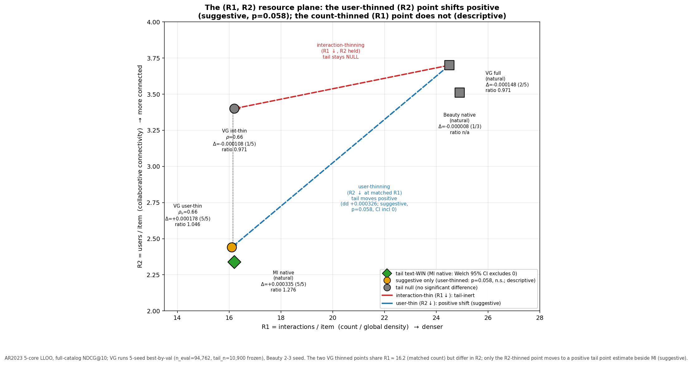

# Artifact-Gated Evaluation of Text-Augmented Sequential Recommendation: An FIR-Optimizer Package and a Musical-Instruments Frequency-5 Case Study on Amazon Reviews 2023

**Authors**: [maintainer to supply before submission — TORS review is single-blind and the manuscript must carry real author/affiliation/contact metadata; withheld only in this public working copy]

*Reader edition — rendered from the canonical markdown source. The ACM (TORS) review artifact is `paper_tex/PAPER_TORS.pdf` (see `VENUE_PLAN.md`); venue metadata (CCS concepts, keywords) lives in that artifact.*


---

## Abstract

Recommender-systems research has a well-documented evaluation-trust problem. We study text-augmented sequential recommendation on Amazon Reviews 2023 (5-core, full-catalog, leave-last-out) and organize the study around a pre-declared, artifact-gated apparatus: version-controlled pre-declarations, a fail-closed build gate recomputing all 175 artifact-gated table cells from released artifacts, comparator regeneration under disclosed environment caveats, and symmetric self-VOIDing adjudication — one campaign remains VOID by its own frozen rule and is reported as such. Findings, at their exact strength: (i) two pre-declared per-category point-estimate comparisons pass against published HSTU-BLaIR numbers (Musical_Instruments fresh 5-seed CI lower bounds 0.04096/0.04083 vs 0.0406; Office_Products 0.03033/0.03024 vs 0.0271 published and 0.0279 environment-matched regeneration) — not SOTA and not paired superiority; (ii) a leak-free causal FIR filter — attributed as the FIR-plus-initialization/optimizer package — is supported on four categories and replicated by an outcome-visible independent-arm rerun (Industrial_and_Scientific +0.002131, CDs_and_Vinyl +0.005770; Holm-corrected; not labeled confirmatory — §5.3); (iii) the Musical_Instruments tail advantage of frozen text features survives a repaired estimand (+0.000420, 95% CI [+0.000181, +0.000660], Holm) but concentrates in the frequency-5 boundary group (excluding it: p = 0.52) — a frequency-5-heavy pattern with the mechanism unresolved; the cross-dataset contrast did not replicate. Every retraction, negative result, and design defect is reported in full; code, data derivatives, per-user sidecars, and the audit chain are public.

---

## 1. Introduction

Sequential recommendation models predict a user's next item from their interaction history. Self-Attentive Sequential Recommendation (SASRec; Kang & McAuley, 2018) and its bidirectional cousin BERT4Rec (Sun et al., 2019) established Transformer-based sequential recommenders as competitive baselines. Subsequent work integrated pre-trained language models for richer item-text representations (ZESRec — Ding et al., 2021; UniSRec — Hou et al., 2022; RecFormer — Li et al., 2023; BLaIR — Hou et al., 2024) and explored generative-retrieval architectures with discrete semantic IDs (TIGER — Rajput et al., 2023; LIGER — Yang et al., 2024).

Recent benchmarks consolidate evaluation around the Amazon Reviews 2023 (AR2023) dataset (Hou et al., 2024), with reported numbers across two preprocessing variants: a **0-core** variant (no minimum interactions filter, used by Hou et al.'s reference repository at `external/AmazonReviews2023/seq_rec_results/`) and a **5-core** variant (minimum 5 interactions per user/item, used by TIGER, LIGER, and other recent works). Numbers reported under one variant are not directly comparable to numbers reported under the other.

This paper's lead contribution, however, is methodological. Recommender-systems research has a documented evaluation-trust problem — weak or mistuned baselines, non-comparable protocols, and unreproducible results repeatedly yield progress claims that do not survive scrutiny (Ferrari Dacrema et al., 2019; Ferrari Dacrema et al., 2021; §2) — and this paper responds with an executable, per-paper discipline rather than a field-level prescription: **(a)** an **version-controlled pre-declared protocol** — the comparator-facing confirmation (§5.2) was frozen in a git-committed pre-declaration (exact configuration, commands, data SHA256s, decision rule, and claim wording) before any confirmation run and executed on never-inspected fresh seeds, and the mechanism studies carry pre-declared decision rules (§5.4–§5.5); **(b)** a **fail-closed artifact gate** — a manifest enumerates every cell of the artifact-gated result tables (175 cells across 15 claim families; two expository tables — the dataset-statistics table in §4.1 and the supporting Appendix A.1 scan — are converted from the canonical markdown outside this graph and are labeled as such in their provenance), a build step recomputes each cell from its source artifacts and exits nonzero if any printed value is not reproduced at its printed precision, values whose artifacts cannot be recomputed are retired rather than grandfathered (§2.2 records one such retirement), and published comparator numbers are carried as explicitly-labeled external constants; **(c)** a **comparator-regeneration harness** (§5.6) — the unmodified reference implementation of our strongest comparator (its preprocessing, its configurations, its trainer, its eval) executes locally via three pure-PyTorch data-movement shims, so the published point estimates we compare against are regenerated by their own generating code rather than only transcribed (environment-caveated single-run regenerations); and **(d)** **symmetric, self-VOIDing adjudication** — pre-declared failures are published with the same prominence as passes. The Office_Products episode (Appendix A.0) demonstrates (d) concretely: our second-category pre-declaration VOIDed itself — its own floor check caught the cross-environment comparability failure it was designed to catch — and the VOID stands even though the anomaly was later mechanistically explained by §5.6's local runs of the comparator's own pipeline. A redesigned Office pre-declaration that gates against the environment-matched local regeneration instead (removing that failure mode by construction) subsequently **passed on fresh never-inspected seeds** — both kernel arms' CI lower bounds above both references (`PREREG_OFFICE_V3.md`; §5.2) — while the V1 VOID stands unchanged.

In this paper we build on an HSTU-style pure-PyTorch encoder implementation based on the published HSTU architecture (Zhai et al., 2024) and ask two questions: **(i) what simple, capacity-shaping components measurably and reproducibly improve text-augmented sequential recommendation under a fixed 5-core full-catalog LLOO protocol — and which intuitively-promising ones do not? (ii) *When* does item-text actually help — and is its benefit concentrated where ID-embedding models structurally fail, on the rare/cold tail?** Our contributions are:

1. **A trustworthy-evaluation apparatus, demonstrated end-to-end** — the version-controlled pre-declared protocol, the fail-closed artifact gate, the comparator-regeneration harness, and the symmetric self-VOIDing adjudication described above, released together with the preprocessing pipeline and per-seed artifacts (§8). The apparatus certifies not that our numbers are large but that they are exactly what the released artifacts recompute, under decision rules frozen before the confirmatory runs; the Office_Products VOID (Appendix A.0) is deliberately retained as the apparatus's demonstration that it catches its own comparability failures.
2. **A strictly causal FIR temporal filter** — a leak-free *causal* FIR adaptation of the frequency-filter ideas of FMLP-Rec (Zhou et al., 2022) and BSARec (Shin et al., 2024). It is a zero-init gated depthwise convolution that sharpens the short-horizon recency structure attention tends to smooth (as an FIR filter it has a learnable frequency response — the only sense in which a spectral reading applies); it is a multi-seed-supported lever as the FIR-plus-initialization/optimizer package (§3 initialization caveat; Video_Games +0.0015), robust across kernel lengths, that combines with label smoothing (+0.0012 and +0.0015 alone, +0.0036 together — the +0.0009 excess is 33% of the component sum; additivity and orthogonality were NOT tested). **Its strongest evidence is cross-category:** on Musical_Instruments a single-lever 5-seed isolation shows the package arm — not label smoothing — accounts for most of the combined lift (attribution caveat §3; no component-by-category interaction was tested) (+0.0025, ≈80% of the combined lift, ≈3× label-smoothing). FMLP-Rec and BSARec use bidirectional sequence filters in their original formulations; under our all-position next-item loss, directly inserting such filters before each position's prediction would mix future positions, so we use a left-causal FIR realization.
3. **A Musical-Instruments frequency-5 tail case for text-augmented recommendation** (a per-dataset empirical observation; **cross-dataset heterogeneity is not established** — the repaired MI−VG interaction is p = 0.13, and one significant plus one nonsignificant estimate is not a significant difference). Reporting `by_popularity` NDCG@10 on nominal train-frequency terciles (train-frequency-only bucketing; cohort caveats in §5.3), and comparing the text stack against an ID-only ablation on the *same* split and seed numbers (arms not initialization-paired — §5.3 disclosure), we find text's tail benefit appears on **one of the three datasets** — a per-dataset *observation* (cross-dataset heterogeneity not established) whose mechanism is **unresolved** (the tested density intervention did not reproduce it, §5.4; no content mechanism is identified — the item-text permutation control has not been run): on the sparse-catalog **Musical_Instruments** text shows a **frequency-5-heavy positive-tail advantage** (5-seed Δ = +0.000335 ± 0.000195, 5/5 same-seed differences positive, independent-arm Welch 95% CI excludes 0, HR-replicated), while on the dense **Video_Games** and **Beauty_and_PC** no significant tail difference was detected (the former powered-equivalence claims are retracted, §5.3; Beauty is exploratory). The MI tail win is replicated by the pre-declared repaired-estimand TFV2 campaign (+0.000420, 95% CI [+0.000181, +0.000660], Holm-PASS; zero-exposure targets separated and degenerate at 0.0 in both arms) — an effect that is **frequency-5-heavy** (excluding the boundary-frequency group the tail delta is null: +0.000071, p = 0.52) and a campaign that is outcome-visible, not confirmatory (§5.3 chronology); the cross-dataset MI−VG contrast did not replicate as significant under TFV2 (+0.000247, p = 0.13) and is descriptive only, as is the regime-migration observation (*tail→mid→head as catalogs densify*). An interaction-thinning **titration** yields a **double result** (level contrasts under a bundled intervention): the head/overall text advantage rises as interactions thin, while the tail effect is trend-free (thinning Video_Games to MI's exact global density does not reproduce MI's tail win — at 5 seeds that density-equivalent rung is a flat null, Δ = −0.000108 ± 0.000503, 1/5 seeds positive) — a tail *correlate* only. We frame this as a refuting keystone, not a confirming one, and as intervention evidence on the dataset rather than proof of the real-world generative process.

Our claimed additions are deliberately small: the **causal FIR filter** (an incremental adaptation of prior frequency-filter ideas), the **MI frequency-5 tail case** (a per-dataset empirical finding; cross-dataset heterogeneity not established), and the **TAPE** ablation. We do not claim a wholly new recommender architecture; every other architecture and training recipe we test originates from prior work, cited at the point of use, with a complete attribution table in §2.1. (An earlier-stage Beauty_and_Personal_Care cross-pipeline transfer study and LIGER-gap analysis are retained in the appendix as supporting material.)

## 2. Related Work and Attribution

We summarize prior work that our experiments directly build on. A complete attribution table for every component used in our experiments appears at the end of this section.

**SASRec** (Kang & McAuley, 2018) is the base Transformer sequential recommender we re-implement. SASRec models a user's history with a causal-masked Transformer encoder and scores the next item via dot product with a learned item-embedding table.

**BERT4Rec** (Sun et al., 2019) adapts BERT-style bidirectional masked-item modeling for sequential recommendation. We implement BERT4Rec as one of our 20 ablation baselines on Beauty_and_PC.

**SBERT / MiniLM** (Reimers & Gurevych, 2019; Wang et al., 2020) provide pre-trained sentence embeddings. We use `sentence-transformers/all-MiniLM-L6-v2` (384-d) as the default frozen item-text encoder (checkpoint: the `sentence-transformers/all-MiniLM-L6-v2` model card — the checkpoint carries its own contrastive fine-tuning and lives in a mutable repository, so we pin the realized embeddings by the SHA-256 text-cache hashes in `RELEASE_MANIFEST.json`).

**UniSRec** (Hou et al., 2022) is an early, widely-adopted text-based sequential recommender that uses a pre-trained language model to embed item text and learns a parametric adaptor to project these embeddings into the sequential model's hidden space; **ZESRec** (Ding et al., 2021) precedes it in representing items from natural-language descriptions with a pre-trained encoder for zero-shot sequential recommendation, and **RecFormer** (Li et al., 2023) subsequently studies language representations for sequential recommendation including low-resource and cold-start evaluation — we make no priority claim in this line. The SASRec-with-frozen-text-encoder pattern we use is a strict simplification of UniSRec.

**BLaIR** (Hou et al., 2024) is a RoBERTa-base model continually pretrained on 10% of (item-metadata, review) pairs from Amazon Reviews 2023. We use `hyp1231/blair-roberta-base` (768-d) as an alternative frozen item-text encoder. Hou et al. also publish a reference implementation, **SASRecText**, that pairs SASRec with BLaIR via a 2-layer MLP adaptor `[768, 300, 64]` with Dropout(0.2) + ReLU; we adopt this adaptor design verbatim (see Appendix A.1).

**TIGER** (Rajput et al., 2023) reformulates sequential recommendation as autoregressive generation over discrete semantic IDs produced by a residual-quantized variational autoencoder over item-text embeddings. TIGER reports strong results on Amazon Reviews 5-core benchmarks.

**LIGER** (Yang et al., 2024) extends TIGER with a dense-retrieval refinement step and reports further gains.

**Amazon Reviews 2023** (Hou et al., 2024) is the source dataset. We use the **5-core leave-last-out** protocol (described in §3) matching the convention used by TIGER, LIGER, and similar works, which differs from the `0core_timestamp_w_his_*` HuggingFace subset used by Hou et al.'s `seq_rec_results/` reference implementation.

**Evaluation practice and reproducibility in recommender systems.** Our lead contribution responds to a documented evaluation-trust problem in this field. Ferrari Dacrema et al. (2019) examined 18 recent neural recommenders and could reproduce only 7 with reasonable effort, 6 of which were often outperformed by comparably simple heuristic baselines; the extended journal analysis (Ferrari Dacrema et al., 2021) corroborates the pattern in greater depth and attributes it in part to the choice and optimization of the baselines used for comparison. Sun et al. (2020) respond at the community level with standardized benchmarking for reproducible evaluation and fair comparison. These works diagnose the problem and propose field-level remedies; what this paper adds is complementary and *per-paper*: an executable discipline that a single submission can adopt and a reviewer can re-run — version-controlled pre-declaration of the comparator-facing confirmation (§5.2), a fail-closed artifact gate that recomputes every artifact-gated table cell from released artifacts at build time (published comparator values are pinned as labeled external constants; §2.2 records a retirement the gate forced), local regeneration of the comparator by its own unmodified reference implementation (environment-caveated single-run regenerations, §5.6), and symmetric publication of failures, including a pre-declaration VOIDed by its own comparability check (Appendix A.0) with a redesigned successor that subsequently passed on fresh seeds (`PREREG_OFFICE_V3.md`; §5.2), the original VOID standing unchanged. None of this apparatus strengthens any empirical claim — every non-claim of §5–§7 stands unchanged; it certifies that the numbers printed are the numbers the artifacts recompute, under decision rules frozen before the confirmatory runs.

### 2.1 Attribution table

| Component | Source | Where in our work |
|---|---|---|
| SASRec architecture | Kang & McAuley, 2018 | base `SASRecSBERT` model |
| BERT4Rec | Sun et al., 2019 | one of 20 ablation baselines |
| MiniLM `all-MiniLM-L6-v2` (384-d) | Reimers & Gurevych, 2019; Wang et al., 2020 | default frozen item-text encoder |
| BLaIR `blair-roberta-base` (768-d) | Hou et al., 2024 (arXiv:2403.03952) | alternative frozen item-text encoder |
| 2-layer MLP adaptor `[768, 300, 64]` Dropout+ReLU | Hou et al., 2024 (SASRecText, in `external/AmazonReviews2023/seq_rec_results/`) | `--mlp-adaptor` flag |
| Rich-text content concatenation (title + categories + store name) | derived from Hou et al., 2024 preprocessing | `encode_richtext_5core.py` |
| Amazon Reviews 2023 dataset | Hou et al., 2024 | all benchmarks |
| TIGER / LIGER | Rajput et al., 2023 / Yang et al., 2024 | published comparator numbers |

### 2.2 Our additions to the above prior art

We do not claim a wholly new recommender architecture. Our architectural additions are deliberately small: a causal FIR adaptation of prior frequency-filter ideas and a soft text-prototype additive term. Our contributions are:

- An **open-source 5-core preprocessing pipeline** (`preprocess_5core_standard.py`) that matches the protocol used by TIGER and LIGER (not the 0-core protocol used by Hou et al.'s repo).
- A **memory-efficient chunked-full-softmax loss** that enables proper full-catalog cross-entropy training at 207k-item catalogs on a single 16 GB GPU.
- An **eval optimization** (caching `all_item_features()` once per `evaluate()` call) that gives ~10× speedup at d=64 with the MLP adaptor.
- A **cross-pipeline transfer study**: empirically testing which published architectural choices help on the 5-core protocol.
- **Negative-result documentation** for 18 of 20 tested variants on Beauty_and_Personal_Care 5-core.
- The **competitive Video_Games 5-core result** on the HSTU-style pure-PyTorch stack (6-seed NDCG@10 = **0.0673 ± 0.0003**, +17.5% over published SASRec 0.0573), shown to be architectural (ID-only ≈0.0656), with no SOTA claim. *(The earlier v1-era SASRec-SBERT number 0.05509 ± 0.00035 has been retired from Table 1a: its raw per-seed artifacts predate the artifact manifest and cannot be recomputed, so it survives only as a RETIRED provenance row in the manifest, not as a paper claim.)*
- The two added components — the **strictly causal FIR temporal filter** (supported on four categories — the breadth campaign's frozen rule fired on both new categories, with its paired interpretation withdrawn, §5.2) and **TAPE** — plus the **MI frequency-5 tail case** (§5.3) and its **interaction-thinning titration** level-contrast result (§5.4). The novelty boundary for each is stated explicitly in Table 0 (§2.3).

### 2.3 Novelty boundary

Table 0 states, component by component, what is prior art, what we reuse, what we change, the evidence behind each claim, and an honest novelty grade. Nothing in this paper is graded above "moderate"; the two architectural additions are graded "incremental" by design. The frequency/time-frequency line in sequential recommendation is broader than the two works we adapt — e.g. frequency-aware hybrid-attention models such as FEARec (Du et al., 2023) and, more recently, wavelet-packet models such as WPGRec (Liu et al., 2026; arXiv:2604.21305) — and our boundary is correspondingly narrow: what we add is only the left-causal, depthwise-FIR form of the idea inside an HSTU-style stack trained with an all-position next-item objective under full-catalog AR2023 5-core LLOO evaluation. Convolutional sequence modeling is likewise long-established prior art — Caser (Tang & Wang, 2018) encodes sequences with horizontal/vertical convolutions, and NextItNet (Yuan et al., 2019) stacks dilated *causal* convolutions as the entire sequence encoder — and our filter is deliberately not such an architecture: it is a single **depthwise, linear FIR tap bank** (no nonlinearity, no channel mixing, zero-initialized to an exact no-op) inserted as a bias-like component inside an attention stack. The claimed contribution is the leak-free FIR form of a frequency-filter *regularizer* under the all-position objective — not convolutional sequence encoding. **Initialization disclosure (2026-07-19):** with the delta-kernel and gate g=0 initialization, both task gradients are exactly zero at the start (y=x, so the gate gradient vanishes and the kernel gradient is multiplied by g=0); learning bootstraps only because Adam's coupled weight-decay term (1e-5) perturbs the delta tap off its fixed point — the optimizer regularizer is therefore part of the filter's learning mechanism, and with weight decay disabled this parameterization is an absorbing no-op. The fixed-average and no-gate comparator arms do not share this singular start, so those comparisons alter the optimization path as well as the named design element; re-running them under a nonsingular common parameterization is queued work, and until then the comparator-ablation attribution carries this caveat.

**Table 0: Novelty boundary — what is reused, what is changed, and how novel each piece is.**

| Component | Prior art | What we reuse | What we change | Evidence | Novelty strength |
|---|---|---|---|---|---|
| HSTU base | Zhai et al., 2024 | pointwise `silu(QKᵀ + rab) V` aggregation, per-block normalization, relative attention biases | pure-PyTorch implementation; diagnosis/removal of two spurious normalizations in our initial reimplementation; equation-level verification only, core-block parity demonstrated at a mirrored aligned configuration (max abs diff 0.0; §3.2 scope note — the trained block is a strict-superset variant); no pinned end-to-end system reproduction (§5.6, §6.5) | Table 1 ablations; §3.7 | none (implementation work) |
| BLaIR / SBERT text embeddings | Hou et al., 2024; Reimers & Gurevych, 2019; Wang et al., 2020 | frozen encoders; Hou et al.'s MLP adaptor verbatim | nothing (frozen, off-the-shelf) | Table 1a encoder comparison | none |
| Label smoothing | Szegedy et al., 2016 | standard uniform label smoothing | applied to full-catalog chunked-softmax CE in this setting | +0.0013 single-flag; +0.0012 stacked (Table 1) | none |
| Time bias | TiSASRec; HSTU (Zhai et al., 2024) | bucketed time-interval attention bias | integration only | +0.0027 single-flag, largest classical component (Table 1) | none |
| FMLP-Rec / BSARec frequency filters | Zhou et al., 2022; Shin et al., 2024 | the idea of filtering sequential representations; frequency-domain motivation; attention-oversmoothing framing | not inserted as-is (bidirectional in their original formulations) | cited motivation (§3.7b) | none (prior art) |
| Causal FIR adaptation (ours) | builds directly on FMLP-Rec / BSARec; causal *convolutional* sequence encoders are prior art (Caser; NextItNet) | their filtering motivation and frequency framing | leak-free, left-causal depthwise FIR realization (zero-init gated) inserted before an HSTU-style stack under the all-position next-item objective, full-catalog LLOO | VG +0.0015 (5-seed); MI +0.0025, ≈80% of the combined lift (5-seed); pre-declared breadth: IS +0.0024, CDs +0.0057 (both 5/5 seeds, CIs exclude 0, §5.2); robust across K∈{4,8,16,50} | incremental |
| TAPE (ours) | TIGER (Rajput et al., 2023); VQ-Rec; ProtoMF | prototype / semantic-ID shared-structure motivation; frozen text embeddings | frozen k-means soft assignment gating a zero-init learnable prototype table, additive | +0.0009 single-flag (n=1); +0.0004 in the 4-seed cross-check; sub-additive (§5.1) | incremental |
| Tail / thinning analysis (ours) | popularity-stratified evaluation (standard); long-tail SR, e.g. MELT (arXiv:2304.08382); cold-start content methods, e.g. DropoutNet, CLCRec | nominal train-frequency tercile bucketing (§5.3 cohort caveats); same-seed-number contrasts (not initialization-paired) | per-dataset (heterogeneity not established) text-vs-ID tail contrast plus interaction- and user-mode thinning interventions with a matched-R1 (resource-controlled) design | MI tail win replicated by the pre-declared, outcome-visible repaired-estimand TFV2 campaign (+0.000420, Holm-PASS; not confirmatory — §5.3); VG null (equivalence claims retracted §5.3); cross-dataset contrast not significant under TFV2 (p = 0.13, descriptive); user-mode dd = +0.000326 (suggestive, p = 0.058, §5.4.2) | incremental (full-catalog/cross-category extension; SimRec precedent — §2.3) |

**Closest systems I — adjacent lines and the narrowed boundary (metadata verified 2026-07-19).** Five adjacent lines narrow what this paper may claim, and we state the narrowed boundary explicitly. (i) *Text similarity for rare/unseen items:* SimRec (Brody & Lagziel, 2024) already targets sequential-recommendation cold-start with text-derived item similarity and reports larger benefits on sparser datasets; our tail contribution is therefore graded **incremental** — a full-catalog, cross-category AR2023 extension with intervention studies and disclosed cohort defects (§5.3–§5.4) — not a new sparse-vs-dense semantic-tail idea. (ii) *Convolution/filtering with attention:* C3SASR (Chen et al., 2022) combines cheap causal convolutions with self-attention, AdaMCT (Jiang et al., 2023) mixes local convolution with Transformer attention, and learnable frequency-domain filtering with gates and side-information fusion appears in DLFS-Rec (Liu et al., 2023), DIFF (Kim et al., 2025), TASIF (Luo et al., 2026), and — with position-specific time-variant convolutional filters — TV-Rec (Shin et al., 2025); our defensible distinction is only the **zero-init gated left-causal depthwise FIR under an HSTU-style all-position objective at full catalog** — not causal/local convolution with attention, learnable filtering, gating, or filter-content fusion as concepts. (iii) *Side-information fusion scope:* NOVA (Liu et al., 2021) and DIF-SR (Xie et al., 2022) document that direct/early fusion can be harmful and propose decoupled designs; TedRec (Xu et al., 2024) fuses text and ID at sequence level in the frequency domain; and AlterRec (Li et al., 2025) studies failures of naive ID/text fusion — we test **only early additive frozen-text fusion**, and every "text helps/does not help" statement in this paper is scoped to that construction. (iv) *Cold-start distinction (stated precisely):* Mecos (Zheng et al., 2021) meta-learns for **new items with few interactions**, and RecGPT (Jiang et al., 2025) is a generative foundation model evaluated in **zero-shot transfer and short-history** settings — two different cold-start settings, both distinct from our mixed zero-/low-exposure full-catalog cohort (which itself mixes zero-train-exposure and low-frequency targets, §5.3); we make no cold-start-method comparison. (v) *Reproducibility apparatus:* executable evaluation frameworks (Elliot — Anelli et al., 2021; DaisyRec 2.0 — Sun et al., 2022), accountability workflows (Bellogín & Said, 2021), and reproduction audits (Petrov & Macdonald, 2022) predate this work; what this paper claims is only its exact combined enforcement mechanism — per-cell recomputation from released artifacts, provenance tripwires, and symmetric self-VOIDing adjudication — positioned against, not above, those frameworks. TAPE's boundary likewise narrows: LLMSQRec (Zhang et al., 2026) combines frozen LLM semantic embeddings, ID embeddings, and learned prototype/codebook quantization for sparse and long-tail settings — TAPE's continuous additive realization differs, but the broad text-prototype-ID concept is not ours. Relatedly, the chunked-full-softmax loss is implementation engineering; memory-efficient exact cross-entropy without materializing the full logit matrix is published (Cut Cross-Entropy — Wijmans et al., 2025), and we cite it as such (§3.5).

**Closest systems II — null-space, frequency, and anisotropy lines (metadata verified 2026-07-20).** Five further works tighten the frozen-text/ID and frequency boundaries: **AlphaFuse** (Hu, Zhang, Liu, Cai, Yang & Wang, SIGIR 2025) learns ID embeddings in the null space of language embeddings and evaluates long-tail settings — it is now the **closest omitted frozen-text-plus-ID comparator**, and benchmarking it under our full-catalog split (or an explicit protocol-based exclusion) is queued experiment work; **DWSRec** (Zhang, Zhou, Zeng & Shen, AAAI 2024) whitens anisotropic pre-trained text embeddings (dual-view); **SIDSRec** (Zhou, Pan & Ming, SIGIR 2026) separates semantic and ID channels before fusion; **BFDRec** (Hu, Zhou, Liao, Zhu, Wen & Zhang, SIGIR 2026) does energy-aware multi-scale frequency modeling with dynamic gating (closest frequency-domain line beside TASIF/DLFS-Rec/DIFF/TV-Rec); and **ACE** (Lee, Kim & Lee, SIGIR 2026) shows a linear-autoencoder reshaping of anisotropic LLM embeddings can itself add capacity usefully — so our negative map's capacity-adding conclusions remain strictly **implementation- and environment-local** (they characterize our probes in our setting, not the design space). Two protocol **controls remain open experiments (disclosed, not executed):** a sequence-splitting/target-strategy parity audit mapping our all-position objective onto the taxonomy of the SIGIR 2026 reproducibility study (arXiv:2604.05309) with demonstrated comparator target-multiplicity parity, and an item-text permutation control (attribute-shuffling style, DOI 10.1145/3805712.3809839) before attributing the +2.7% stack lift to semantic alignment rather than added representation structure.

**Closest systems III — LLM-semantic tail and convolutional lines (metadata verified 2026-07-20).** Four further works narrow the two axes our findings sit on. *Semantic-tail line:* **LLM-ESR** (Liu, Wu, Wang, Zhang, Tian, Zheng & Zhao — NeurIPS 2024 spotlight) fuses LLM semantic embeddings with collaborative signals in a dual-view design for long-tail items and adds retrieval-augmented self-distillation for long-tail users; **FAERec** (Wei, Dang, Guo, Zhao & Sun, 2026) adaptively gates ID and LLM embeddings with dual-level (contrastive + correlation) alignment for tail items; **LLM2Rec** (He, Liu, Zhang, Ma & Chua — KDD 2025) trains a two-stage LLM-derived embedding model encoding both semantics and collaborative signal. LLM-ESR and FAERec target long-tail improvement directly, and LLM2Rec targets general sequential recommendation via LLM-derived embeddings — an active methods axis. **LLM2Rec is the closest protocol overlap**: it evaluates on Amazon Reviews 2023 with 5-core filtering, leave-one-out and full-item ranking, but with maximum history length 10 (ours: 50) and a correspondingly different item universe and splits, so its numbers are not comparable under the §2.1 executable-protocol boundary; LLM-ESR, FAERec, and ConvFormer do not use this protocol. None of this changes what we claim: our tail contribution is not a method but a *measured boundary* — the MI frequency-5-heavy pattern (cross-dataset heterogeneity not established) of a deliberately frozen additive text stack against an ID-only control under a gated protocol (§5.3), including where text does *not* help (zero-exposure targets: zero hits through rank 100 in all four TFV2 categories). Whether these adaptive-fusion designs move the same frozen-protocol boundary is an open experiment we have not run, and we say so. *Convolutional-sequence line:* **ConvFormer** (Wang, Lian, Wu, Li, Fan, Xu, Li & Xie, 2023) replaces item-to-item attention with convolution in sequential user modeling — the nearest Transformer-replacing convolutional relative alongside FMLP-Rec, BSARec, AdaMCT, and C3SASR; our FIR claim remains exactly the narrow one already stated (a leak-free left-causal FIR realization *before* an HSTU-style stack under the all-position objective, attributed as the FIR-plus-initialization/optimizer package), not a claim to convolutional sequence modeling as such.

## 3. Method

### 3.1 Preprocessing pipeline

We preprocess Amazon Reviews 2023 (Hou et al., 2024) into 5-core leave-last-out splits. For each category we:
1. Load raw user-item review interactions from the `raw_review_<category>` HuggingFace subset.
2. Apply a 5-core filter iteratively until no user or item has fewer than 5 interactions.
3. Sort each user's interactions chronologically.
4. Hold out the last interaction as test, the second-to-last as validation, the rest as training.
5. Encode item metadata (`meta_<category>.jsonl`) with the chosen frozen text encoder.

This protocol matches TIGER (Rajput et al., 2023) and LIGER (Yang et al., 2024) but differs from Hou et al. (2024)'s reference repo (`external/AmazonReviews2023/seq_rec_results/`) which uses the `0core_timestamp_w_his_*` HuggingFace subset. The 5-core protocol produces smaller, denser interaction matrices.

**Pre-core deduplication (disclosed 2026-07-19).** Before k-core filtering, duplicate `(user, item)` interactions are collapsed to a single event, keeping the **earliest** timestamped occurrence (first-exposure convention). This step is material and was previously undocumented in the paper: it removes 41,888 of 3,017,439 raw rows on Musical_Instruments (1.39%), 69,115 of 4,624,615 on Video_Games (1.49%), 320,078 of 23,911,390 on Beauty_and_PC (1.34%), and 156,363 of 12,845,712 on Office_Products (1.22%); the FIR-breadth categories were preprocessed from AR2023 rating-only exports whose (user, item) pairs are already unique (0 rows removed on Industrial_and_Scientific and CDs_and_Vinyl). Deduplication can change k-core membership, sequence order, and held-out targets; sensitivity to a keep-latest rule is untested (a disclosed limitation). (The MI/Office counts are from the retained preprocessing logs; the VG/Beauty logs were not retained, and their counts were regenerated 2026-07-19 from the raw dumps with the released deterministic script.)

**Timestamp-tie policies (disclosed 2026-07-19; two distinct deterministic rules).** Two tie-breaking rules operate at different stages and were previously undocumented. (i) Preprocessing stable-sorts each user's interactions by timestamp only, so for equal-timestamp events the raw-file order decides both which duplicate survives deduplication and which event lands on a leave-two-out split boundary. (ii) The trainer later re-sorts each user's train sequence by `(timestamp, item_index)`, so within-train equal-timestamp order is decided by reindexed item ID. Both rules are deterministic given the released raw dumps and code. Measured scale (2026-07-19, from the released splits): on Musical_Instruments, 3 of 57,439 users (0.01%) have test-target timestamp equal to the validation-target timestamp, 3 have validation equal to the last train timestamp, and 12 (user, timestamp) groups cover 24 of 511,836 rows; on Video_Games the counts are 4 and 8 of 94,762 users and 61 groups covering 122 of 814,586 rows (0.01%). At this scale the tie policies cannot materially affect any reported number; we nevertheless document them as part of the exact preprocessing contract.

### 3.2 Model architecture

**Shared item-feature construction (both encoder families).** For each item `i`:
- A learned per-item embedding `e_i ∈ R^d` (initialized N(0, 0.02), padding-aware).
- A frozen text embedding `s_i ∈ R^k` from MiniLM (k=384) or BLaIR (k=768).
- A learnable projection `Φ : R^k → R^d`.

The item feature passed into the encoder is `f_i = e_i + Φ(s_i)`. Sequences are right-padded with a dedicated pad token and processed with a causal-only attention mask (no key-padding mask — see §3.4). The output logits for position `t` are `h_t · all_items.T` where `all_items` is the (n_items, d) item-features table.

**Headline encoder — HSTU-style (every §5 result).** All headline experiments use the **HSTU-style pure-PyTorch pointwise-attention encoder**, described in full in §3.7: pointwise `silu(QKᵀ + rab) V` aggregation with the published per-block normalization — no softmax, no 1/√d scaling — with the core block verified exactly (max abs diff 0.0) against the reference research implementation at a mirrored, aligned, dropout-free configuration (`HSTU_PARITY_REPORT.md` discloses the alignment: identity affine norms, zeroed extra `uvqk` bias, ε 1e-6, eval mode; the trained configuration is a strict-superset HSTU-style variant — §6.5). Configuration, stated here and in §4.4: **4 layers, 2 heads, d = 64, dropout 0.5**.

**Baseline encoder — SASRec-SBERT (protocol parity and the superseded Appendix A.1 scans only).** The SASRec-family baseline follows Kang & McAuley (2018): a 2-layer pre-norm Transformer encoder (d=64, n_heads=2, FFN dim=4d, GELU activation) followed by a final LayerNorm, using the same item-feature construction. **No headline number uses this encoder**; it appears as the per-category parity/floor baseline and in the superseded Beauty scan (Appendix A.1).

### 3.3 Choice of projection Φ

Following our cross-pipeline transfer study (Appendix A.1), we compare two designs for `Φ`:
- **Linear**: `Φ(s) = W s` for a learned weight `W ∈ R^{d × k}`.
- **MLP** (adopted from Hou et al., 2024 SASRecText): `Φ(s) = W_2 · ReLU(W_1 · Dropout(s))` with hidden dim 300 and Dropout(0.2) between and before the linear layers. **This design is from Hou et al., 2024 and we do not claim novelty for it.**

### 3.4 Right-padding + causal-only mask

During exploration we identified a numerical failure mode in the standard SASRec implementation pattern: combining left-padding with both a key-padding mask and a pre-norm Transformer encoder produces NaN logits when an entire row of keys is padded (the softmax denominator is zero). The NaN propagates through residual connections and silently inflates eval NDCG to ~0.9955 — a "fake-perfect" result. We adopt right-padding + causal-only mask (no key-padding mask) to avoid this trap.

### 3.5 Chunked-full-softmax loss

For training with cross-entropy over the full catalog (no sampled negatives), the full logits tensor `(B, L, n_items)` is prohibitive at L=50 and n_items=207k. We implement an incremental-logsumexp loss:

```
def chunked_full_softmax_loss(hidden, targets, model, item_chunk):
    lse = -inf  # running logsumexp over the item dimension
    target_scores = None
    for chunk_start in range(0, n_items, item_chunk):
        chunk_emb = model.item_features(chunk_ids)
        chunk_logits = hidden @ chunk_emb.T
        lse = logsumexp(lse, logsumexp(chunk_logits, axis=-1))
        if any(target in chunk):
            target_scores[in_chunk] = chunk_logits[in_chunk, target]
    return -mean(target_scores - lse)
```

This bounds peak memory by `(batch, item_chunk)` instead of `(batch, n_items)` and allows proper full-softmax training at the 207k-item Beauty_and_Personal_Care scale on a 16 GB GPU.

Memory-efficient exact cross-entropy has published precedent (Cut Cross-Entropy, ICLR 2025, computes exact CE without materializing the full logit matrix); our chunked variant is independent implementation engineering in the same spirit, claimed only as engineering. 

### 3.6 Evaluation protocol

We score each user against the **full catalog** of 207k items (Beauty_and_PC) or 25k items (Video_Games). For the held-out test item, we compute the rank under dot-product scoring (after masking train+val items the user has already seen) and report NDCG@10, HR@10, MRR. We use the standard SASRec test-time convention of including the validation item in the input sequence (Kang & McAuley, 2018).

For our default 16 GB GPU, the optimized evaluation caches the (n_items, d) item-features table once per `evaluate()` call rather than recomputing it per batch — this is critical with the MLP adaptor, which would otherwise recompute the 207k-item × 768 → 300 → 64 MLP forward 1,400+ times per evaluation.

### 3.7 Added components (deliberately small adaptations)

Our two architectural additions (the novelty boundary is stated in §2.3) are deliberately simple, default-OFF, and zero-initialized so that each is a *bit-identical no-op at initialization* and reduces the design to a single controlled lever. Both are defined on top of an **HSTU-style pure-PyTorch implementation of the HSTU encoder, based on the published architecture** (Zhai et al., 2024): we use the pointwise-aggregated interaction `silu(QKᵀ + rab) V` with the published per-block normalization, having diagnosed and removed two spurious normalizations (a 1/√d score scaling and a 1/(i+1) row averaging) in our initial reimplementation that collapse HSTU's pointwise attention into weak mean-pooling. We verify the implementation equation-by-equation against the published HSTU formulation (pointwise `silu(QKᵀ + rab) V` aggregation, no softmax, no 1/√d scaling); an executable end-to-end reproduction of the official kernel stack is impossible on our hardware (§7); the core block, however, passes an exact numerical parity test against the reference research implementation (max abs diff 0.0; `HSTU_PARITY_REPORT.md`).

**(a) Text-Anchored Prototype Embeddings (TAPE).** TAPE is a simple soft text-prototype additive capacity term inspired by semantic-ID and prototype methods (TIGER, VQ-Rec, ProtoMF); it provides a small but not headline gain (§5.1). Let `t_i ∈ ℝ^{d_text}` be item *i*'s frozen text embedding (MiniLM or BLaIR). We k-means the L2-normalized text embeddings into *K* centroids `{c_1,…,c_K}` once, offline, and form a **frozen soft assignment** `A_i = softmax(⟨t_i, c⟩ / τ) ∈ Δ^{K}` (τ = 0.05). We add a **learnable prototype table** `P ∈ ℝ^{K×d}` (zero-initialized) to each item's feature:

  `e_i = id_i + Φ(t_i) + A_i P`,

where `id_i` is the learned per-item embedding and `Φ` the learned projection of the frozen text embeddings. Items in the same semantic neighborhood share the learnable capacity `A_i P` — the shared-structure benefit of TIGER-style semantic IDs (Rajput et al., 2023) without discrete codes or an autoregressive decoder. Because `A` is frozen and `P` is zero-init, TAPE is an exact no-op at initialization and recovers the baseline. TAPE is adjacent to TIGER (discrete RQ-VAE IDs), VQ-Rec (PQ codes), and ProtoMF (prototype matrix factorization for explainability); it differs only in realization — a frozen text-derived soft assignment gating a learnable prototype table inside a sequential recommender — and we present it as a small adaptation of these prior ideas tested as a secondary ablation, not as a headline contribution. Default K = 512.

**(b) Strictly causal FIR temporal filter.** BSARec (Shin et al., 2024, Thm 3.1) analyzes vanilla Transformer self-attention as low-pass in the sequential-recommendation setting. We hypothesize that the HSTU-style pointwise aggregation used here can benefit from a similar local high-frequency inductive bias; the empirical ablation (§5.1–§5.2) tests this hypothesis. We insert, immediately before the HSTU stack, one **per-channel learnable FIR filter** as a zero-init gated residual on the sequence embeddings `x ∈ ℝ^{B×L×d}`:

  `y = DepthwiseConv1d_K(pad_left(x, K−1))`,  `x ← x + g ⊙ (y − x)`,

implemented as a depthwise `Conv1d(d, d, kernel_size=K, groups=d, bias=False)` with a **left-only causal pad of K−1**, a scalar gate `g` zero-initialized, and the kernel initialized to a causal delta (all-pass). The left-only pad makes output position *t* a function of input positions ≤ *t* only — so under our all-position next-item loss there is **no future-label leakage**. FMLP-Rec (Zhou et al., 2022) and BSARec use bidirectional sequence filters in their original formulations; under our all-position next-item loss, directly inserting such filters before each position's prediction would mix future positions, so we use a left-causal FIR realization. The novelty boundary is narrow and we state it plainly. *Not new*: filtering sequential representations, the frequency-domain motivation, and the attention-oversmoothing framing (FMLP-Rec; BSARec). *New*: the leak-free, left-causal FIR realization inserted before an HSTU-style stack under the all-position next-item objective, evaluated under full-catalog LLOO. As an FIR filter the module has a learnable per-channel frequency response — the only sense in which we use the word "spectral" — and it supplies an explicit local temporal bias that the baseline does not learn as reliably in our low-capacity setting (we do not claim the attention stack cannot represent this behavior). The gain is robust across kernel lengths K ∈ {4, 8, 16, 50} (§5); we use K = 8 on Video_Games and K = 16 on Musical_Instruments.

Both components are leak-free by construction and add negligible parameters (TAPE: K×d ≈ 33k; filter: K×d ≈ 0.5–3k). Two further regularizers we use are *not* claimed novel: **label smoothing** (Szegedy et al., 2016) on the full-softmax CE target, and the standard time / text-similarity / relative-position attention biases (TiSASRec; HSTU; Shaw et al., 2018), each cited at the point of use.

## 4. Experiments

### 4.1 Datasets

All datasets are AR2023 5-core categories under the same full-catalog LLOO protocol (§3.6).
Counts are **total 5-core interactions** (train = total − 2 × users, since LLOO holds out one
valid and one test interaction per user):

| Category | Role in this paper | Users | Items | Interactions (total) |
|---|---|---|---|---|
| **Video_Games** | headline reference numbers (§5.1); tail-pattern null (equivalence claim retracted §5.3) | 94,762 | 25,612 | 814,586 |
| **Musical_Instruments** | cross-category FIR confirmation + **pre-declared comparator confirmation** (§5.2) | 57,439 | 24,587 | 511,836 |
| **Office_Products** | V1 prereg **VOID** (descriptive; Appendix A.0); **redesigned V3 prereg PASSED** (§5.2; `OFFICE_V3_RESULTS.md`) | 223,308 | 77,551 | 1,800,878 |
| **Beauty_and_Personal_Care** | tail-pattern exploratory 3-seed estimate (§5.3); superseded cross-pipeline scan (Appendix A.1) | 729,576 | 207,649 | 6,624,441 |
| Industrial_and_Scientific | **pre-declared FIR-breadth: artifact-PASS** (frozen rule fired; paired premise withdrawn; post-hoc independent-arm estimate — §5.2; `FIR_BREADTH_RESULTS.md`) | 50,985 | 25,848 | 412,947 |
| CDs_and_Vinyl | **pre-declared FIR-breadth: artifact-PASS** (frozen rule fired; paired premise withdrawn; post-hoc independent-arm estimate — §5.2; `FIR_BREADTH_RESULTS.md`) | 123,876 | 89,370 | 1,552,764 |

Video_Games/Musical_Instruments/Office_Products match the HSTU-BLaIR comparator pipeline's own
statistics exactly on users/items (interactions within ±1; §5.2). The Beauty_and_PC catalog is
8× larger than Video_Games, with median user history of only 5 interactions — a harder
benchmark. Every pre-declared campaign in this version is fully adjudicated (verdicts in §5.2 and
Appendix A.0).

### 4.2 Baselines

- Popularity (trivial floor)
- SASRec with sampled-512 softmax (our "original" baseline)
- SASRec with chunked-full-softmax (improved baseline)
- BERT4Rec (Sun et al., 2019)
- Published comparators: TIGER (Rajput et al., 2023), BLaIR (Hou et al., 2024), LIGER (Yang et al., 2024)

### 4.3 Experimental design (headline runs)

All headline results (§5.1–§5.4) use the HSTU-style pure-PyTorch encoder (§3.2) under the fixed AR2023 5-core full-catalog LLOO protocol (§3.6). Each configuration is trained for **40 epochs** (the §5.1 Video_Games headline; the pre-declared-file MI/Office V3/FIR-breadth campaigns train 20 epochs per their frozen configurations) at batch size 256 (d_model 64, 4 layers, 2 heads, dropout 0.5) with the memory-efficient chunked-full-softmax loss (§3.5, item chunk 32,768) and a warmup-cosine learning-rate schedule. On top of the bias stack (TAPE-512 + time bias + text-similarity bias + pos-rab) the winning configuration adds label smoothing (ε=0.2) and the causal FIR filter (K=8). We run **6 seeds (20260608–20260613)** for the full-model headline and **5 seeds (20260608–20260612)** for every per-component ablation rung, reporting mean ± sample-std; the reported test number is always selected by best validation NDCG@10 (best-by-val), never by test. **Fixed-split inference scope (stated prominently, 2026-07-20):** the training seed is the only randomized unit; every interval in this paper quantifies optimization variability on one fixed public split per category — nothing here estimates user-resampling, split-choice, category-sampling, or cross-dataset uncertainty, and all claims are scoped to these exact datasets and splits. Evaluation is full-catalog (n_eval = 94,762 on Video_Games), with all train+val items masked (§3.6).

The tail analysis (§5.3–§5.4) rests on two controlled contrasts, each toggling exactly one factor on the same split and seeds and reporting `by_popularity` NDCG@10 / HR@10 on leak-free train-frequency terciles (terciles frozen at full density):
- **text vs ID-only:** the full text stack against an ID-only ablation (`--no-sbert`, no prototypes, no text-similarity bias).
- **density / connectivity titration (§5.4):** training-only sub-sampling that thins either interactions (interaction-mode) or whole users (user-mode) to match a sparser reference category's resource levels, with the evaluation set held fixed.

A separate **20-variant cross-pipeline transfer scan on Beauty_and_PC** — supporting reproducibility material, not part of the headline spine — is reported in Appendix A.1.

### 4.4 Training details and hardware

Headline runs use Adam (lr 1e-3, weight decay 1e-5) with gradient clipping (norm 5.0) under the 40-epoch warmup-cosine schedule above. Hardware: a single NVIDIA RTX 5060 Ti (16 GB, Blackwell sm_120). Video_Games training takes ~10 min/seed; Beauty_and_PC ~1.5–2 hr/seed with the chunked-full-softmax loss. (The Appendix A.1 Beauty scan used a shorter 15–20-epoch budget and seeds 42/43; those details are local to that supporting study.)

## 5. Results

**Statistical reporting conventions.** Unless stated otherwise: the sample unit is the training seed; means are reported ± sample standard deviation over seeds; confidence intervals are two-sided 95% Student-t intervals with df = n−1 (the six-seed Video_Games headline is n = 6; controlled ablation rungs are generally n = 5; every other exception is named at the point of use); comparisons between our own arms use same-numbered seeds and are analyzed as independent arms (Welch/Satterthwaite) — same-seed-number arms are NOT initialization-paired (§5.3 randomization disclosure; per-seed difference tables are descriptive); comparisons against published numbers are point-estimate comparisons (the comparator is single-seed and unpaired); pooled tail hit-counts are reported as descriptive counts only — the same tail users recur under every seed and under both arms, so two-proportion z statistics over seed-summed pseudo-trials are invalid and are retracted (2026-07-19); the accompanying inference treats the five trained models per arm as the units (independent-arm Welch, §5.2/Appendix A.0); p-values are uncorrected unless a correction is named — cells labeled *confirmatory* in the artifact manifest are pre-declared prospective campaigns or their frozen-protocol locks — selection timing, not seed count, is the criterion (corrected 2026-07-19; the graph-taxonomy audit against this criterion is queued) — while multi-seed post-hoc results improve precision without becoming confirmatory, and *exploratory* cells carry no confirmatory weight.


### 5.1 Video_Games — multi-seed reference numbers (NOT SOTA)

Our headline result (Table 1) is built on the **HSTU-style pure-PyTorch encoder** with the two added components and stacks each lever in a controlled 5-seed ablation; Table 1a reports the SASRec-family text baselines that establish protocol parity; Table 1b compares to the reported HSTU-BLaIR reference and our SM120 compatibility-port reproduction.

**Table 1: Headline component ablation — NDCG@10 on AR2023 Video_Games 5-core LLOO (full-catalog eval, n_eval = 94,762; 5 seeds = 20260608…20260612 unless noted; the full-model row is 6-seed 20260608…20260613; one flag added per row).**

| Configuration | NDCG@10 | seeds | Δ |
|---|---:|---:|---|
| HSTU-style encoder, plain | 0.0588 | 1 | — |
| + TAPE-512 (sub-additive text component) | 0.0597 | 1 | +0.0009 |
| + full bias stack (TAPE + time + text-sim + pos-rab) | 0.0637 ± 0.0003 | 5 | +0.0049 vs plain (+8.3%) |
| + label smoothing ε=0.2 (Szegedy 2016) | 0.0649 ± 0.0003 | 5 | +0.0012 (bands non-overlapping) |
| **+ causal FIR filter K=8 (ours) → full model** | **0.0673 ± 0.0003** | **6** | **+0.0024 (bands non-overlapping)** |
| *(isolation)* causal filter only, no label smoothing | 0.0652 ± 0.0003 | 5 | +0.0015 vs the 0.0637 stack |
| *(isolation)* ID-only (no SBERT / no text-sim / no prototypes) | ≈0.0656 ± 0.0002 | 5 | text adds only +0.0018 (+2.7%) overall |

The full model is **+17.5%** over the published SASRec baseline (0.0573, Table 1b) on the identical protocol — but **this win is architectural, not text-driven**: the ID-only ablation already reaches ≈0.0656 (itself +14% over published SASRec), and the entire frozen-text stack (SBERT features + text-sim bias + prototypes) adds only **+0.00178 ± 0.00021 (5-seed, +2.7%)** overall. The two supported regularizers stack with a combined lift whose excess over the component sum is 33% — additivity and orthogonality were NOT tested (loss target vs. embedding spectrum): label smoothing alone +0.0012, causal filter alone +0.0015, combined +0.0036 over the bias stack. Per-component single-flag attribution on the HSTU-style implementation: the **time bias is the largest classical component (+0.0027)**, label smoothing +0.0013, causal filter +0.0015, while **text-similarity bias is dead weight (±0.0001, drop candidate)** and **TAPE is sub-additive (+0.0009)**. *(The time-bias, text-sim, and TAPE single-flag figures here are the single-seed seed-20260608 DECOMP values, honestly flagged n=1 (reported inline here, not in a table). A 4-seed multi-seed cross-check — DECOMP5, seeds 20260609–12, HSTU-style base 0.0594 — confirms the ordering: time bias +0.0030 (largest classical component, ≥ the single-seed +0.0027), pos-rab +0.0012, TAPE +0.0004, text-sim −0.00005 (no benefit observed at tested power). The qualitative attribution is unchanged; the only number that materially moves is TAPE, whose multi-seed single-flag lift (+0.0004) is smaller still than the single-seed +0.0009 — further support for its demotion from a headline component.)* The causal filter's gain is robust across kernel lengths K∈{4,8,16,50} (k16 marginally best & tightest, 5-seed 0.0676 ± 0.0002; low kernel sensitivity, §5.4). Every capacity-*adding* probe we tried instead (continuous time-decay kernel, expert heads, text-distillation, dual-text, EMA, CL4SRec, James–Stein shrinkage, niche-competition loss, heat-kernel label smoothing, spectral-shrink, cue-fusion, forced ID→text routing) was neutral or harmful — several with a learned scalar the model itself drove to zero (the negative-result map, tabulated in Table 2, §5.5).

**Table 1a: SASRec-family text baselines (protocol-parity check, full-catalog eval).**

| Method | NDCG@10 | HR@10 | Notes |
|---|---:|---:|---|
| popularity | 0.0125 | 0.0248 | trivial floor (traceable: `results_5core_Video_Games.json`) |

*The v1-era SASRec/SBERT/BLaIR baseline rows and the observations derived from them have been REMOVED per the artifact-graph gate: their per-seed artifacts were not retained and the values are untraceable. Protocol parity is established independently by the dataset-identity statistics (exact user/item match, ±1 interactions on every category), the frozen split hashes, and the per-category floor runs recorded in the pre-declaration results files.*

**Table 1b: Reported and locally audited HSTU-BLaIR comparator evidence** (Liu, 2025, arXiv:2504.10545):

The HSTU-BLaIR paper reports on AR2023 Video_Games 5-core LLOO with identical dataset stats to ours (25,612 items / 94,762 users / 814,585 interactions). They train for **100 epochs** following Zhai et al.'s HSTU protocol. Their single-seed numbers:

| Method | NDCG@10 | HR@10 | Comparison to ours |
|---|---:|---:|---|
| SASRec (Liu, 2025, single seed, 100 epochs) | **0.0573** | 0.1028 | −15% below our full model 0.0673 ± 0.0003 |
| HSTU (Zhai et al., 2024) | 0.0741 | 0.1315 | +10% above our full model |
| HSTU-OpenAI (TE3L) | 0.0742 | 0.1328 | +10% above our full model |
| **HSTU-BLaIR (Liu, 2025)** | **0.0760** | **0.1353** | **+13% above our full model; stronger reported reference** |
| HSTU-BLaIR local SM120 compatibility port (this audit) | 0.07382 final full-eval (exported artifact; the higher best-epoch reading survives only in an unretained WSL log and is excluded from the artifact graph) | 0.13234 final | stronger than ours; not a faithful pinned-environment reproduction |

**Our full model (0.0673) exceeds their published SASRec (0.0573) but does not reach their HSTU (0.0741) or HSTU-BLaIR (0.0760) on Video_Games.** Our local compatibility-port HSTU-BLaIR run reached final full-eval NDCG@10 `0.07382` (the best-epoch reading exists only in an unretained WSL log and is excluded from the artifact graph); the run is stronger than SASRec-SBERT but carries SM120/fbgemm validity caveats.

What this paper provides relative to HSTU-BLaIR:
- Multi-seed std (n=5 vs their n=1)
- Same-protocol multi-seed text-vs-ID ablation (ID-only vs text-augmented) under matched training (the earlier 3-method encoder ablation was retired with its v1-era rows; see the manifest's RETIRED entries)
- Open-source preprocessing pipeline
- Compact SASRec implementation details and bug fixes

What this paper does NOT provide:
- A new leaderboard result; HSTU-BLaIR's reported 0.0760 remains the stronger external reference.
- A faithful pinned-environment end-to-end HSTU-BLaIR reproduction. (The encoder core block matches the reference research code exactly at a mirrored aligned configuration — equation/path equivalence, not trained-configuration identity — §3.2, and the reference implementation's research path runs locally under data-movement shims as environment-caveated single-run regenerations, §5.6 — but a pinned-GPU end-to-end reproduction on compatible hardware remains future work.)

**Older published baselines on different protocols** (NOT directly comparable; for context only):

| Method | NDCG@10 | Dataset | Protocol |
|---|---:|---|---|
| SASRec (in TIGER paper) | 0.0318 | Amazon Beauty **2014** | their 5-core (different category, different dataset year) |
| TIGER (Rajput et al., 2023) | 0.0384 | Amazon Beauty **2014** | their 5-core |
| SASRec (in LIGER paper) | 0.02179±0.00023 | Amazon Beauty **2014** | their 5-core |
| LIGER (K=20, Yang et al., 2024) | 0.04020±0.00044 | Amazon Beauty **2014** | their 5-core |
| LIGER (K=N, full retrieval) | 0.04738±0.00151 | Amazon Beauty **2014** | their 5-core |
| Best LLM-encoder in BLaIR (Hou et al., 2024) Table 8 | 0.0138 | AR2023 Video_Games | **by-timestamp 8:1:1, no k-core**, UniSRec downstream |

**Comparability caveat**: TIGER and LIGER evaluate on the older Amazon Reviews 2014 dataset, not AR2023. The BLaIR paper does evaluate on AR2023 Video_Games but uses a by-timestamp split (no k-core filter) and a different downstream architecture (UniSRec), producing numbers ~3-4× lower than our 5-core LLOO numbers. The 5-core filter guarantees ≥5 interactions per user and item in the full filtered sequence (which substantially eases the benchmark relative to the by-timestamp variant); note that after the leave-last-out split a small set of items retains zero *training* occurrences (§5.3 cohort disclosure). We therefore do **not** claim SOTA over TIGER/LIGER/BLaIR. HSTU-BLaIR is the relevant stronger AR2023 Video_Games 5-core reference and blocks a SASRec-SBERT SOTA claim.

**2026 semantic-ID / generative retrieval line.** Recent 2026 work reports Amazon Reviews 2023 numbers in three distinct, non-interchangeable setups. (i) **Same-statistics AR2023 5-core LLOO** (the HSTU-BLaIR protocol family we evaluate in): the concurrent preprints **SID-MLP** (arXiv:2605.12617) and **Latte** (arXiv:2605.06331) report leave-one-out numbers on the same MI/VG dataset statistics (Latte reports MI NDCG@10 0.0331 and VG 0.0515). **GrIT** (Shyam et al., 2026; arXiv:2602.19728) likewise reports Video_Games numbers on matching 5-core statistics with full-item-set ranking (NDCG@10 0.0588); our 5-seed 0.0673 ± 0.0003 is numerically higher, but we have not audited concurrent preprints' training and protocol details for full comparability, so we record this as a point-estimate observation, not a claim. (GrIT also reports same-statistics numbers for Industrial_and_Scientific and CDs_and_Vinyl — the two categories of our pre-declared FIR-breadth campaign; we note this for literature completeness only: the FIR-breadth results are internal paired filter-vs-no-filter contrasts under their frozen wording and make no comparison against GrIT or any external number.) We cite these works for completeness of the protocol family and make **no comparative claim** against concurrent arXiv-only work; their published point estimates do not alter the comparator choice — the published HSTU-BLaIR 0.0406 remains the strongest Musical_Instruments reference we know of in this family, and it is the point estimate our pre-declared confirmation exceeds (§5.2). (ii) **The SID line's own filtered universe**: **ReSID** (arXiv:2602.02338) reports MI NDCG@10 = 0.0346 in its main ranking table under its own filtering; **ChronoSID** (arXiv:2607.03918), in its output-level MI table, reports 0.0345 for ChronoSID versus 0.0325 for its ReSID reproduction. Each uses the SID line's filtered universe (57,359 users / 23,742 items / 490,522 interactions), which differs from the 57,439 / 24,587 / ~511,835 HSTU-BLaIR-family statistics we and the comparator share; metrics and protocols are not interchangeable across the two lines, so we discuss this line rather than claim against it. (iii) **Older Amazon-2014 protocols**: TIGER/LIGER numbers predate AR2023 and are not comparable (§2.1, Appendix A.3). (iv) **Other AR2023-adjacent, non-interchangeable protocols**: *Augment or Not?* (Huang et al., 2025; arXiv:2505.23053) benchmarks LLM recommenders on AR2023 Musical_Instruments / Industrial_and_Scientific under 5-core leave-one-out (best listed MI NDCG@10 0.0282); **DiffuReason** (Jiang et al., 2026; arXiv:2602.09744) evaluates an AR2023 "Video & Games" universe with different rating filtering and statistics (67,658 users / 25,535 items / 654,867 interactions, vs this family's 94,762 / 25,612 / ~814,586), so its HSTU-backbone numbers are not comparable to any number in this paper — we cite it precisely to flag that non-comparability, which also reinforces why we make no Video_Games claims. A further candidate, **SILLM4Rec** — "Self-Improving with Chain of Thought Enhanced Preference Optimization for Multimodal Recommendation" (Wu, Quan, Liu, Huang & Sang, MMAsia 2025; DOI 10.1145/3743093.3771011) — is excluded on a now-confirmed protocol distinction (full text inspected 2026-07-19): its evaluation samples 500 disjoint Video_Games test users, caps histories at the most recent 20 items, and ranks one held-out positive against nine randomly selected negatives (its §4.1.3–4.1.4), so its reported Video_Games NDCG@10 of 0.6073 (its Table 1) is a ten-candidate sampled-ranking number, not comparable to any full-catalog value in this paper. Finally, three further 2026 semantic-ID works are cited for coverage and are explicitly out of scope: **UniSGR** (Sun et al., 2026; arXiv:2607.04068) evaluates semantic-ID generation-plus-ranking on private industrial logs with online A/B testing, not public AR2023 LLOO; **DIGER** (Fu et al., 2026; arXiv:2601.19711) studies differentiable semantic-ID learning; **ACERec** (Xia et al., 2026; arXiv:2602.13573) targets long semantic IDs across six benchmarks. Per the checked evidence none evaluates the AR2023 full-catalog LLOO protocol family on our categories, and we make no comparison against any of them.

What we *can* claim:
- Among our HSTU-style full-catalog AR2023 5-core LLOO runs, SASRec-SBERT is a strong, simple, compact baseline — with no priority claim for the protocol: HSTU-BLaIR published AR2023 5-core numbers before this work, and 2026 preprints report further AR2023 LLOO numbers on the same dataset statistics (the concurrent-preprint paragraph in §5.1). It is using only 11.6M parameters and ~10 min of training on a single consumer GPU.
- Compared to a popularity floor (0.0125), our model achieves a ≈5.4× improvement, indicating the model is learning meaningful sequential structure rather than just popularity.

### 5.2 The causal FIR filter carries the cross-category generalization (Musical_Instruments)

The single most important robustness result for the filter is that it transfers to a *second* category, and does so *more strongly than label smoothing*. On Musical_Instruments (a sparser AR2023 category), the full V2 stack reaches **NDCG@10 = 0.0413 ± 0.0005 (5-seed)**, **+7.9%** over a matched HSTU+TAPE base (0.0383 ± 0.0004) and **+57%** over a plain ID-only SASRec (0.0264). A controlled single-lever isolation (best-by-val, vs the MI SBERT+TAPE base 0.0383, four 20-epoch seeds 20260609–12) dissociates the two supported regularizers:

**Table 1c: Musical_Instruments per-lever isolation (NDCG@10, best-by-val, vs MI SBERT+TAPE base; shares are of the 5-seed V2 combined lift +0.0032).**

| Configuration | NDCG@10 | Δ vs base | share of combined lift |
|---|---:|---:|---:|
| MI SBERT+TAPE base (four 20-epoch seeds) | 0.0383 | — | — |
| + label smoothing only (5-seed) | 0.0391 ± 0.0001 | +0.0008 | 26% |
| **+ causal filter only (k16, 5-seed)** | **0.0408** | **+0.0025** | **77%** |
| + both = V2 (k16, 5-seed) | 0.0415 | +0.0032 | 100% |

(Recomputed best-by-val from the released per-seed artifacts. Against the headline 5-seed V2 stack the filter's share is 77% (k16) / 82% (k8). LS-only is the 5-seed family `results_MI_lsonly_seed{08–12}` (0.03914 ± 0.00013); base is the four e20 seeds 20260609–12.)

**The causal filter contributes ≈3× what label smoothing does on the second category, and ≈80% of the combined lift (77% vs the k16 stack, 82% vs the k8 headline stack)** — i.e. the package's gain appears on both development categories while label smoothing's does not (no formal component-by-category interaction was tested). The filter's kernel-robustness also generalizes (MI k8 0.0413 ± 0.0005 ≈ k16 0.0415 ± 0.0002). This locks the causal FIR filter as the paper's primary methodological anchor: a leak-free, simple, parameter-cheap operation supplying an explicit local temporal bias that the baseline does not learn as reliably in our low-capacity setting — now supported on four categories: the two development categories plus the pre-declared breadth campaign below. (Breadth robustness note, 2026-07-19: the breadth analysis is same-seed paired per its frozen pre-declared wording; because same-seed arms are not initialization-paired (§5.3), we also report the independent-arm Welch 95% CIs — Industrial_and_Scientific [+0.0019, +0.0029], CDs_and_Vinyl [+0.0050, +0.0063] — both excluding zero, and we describe the treatment as the FIR-plus-initialization/optimizer package (§3).)

**Pre-declared breadth (two further categories).** Under `PREREG_FIR_BREADTH.md` (committed before any run; fresh never-inspected seeds 20260713–17; mechanical adjudication in `FIR_BREADTH_RESULTS.md`), the filter was transplanted with **zero per-category tuning** and tested as a same-seed 5-seed filter-vs-no-filter contrast — an internal contrast with no comparator involved — on two categories never used in its development. **Both categories fired the frozen decision rule**: Industrial_and_Scientific same-seed Δ = **+0.0024 ± 0.0005** (pre-declared paired-analysis 95% CI [+0.0018, +0.0030]; 5/5 same-seed differences positive) and CDs_and_Vinyl same-seed Δ = **+0.0057 ± 0.0006** (pre-declared paired-analysis 95% CI [+0.0049, +0.0064]; 5/5). **Analysis-premise correction (2026-07-19):** the frozen rule *as written* is a paired Student-t, but its pairing premise is now known to be false — same-numbered seeds are not initialization-paired (§5.3 randomization disclosure) — so the pre-declared intervals are reported as executed-as-frozen outputs whose *paired interpretation is withdrawn*; the **primary supported statement** is the post-hoc independent-arm Welch analysis (we no longer call it conservative: with correlated arms neither interval has a general conservative ordering, and here the Welch intervals are in fact narrower than the paired ones), under which both effects remain positive with 95% CIs excluding zero (Industrial_and_Scientific [+0.0019, +0.0029], CDs_and_Vinyl [+0.0050, +0.0063]; graphed as `firb.*.welch`, evidence-class exploratory since the Welch analysis is post-hoc). Per the frozen claim wording as narrowed by this correction, each result is exactly: *the causal-FIR-filter arm's 5-seed improvement over the no-filter arm on that category is positive with a 95% CI excluding zero* — an internal same-seed contrast of the FIR-plus-initialization/optimizer package; nothing broader, no SOTA language, no comparator statement. The filter package is thus multi-seed-supported on **four categories**, two of them under this pre-declared breadth campaign — and now **estimated under the valid independent-arm TFV2 pre-declaration (outcome-visible; not confirmatory — §5.3(vii))** (below), which supersedes this campaign's withdrawn paired interpretation as the primary FIR evidence.

**TFV2 independent-arm replication (pre-declared, outcome-visible; adjudicated 2026-07-20).** The `PREREG_TAIL_FIR_V2.md` campaign (Git-committed frozen rules; outcome-visible — OTS chronology in §5.3, disclosure (vii)) reran both breadth categories as fully independent 8-vs-8 arms (fresh never-inspected seeds; no pairing premise; per-run sidecars released): Industrial_and_Scientific overall Δ = **+0.002131** (t = 16.99, 95% CI [+0.001862, +0.002400]) and CDs_and_Vinyl overall Δ = **+0.005770** (t = 26.12, 95% CI [+0.005275, +0.006266]) — **both PASS under Holm** (one family with the tail endpoint E1, §5.3). This replaces the withdrawn paired interpretation with a valid pre-declared independent-arm design; the treatment remains the FIR-plus-initialization/optimizer package. Descriptively, the filter's positive-frequency-tail improvements are +0.000775 (IS, p = 2×10⁻⁴) and +0.002329 (CDs, p = 3×10⁻¹²).

**Comparator ablations (audit-requested).** Each arm targets one named design element of the filter (with the disclosed caveat that the singular headline initialization means these arms also alter the optimization path, §3) on the same 5-seed MI stack: freezing the kernel at a causal moving average (learnable gate retained) recovers only +0.00133 of the filter's +0.00225 gain over the no-filter baseline (0.04046 ± 0.00022 vs 0.04138 ± 0.00053; non-overlapping bands) — an observation confounded by the shared singular start (§3): no learned-shape attribution is claimed. Freezing the gate at 1 (delta-initialized kernel) matches the full filter (0.04127 ± 0.00046), so the zero-init gate comparison is confounded by the singular-initialization bootstrap (§3 disclosure) and is not a clean single-factor attribution.


**Pre-declared confirmation vs the published per-category reference.** The seeds above (20260608–17) are *exploratory*: kernel choice, epoch budget, and the decision to compare against the published Musical_Instruments HSTU-BLaIR number (0.0406; Liu 2025, Table 2) were all made while inspecting them. To make the comparison selection-free, we froze a version-controlled pre-declared protocol (`SOTA_CONFIRM_PREREG_V2.md`, committed to version control before any confirmation run: exact config and commands, data SHA256s, decision rule, claim wording) and ran **five pre-specified never-inspected seeds (20260618–22) under each of the two kernels — ten arm-runs** with per-run provenance manifests (command, git commit + clean-tree flag, environment, data hashes) and per-user record sidecars. Result: **K=16 fresh 5-seed 0.04152 ± 0.00045 (95% CI lower bound 0.04096) and K=8 0.04120 ± 0.00030 (CI-LB 0.04083) — both CI lower bounds above the published 0.0406, 10/10 seeds above.** The supported claim is exactly this: *fresh multi-seed means and seed-level confidence intervals exceed the published HSTU-BLaIR point estimate on this category under our reproduced protocol (parity evidence: users/items match the paper exactly; interactions differ by one — see `SOTA_CONFIRM_PREREG_V2_ERRATA.md` E1; our plain SASRec floor is* below *their published SASRec, ruling out an easier split).* The comparator is single-seed; our post-hoc local regeneration of it (§5.6 — the reference implementation's research path under data-movement shims, unpinned environment) regenerates the published value at its best full-eval epoch (0.0406; final epoch 0.0391) but is itself a single environment-caveated run, so no paired or distributional superiority is claimed, and this remains a per-category result — Video_Games is explicitly not claimed (§5.1). The first execution of this confirmation was voided by its own provenance tripwire (a concurrent documentation edit dirtied the tracked tree mid-campaign) and re-executed in full under a clean tree; both executions agree per-seed to ±0.0003 (`SOTA_CONFIRM_V2_RESULTS.md`). One protocol deviation is disclosed rather than claimed away: the gated runs executed at a documentation-only descendant commit of the pre-declaration's introducing commit (the pre-declared commit-equality rule was not literally satisfied); code identity across the two commits is demonstrated by empty protocol-file diffs and, in the from-scratch rebuild, by code hashes embedded in each run manifest (`SOTA_CONFIRM_PREREG_V2_ERRATA.md`, E3).

**Office_Products V1 (the original second-category attempt) — descriptive only; superseded by the counted V3 campaign below.** Office_Products numerically exceeded the published HSTU-BLaIR point estimate under the frozen MI configuration, but the pre-declared SASRec floor check failed because our local SASRec floor was substantially above the published SASRec reference. We therefore treat the V1 Office campaign as descriptive evidence, not as a passed confirmatory category (the separately pre-declared V3 campaign later passed and is counted, §5.2). The floor anomaly has since been resolved mechanistically — the reference implementation's own SASRec, run locally on its own pipeline (§5.6), lands +13.9% above its published row, while a completed run of their Office HSTU-BLaIR configuration regenerates its published row (+1.6%; §5.6) — the conservatism is a property of the published Office SASRec row specifically. The VOID is retained on procedural grounds (the pre-declared floor check failed as written); full detail, decomposition, and disclosures in Appendix A.0.

 **Office_Products V3 (redesigned pre-declaration) — PASSED.** Under `PREREG_OFFICE_V3.md` (committed before any run; fresh never-inspected seeds 20260728–32; gate: each arm's fresh 5-seed 95% CI lower bound must exceed the **environment-matched local regeneration of the comparator** — best full-eval 0.0279, itself above the published 0.0271 — with ≥4/5 seeds individually above), **both kernel arms passed**: K=16 fresh 5-seed **0.03047 ± 0.00011 (CI-LB 0.03033)** and K=8 **0.03029 ± 0.00005 (CI-LB 0.03024)**, 10/10 seeds above both references; dataset identity, reference-artifact hashes, and per-run provenance verified mechanically (`OFFICE_V3_RESULTS.md`). Per the frozen claim wording: *a per-category point-estimate comparison against the published 0.0271 and its environment-matched single-run local regeneration 0.0279; no paired or distributional superiority is claimed; this is not SOTA on Office_Products, not SOTA on Amazon Reviews 2023, and not a general-SOTA claim of any kind.* The V1 VOID above stands unchanged as its own record (Appendix A.0).

### 5.3 The Musical_Instruments frequency-5 tail case (cross-dataset heterogeneity not established)

Beyond *whether* text helps overall (modestly: +2.7% on Video_Games, §5.1), we ask *where this additive frozen-text construction helps* (only early additive fusion of frozen text features is tested — §2.3 scope note). `evaluate()` reports `by_popularity` NDCG@10 over nominal train-frequency terciles {tail, mid, head} (bucketed by TRAIN frequency only, so no validation/test frequencies enter the bucketing; two cohort-definition defects are disclosed below), and we compare the full text stack against an ID-only ablation on the **same split and seed numbers**. The cold-start intuition — text should rescue rare items where ID embeddings are starved — holds on *one* of three datasets, and the MI difference survives an independent-arm analysis.

**Randomization disclosure (load-bearing; added 2026-07-19).** Same-numbered seeds do **not** make the two arms a matched pair. The driver seeds Python/NumPy/Torch once at startup; the text arm then constructs its SBERT projection and distillation head **before** the shared backbone, so the backbone initialization, the DataLoader shuffle stream, and the dropout stream all differ between same-seed text and ID runs (direct constructor probe at one seed: `item_emb` identical; `pos_emb` max |Δ| ≈ 0.104; first `uvqk` ≈ 0.079; `out` ≈ 0.079). Every "paired, per-seed" label previously attached to Table 1d is therefore **withdrawn**: the tabulated per-seed differences are same-seed-number differences of independently initialized arms (descriptive), and all inference below is **independent-arm (Welch)**. The prior paired-CI/MDE/TOST analyses are retracted (point 2 below), and their artifact-graph nodes are tombstoned.

**Table 1d: text − ID tail-tercile NDCG@10 contrast (same-seed-number arms — NOT initialization-paired; per-dataset estimates — cross-dataset heterogeneity not established, point 3).**

| dataset | catalog density | tail Δ NDCG@10 (5-seed) | seeds positive | verdict |
|---|---|---:|---:|---|
| **Musical_Instruments** | sparse | **+0.000335 ± 0.000195**, Welch 95% CI [+0.000109, +0.000562] **excl 0** | **5/5** | **frequency-5-heavy tail advantage (independent-arm robust; §5.3)** |
| **Video_Games** | dense | −0.000148 ± 0.000179 | 2/5 | null — equivalence **NOT** established (retraction, point 2) |
| **Beauty_and_PC** | dense | −0.0000078 (3-seed, sample-sd 0.000020) | 1/3 | exploratory (3-seed; mixed eval geometry) |

Three points bound what this table can and cannot support:

1. **The MI tail win survives an independent-arm analysis and replicates on a rank-free metric.** Welch two-sample on the per-arm tail values: t = 3.94, df ≈ 4.5, p = 0.014, 95% CI [+0.000109, +0.000562]. Tail HR Δ = +0.00109 ± 0.00065, 5/5 same-seed differences positive (≈29.6 vs 20.0 hits/seed). We are honest about scale: text's *largest absolute* lift is at the head (+0.00527 on MI), and the tail win is a large *relative* gain (+27.6%) on a tiny (~30-hit/seed) base — we always report relative, absolute, and hit-count together.
2. **Retraction (2026-07-19): the former powered-null / TOST-equivalence claims for Video_Games and Beauty are withdrawn.** The earlier analysis (i) used a paired SE and a paired TOST although the arms are not a matched pair (disclosure above), and (ii) set the equivalence margin to ±0.000335 — the *observed* MI point estimate, a data-derived margin with no independent justification. Under the independent-arm analysis the VG 90% CI [−0.000360, +0.000063] is **not** contained in ±0.000335, so equivalence is **not established** even at that (selection-sensitive) margin. What remains supportable: no significant VG tail difference was detected (Welch p ≈ 0.22). Beauty was **never** equivalence-tested (3 seeds; no MDE/TOST nodes exist in the artifact graph, which classifies it exploratory) and one of its three seed-pairs compares a stratified-eval text run (n_eval = 212,245) against a full-eval ID run (n_eval = 729,576) with unmatched user sets; its near-zero estimate is **exploratory**. The retired paired-MDE/TOST nodes are tombstoned in the artifact graph (no recomputation).
3. **Cross-dataset contrast — narrowed after the repaired campaign (did not replicate; one significant and one nonsignificant estimate is not a significant difference).** The original four-arm Welch–Satterthwaite contrast, computed on the defective nominal cohort from the original 5-seed arms, was (MI text − MI id) − (VG text − VG id) = +0.000484, t = 3.51, p = 0.0054. Under the pre-declared repaired-estimand TFV2 campaign (8-vs-8 independent arms, tie-safe cohorts, zero-exposure separated) the same contrast is **+0.000247, t = 1.57, df ≈ 27, p = 0.13 — not significant**. The cross-dataset significance therefore **did not replicate and is no longer claimed**; what stands is the within-MI tail effect (point 1 and the TFV2 block below), with the sparse-vs-dense pattern retained only as a descriptive observation, including the regime-migration description (text's winning stratum slides tail → mid → head as catalogs densify: MI sparse → VG → Beauty dense). The tail pattern and its two-axis descriptive contrast (bundled interventions) are summarized in **Fig. 1** (`figures/fig_tail_law_mechanism`): panel (A) this MI frequency-5 tail case, panel (B) the interaction-density titration level-contrast result (§5.4), and panel (C) the connectivity-vs-count descriptive contrast (§5.4.1–§5.4.2).

**Cohort-definition defects (disclosed 2026-07-19; unresolved sensitivity risk).** Two defects in the nominal terciles are disclosed rather than claimed away. **(i) The "tail" mixes true zero-train-exposure items with low-frequency items.** 5-core holds on the full filtered sequence, but the leave-last-out split can strand an item with zero TRAINING occurrences: MI has 31 such items covering 106 of its 8,800 tail test-target rows (1.2%); VG has 85 covering 345 of 10,900 (3.2%); Beauty has 264 covering 1,040 of 71,522 (1.5%); Office has 326 covering 1,261 of 36,610 (3.4%). The published aggregates cannot show how the tail effect distributes over the zero-train and positive-frequency subgroups, and per-row outcome sidecars are not part of the ORIGINAL runs' release; the pre-declared TFV2 campaign (below) has since executed exactly that rerun — with released per-row sidecars, tie-safe strata, and a separated zero-exposure bin — and its outcomes are reported in full. **(ii) Boundary ties are split by item-ID order.** The cohort builder stable-sorts items by train frequency and cuts at n/3, so equal-frequency items at a boundary are assigned by lexicographic item-ID (ASIN) order: on MI the tail/mid cut passes through 2,418 frequency-6 items (195 tail-side); on VG through 2,071 (1,389 tail-side); on Beauty through 13,393 frequency-7 items (1,156 tail-side); on Office through 6,629 frequency-6 items (705 tail-side). These are *nominal* index-order terciles, not population-statistical terciles; sensitivity to tie-safe rules was unquantified on the ORIGINAL runs' artifacts; the TFV2 campaign has since quantified it (boundary and absolute-band sensitivities, TFV2 block below). Both defects apply identically to both arms of every contrast (the cohorts are arm-independent), which bounds but does not eliminate the risk.

**Pre-declared repaired-estimand campaign (TFV2; adjudicated 2026-07-20).** In response to the cohort and randomization defects above, we froze `PREREG_TAIL_FIR_V2.md` — this project's first campaign with OpenTimestamps proofs (requested and committed at launch; **the earliest independently verifiable Bitcoin attestation postdates the first completed result, so we do not claim independent external timestamping before launch — exact chronology in disclosure (vii) below**; the upgraded proofs are committed and anyone can run `ots verify` against the file bytes) — and ran it to completion: 8 fresh, never-inspected seeds per arm, arms **pre-specified as independent** (no pairing claim of any kind), per-user prediction sidecars released for every run, zero-exposure targets separated into their own bin, and a tie-safe whole-frequency-group tail (MI: 7,969 positive-frequency tail items, boundary frequency 5; the 31 zero-train items are excluded from every tail statistic). Mechanical adjudication (`adjudicate_tfv2.py`, committed before any campaign result beyond the disclosed run-1 log tail was inspected — see the process disclosures below; verbatim output in `TFV2_ADJUDICATION.md`): **E1 — MI positive-frequency-tail NDCG@10, text − ID: +0.000420, t = 3.79, df ≈ 13.2, p = 0.0022, 95% CI [+0.000181, +0.000660] — PASS under Holm** (one family with the two FIR endpoints, §5.2). Honest secondaries (pre-declared gate-free, reported in full): the **zero-exposure bin is degenerate at exactly 0.0 in both arms on every seed** — and across **all four TFV2 categories**, zero-exposure targets record **zero hits through rank 100** in every sampled sidecar: under this training regime the models cannot retrieve unseen items at all, which is why zero-exposure separation is mandatory and why **no cold-start capability is claimed anywhere in this paper**; the absolute band [1,6] replicates (+0.000546, p = 0.0039) and tail HR@10 replicates (+0.001150, p = 4×10⁻⁵); the **exclude-boundary sensitivity is not significant** (+0.000071, p = 0.52) while the 3,270-item boundary-frequency group alone (train frequency 5; 2,291 test rows per run) is +0.001379 (t = 7.43, p = 3.3×10⁻⁶, 95% CI [+0.000980, +0.001777]) — the endpoint passes exactly as pre-defined, but the evidence is a **frequency-5-heavy positive-tail pattern, not a smooth rare-item benefit**, and we characterize it as such; VG's repaired tail Δ is +0.000173 (p = 0.14, not significant); and the four-arm cross-dataset contrast is +0.000247 (p = 0.13, not significant — point 3). **This campaign supersedes the defective-cohort analysis as the paper's primary tail evidence**; under the paper's selection-timing taxonomy it is labeled **outcome-visible, not confirmatory** (disclosure (vii) below); Table 1d above remains as the disclosed historical record of the original (defective-cohort, same-seed) analysis.

**TFV2 campaign-process disclosures (2026-07-20, responding to the concurrent author-operated adversarial audit rounds).** (i) *Sequential visibility:* the driver logs per-epoch test metrics (long-standing behavior), so interim values existed in logs while the queue ran, and the author-operated audit automation's concurrent run computed interim 8-vs-5 contrasts mid-queue; the campaign had a fixed run-to-completion design with no stopping rule, its endpoints and analysis were frozen in Git before launch (disclosure (vii) states exactly what the external timestamps do and do not establish), and no continuation, stopping, or analysis decision was made on interim values — we report this as a disclosed sequential-visibility threat rather than claiming blindness. (ii) *Adjudicator timing:* `adjudicate_tfv2.py` was committed after the MI/VG outputs existed on disk but before any campaign output was inspected; committed-before-existence is adopted as the standard for future campaigns. (iii) *Smoke visibility:* the 1-epoch config-parity smoke run (non-campaign seed 999001) printed its own metrics to the console; campaign seeds were untouched before the freeze. (iv) *State-record defect (disclosed):* the post-erratum retry overwrote the 32 original argparse-failure logs while `tfv2_logs/FAILURES.log` still listed those runs as failed — the failure list now carries a dated resolution note, the runner appends rather than truncates logs going forward, and the erratum records the event; all 64 result JSONs, every sidecar, the frozen command file, and the OTS proofs are preserved. (v) *Rank convention:* the sidecar field `rank0` is zero-based (best = 0); any prose position is one-based. (vi) *Cohort serialization:* the frozen tie-safe cohort memberships used by the adjudicator are serialized per category as `_bestrec_run/tfv2_cohorts_<category>.json`, so any future table or figure binds to these exact objects — the legacy `by_popularity` "tail" bucket is NOT the frozen cohort (it mixes zero-exposure items and an item-ID-order tie subset) and is retained in run outputs for historical comparability only. (vii) *External-timestamp chronology (stated exactly; added 2026-07-20 after independent block-header verification):* the pre-registration and command file were Git-committed at 01:26:34 AEST (2026-07-20) and OTS calendar proofs were requested then; the first campaign result file was complete at ≈ 01:36:02 AEST; the **earliest independently verifiable Bitcoin attestation is at block height 958749, timestamped 01:48:23 AEST** — after the first result (blocks 958749/958761; the amended post-erratum pre-registration proof anchors at ≈ 06:11:59 AEST, after the MI/VG outputs and the disclosed run-1 inspection, and matches the CRLF worktree bytes rather than the LF Git blob). OpenTimestamps proves existence before an attested time, not before launch; the pre-launch freeze therefore rests on the Git history alone, which is not independent evidence. **Consequently this campaign is labeled outcome-visible and is NOT counted as confirmatory under the paper's own selection-timing taxonomy**; its estimates stand as pre-declared-endpoint statistics whose selection risk is bounded by the frozen rules' Git chronology and the released per-user sidecars. (viii) *Power rationale (disclosed):* the 8-seeds-per-arm size was a resource-based choice made without a prospective MDE/power analysis; the realized confidence intervals are post-outcome precision summaries on these fixed splits, not design guarantees. (ix) *Run-manifest dirty flag (disclosed):* all 64 TFV2 run manifests record `git_dirty_tracked=true` (concurrent documentation edits were in the tree while the queue ran); the normalized code hashes embedded in each manifest match the committed driver, but the dirty-state diff itself was not preserved — a provenance caveat we record rather than claim away.

![Fig. 1: (A) TFV2 repaired-estimand tail contrasts — MI, VG, and the MI−VG interaction as Welch 95% CIs (8 fresh seeds per arm; one estimand; outcome-visible campaign, §5.3; cross-dataset heterogeneity not established, p = 0.13). The historical defective-cohort Table 1d values are tabulated, not plotted. (B) Interaction-density titration level contrasts and (C) two-axis descriptive ratios — both on ONE fixed subset draw with no draw/seed uncertainty shown; arms are not initialization-paired (§5.3); the panel-C shift is suggestive only (p = 0.058, CI includes 0). Plotted values, estimator, and analysis IDs: figures/fig_tail_law_mechanism_data.csv.](figures/fig_tail_law_mechanism.png)

*Fig. 1: (A) TFV2 repaired-estimand tail contrasts — MI, VG, and the MI−VG interaction as Welch 95% CIs (8 fresh seeds per arm; one estimand; outcome-visible campaign, §5.3; cross-dataset heterogeneity not established, p = 0.13). The historical defective-cohort Table 1d values are tabulated, not plotted. (B) Interaction-density titration level contrasts and (C) two-axis descriptive ratios — both on ONE fixed subset draw with no draw/seed uncertainty shown; arms are not initialization-paired (§5.3); the panel-C shift is suggestive only (p = 0.058, CI includes 0). Plotted values, estimator, and analysis IDs: figures/fig_tail_law_mechanism_data.csv.*

### 5.4 Titration: thinning tracks the head effect but not the tail effect (a double/refuting result; level contrasts under a bundled intervention)

To test whether *global interaction density* (the most obvious covariate separating sparse MI from dense VG) drives the tail pattern, we ran a pre-declared **interaction-thinning titration**: a six-rung ladder thinning Video_Games' interaction graph toward progressively lower density (down to MI's exact global density at ρ=0.66), re-measuring the `text − ID` head and tail Δ at each rung (best-by-val, n_eval fixed at 94,762 every rung). The result **splits**, and we report it as a *double* result — confirming on one stratum, refuting on the other:

- **HEAD = strong falling-density rank trend on NDCG (5-seed-locked across every rung; not strictly monotone).** Head Δ rises overall as VG thins — per-rung 5-seed means down the density ladder ρ = 1.0 → 0.94 → 0.91 → 0.88 → 0.78 → 0.66: **+0.00221 → +0.00239 → +0.00254 → +0.00252 → +0.00266 → +0.00354**, all six rungs 5/5 seeds positive; **Spearman ρ_s(head Δ vs density) = −0.94 on NDCG (exact two-sided permutation p = 0.017)** with one adjacent reversal (+0.002544 → +0.002520), and the **HR trend is directionally consistent but not significant (ρ_s = −0.71, exact p ≈ 0.14)**. ⇒ The head/overall text-complementarity rises under this bundled thinning intervention (a rank trend over six rungs on one fixed draw, no multiplicity correction; not strict monotonicity and not component-level causal attribution). (Every rung is 5 seeds {20260608–12}.)
- **TAIL = REFUTED dose-response (5-seed-locked).** Tail Δ is non-monotone and trend-free across the same rungs — 5-seed means **−0.000148 → +0.000165 → +0.000039 → +0.000537 (ρ=0.88) → +0.000056 → −0.000108 ± 0.000503 (ρ=0.66, the MI-equivalent density rung)**; per-rung positive-seed counts 2/5, 4/5, 3/5, 4/5, 2/5, 1/5 — no rung clears MI's +0.000335/5-of-5 bar, and **Spearman ρ_s(tail Δ vs density) = −0.14 (n.s., 5 seeds)**. Thinning VG to MI's exact global density does *not* reproduce MI's +0.000335 tail *win* — the MI-equivalent ρ=0.66 rung sits at a flat null straddling 0 (1/5 seeds positive), no further toward MI's positive value than full-density VG. **(Honesty note:** this rung was −0.000450 at 2 seeds and "the most-negative thinned point"; filling it to 5 seeds regressed it to −0.000108 ± 0.000503, dissolving the "trough" sub-claim. The refutation is unaffected — thinning still never crosses toward MI's win — but it is now a *flat tail null under thinning*, not a deepening loss.) ⇒ Global density is **not supported by the thinning intervention** as a driver of the tail win — a tail *correlate* only. (The reproducible ρ=0.88 bump is non-monotone and does not survive a Bonferroni correction across the six rungs; we record it but do not headline it as a crossing.)

**Table 1e: the interaction-thinning density-titration ladder** (AR2023 Video_Games 5-core LLOO, full-catalog n_eval = 94,762, tail_n = 10,900; same-seed-number text−ID (not initialization-paired, §5.3), best-by-val; 5 seeds = 20260608–12 per rung; mean ± sample-std, positive-seed count in parens). Realized interactions/item are the run-log values. (The former α = ipi/d_eff column is retracted with the spectral analysis — see the §5.4 retraction note; its cells are removed from the paper and marked REMOVED_FROM_PAPER in the artifact graph.) All cells are re-read from the frozen `results_TITR*/TAIL_*` JSONs by `_bestrec_run/make_table_5_4_titration.py`, which **integrity-gates** the recomputed NDCG head/tail means against the locked prose values above (aborts on any >5e-5 drift); the HR columns and per-rung seed bands are the net-new tabulation the prose summarized only as Spearman trends.

| ρ | kept inter./item | head ΔNDCG@10 | head ΔHR@10 | tail ΔNDCG@10 | tail ΔHR@10 |
|---|---|---|---|---|---|
| 1.00 | 24.405 | +0.002213 ± 0.000241 (5/5) | +0.004238 ± 0.000765 (5/5) | −0.000148 ± 0.000179 (2/5) | +0.000128 ± 0.000582 (3/5) |
| 0.94 | 22.947 | +0.002389 ± 0.000267 (5/5) | +0.004083 ± 0.000830 (5/5) | +0.000165 ± 0.000370 (4/5) | +0.000807 ± 0.000712 (5/5) |
| 0.91 | 22.210 | +0.002544 ± 0.000491 (5/5) | +0.004940 ± 0.000892 (5/5) | +0.000039 ± 0.000310 (3/5) | +0.000110 ± 0.000766 (3/5) |
| 0.88 | 21.484 | +0.002520 ± 0.000421 (5/5) | +0.004869 ± 0.000765 (5/5) | +0.000537 ± 0.000386 (4/5) | +0.000661 ± 0.000995 (4/5) |
| 0.78 | 19.030 | +0.002664 ± 0.000398 (5/5) | +0.004467 ± 0.001082 (5/5) | +0.000056 ± 0.000552 (2/5) | +0.000239 ± 0.001087 (2/5) |
| 0.66 | 16.109 | +0.003540 ± 0.000416 (5/5) | +0.005720 ± 0.000904 (5/5) | −0.000108 ± 0.000503 (1/5) | +0.000073 ± 0.001165 (3/5) |

The table makes the double result legible at a glance: **head ΔNDCG rises overall (with one head-NDCG reversal; not strictly monotone)** as ρ falls (24.4→16.1 interactions/item), every rung 5/5 positive (Spearman ρ_s = −0.94 NDCG / −0.71 HR — the head advantage rises under thinning; a level trend, not component-level attribution), while **tail ΔNDCG stays trend-free** (ρ_s = −0.14 n.s.), no rung — including the MI-density ρ=0.66 rung — clearing MI's native +0.000335/5-of-5 bar (⇒ density *not supported* as a tail driver by the thinning intervention, a correlate only). The HR columns track the NDCG verdict (head all-positive and rising; tail noisy and trend-free).

**Methodological honesty (this is the load-bearing framing):** the titration is a **refuting tail keystone, not a confirming one.** Writing it as if it confirmed a density-driven tail pattern would be the same a val≈0.076-class inflation this study exists to prevent. The contrast — the same bundled intervention moving the head effect monotonically while leaving the tail effect trend-free — is a level contrast only (the stratum-by-density interaction test is not significant; we do not claim an interaction effect). What MI-specific property co-varying with but distinct from global density drives the tail win remains **open**; the leading candidate is collaborative connectivity (**users/item**: MI 2.34 ≪ VG 3.70 ≈ Beauty 3.51), which interaction-thinning barely moves, and which a user-mode titration (§5.4.2) targets — finding a suggestive, directionally consistent tail-level response under that bundled intervention (not significant under the corrected independent-arm analysis), the residual unidentified (a dataset-specific content factor is one descriptive hypothesis, untested).

#### 5.4.1 The level contrasts in one scale-free table: the cross-dataset tail/head arm ratio (descriptive; no interaction-test support)

The per-rung Δ trends above are absolute-difference statistics, which a reviewer can dismiss as a level/scale artifact (MI's tail sits ≈3× lower in absolute NDCG than VG's). We therefore restate the dissociation in a **scale-free** form: the per-arm mean absolute NDCG@10 (best-by-val), expressed as the **text-arm ÷ ID-arm ratio**, on a single density axis spanning VG at full density, VG thinned to MI's exact global density (ρ=0.66), and MI native at that same density. A ratio >1 means text leads ID; <1 means text trails ID.

| regime (interactions/item) | n (text/id) | TAIL text | TAIL id | **TAIL ratio** | tail Δ | **HEAD ratio** |
|---|---|---|---|---|---|---|
| VG full density (ipi 24.5) | 5 / 5 | 0.004919 | 0.005068 | **0.971 (−2.9%)** | −0.000148 | 1.026 (+2.6%) |
| VG thinned → MI-density (ρ=0.66, ipi 16.2) | 5 / 5 | 0.003569 | 0.003677 | **0.971 (−2.9%)** | −0.000108 | 1.049 (+4.9%) |
| MI native (ipi 16.2) | 5 / 5 | 0.001551 | 0.001216 | **1.276 (+27.6%)** | +0.000335 | 1.101 (+10.1%) |

Reading the table down the two ratio columns gives the level contrast on one axis, scale-free:

- **HEAD ratio is density-CONSISTENT (the head effect tracks density under thinning).** As VG is thinned toward MI's density the head text/ID ratio rises **monotonically 1.026 → 1.049 → 1.101**, *toward* MI's native head ratio. This is the cross-dataset mirror of the within-VG head dose-response (§5.4, ρ_s = −0.82/−0.86), and it lands the head-side trend in the same table as the tail null — robust at 5 seeds.
- **Under this one pre-declared thinning draw the TAIL ratio did not move toward MI (density not supported as the tail driver on this draw; this neither establishes density invariance nor identifies any mechanism).** Over the same thinning the tail text/ID ratio is essentially **flat at ≈0.971** (full → MI-density), staying well below 1 and far below MI's native **1.276**. Thinning VG to MI's exact global density reaches MI's *density* but not MI's *tail advantage*: both arms starve proportionally (text −27.4%, ID −27.4% from full to ρ=0.66 ⇒ ratio invariant), so the thinned tail is text-*neutral*, never text-*rich*. Approaching MI's density by thinning VG does not move the tail ratio toward MI's value at all. Thinning interactions therefore *did not reproduce* MI's tail advantage (one fixed draw) — the tail advantage is a dataset property not moved by global-density matching (mechanism unresolved).

**A candidate explanation for "thin VG ≠ be MI" (hypothesis — NOT an identified mechanism; the item-text permutation control has not been run).** MI's tail win is neither a "text rises" story nor an "ID collapses" story: at MI's tail *both* arms sit at the sparse floor (≈0.0012–0.0016, ≈3× below VG's tail ≈0.005), yet text holds a +27.6% edge there. The binding difference between MI-native-sparse and VG-thinned-sparse is **what kind of sparsity**: MI pairs few interactions with an intact, discriminative item-text corpus the frozen-text channel can exploit at rare items (*sparse-but-text-rich*), whereas thinning VG removes the co-occurrence substrate the text channels ride on without replacing it (*sparse-and-text-impoverished*). At 5 seeds the thinned tail starves *both* arms proportionally (text −27.4%, ID −27.4% to ρ=0.66 ⇒ the tail ratio stays flat at ≈0.97, never climbing toward MI's 1.276) — so VG-thinning reaches MI's density but leaves the tail text-neutral, not text-rich. This is the positive mechanism behind the refutation, and it reframes the user-mode titration's prediction (§5.4.2): because thinning *users* (not interactions) preserves each surviving user's full history, the text tail-arm should retain more of its substrate — so the decisive read is whether the user-mode tail ratio climbs above ≈0.97 toward MI's 1.276 (pointing at users/item as the associated axis) or stays flat near 0.97 (the interaction-thinning signature). **This read now has its §5.4.2 answer: the user-thinned tail ratio climbs to 1.046 at MI-matched connectivity — a directionally consistent (suggestive, not significant under the corrected independent-arm analysis) tail-level response under the bundled interventions.**

**Caveat (load-bearing):** the VG-thinned ρ=0.66 row is **5-seed**. The tail-ratio *direction* (both VG points at ≈0.971, below 1 and far below MI's 1.276) is robust to the seed count; the earlier 2-seed magnitude (tail ratio 0.884, −11.6%) and the "most-negative trough / text-starves-faster" sub-claim were small-sample artifacts and are **retracted** — the corrected 5-seed endpoint is a flat null (tail ratio 0.971, Δ −0.000108 ± 0.000503, 1/5 seeds positive), i.e. density-*inertness* rather than a deepening loss. The qualitative refutation is unaffected. MI-native and VG-full are both 5-seed. As in §5.4 we claim a **level contrast only**, not a significant stratum×density *interaction* (the slope-difference itself is n.s. at the available seed counts).

#### 5.4.2 User-mode titration: a suggestive tail-level response at MI-matched connectivity (bundled intervention; descriptive)

§5.4.1 closes with a pre-declared decisive read: thinning *users* (rather than interactions) lowers collaborative connectivity (users/item) while **preserving each surviving user's full history**, so if the user-mode tail ratio **climbs above ≈0.97 toward MI's 1.276**, the connectivity-associated branch is supported; if it stays flat near 0.97, the interaction-thinning signature repeats. We ran that titration (drop whole users with probability ρ_user, keep all their interactions; eval histories and terciles frozen at full density; ≥5 seeds at the MI-equivalent rung). Its decisive form is a **matched-R1 contrast**: at ρ_user=0.66 the realized train interactions/item is **16.12 — identical to the interaction-mode ρ=0.66 rung (16.2)** — but users/item falls to **2.44 (≈ MI's 2.34)** versus interaction-mode's ≈3.4. At this matched interaction count the two modes still differ in **everything the two bundled schemes change differently** — user composition, history lengths, item degrees, per-epoch example/target/batch/optimizer-update counts, and graph topology — with connectivity (users/item) the *targeted* axis. The mode contrast is therefore a **bundled-scheme contrast at matched R1**, not a single-factor connectivity attribution.

The read comes out on the predicted branch — a positive shift (suggestive):

| regime (int/item, users/item) | TAIL ratio | tail Δ (5-seed) | HEAD ratio |
|---|---|---|---|
| VG full (24.5, 3.70) | 0.971 | −0.000148 | 1.026 |
| VG interaction-thinned ρ=0.66 (16.2, ~3.4) | 0.971 | −0.000108 ± 0.000503 (1/5 pos) | 1.049 |
| **VG user-thinned ρ_user=0.66 (16.1, 2.44)** | **1.046** | **+0.000178 ± 0.000153 (5/5 pos, t≈2.6)** | 1.039 |
| MI native (16.2, 2.34) | 1.276 | +0.000335 ± 0.000195 (5/5 pos) | 1.101 |

At MI-matched connectivity the VG tail text/ID ratio **moves from 0.971 to 1.046**. **Analysis status (corrected 2026-07-19; the former paired inference is retracted):** the difference-of-differences vs the full-density anchor is **dd = +0.000326 ± 0.000210 (all five same-seed dd positive)** — but because the arms are not initialization-paired (§5.3 disclosure), the earlier paired-analysis t of 3.47 with its zero-excluding CI overstated the evidence. Under the independent-arm four-group analysis the dd is **directionally consistent but not significant: Welch–Satterthwaite t = 2.09, df ≈ 12.1, p = 0.058, 95% CI [−0.00001, +0.00067] (includes zero)**. The within-rung text−ID tail level at ρ_user=0.66 is **+0.000178 (5/5 same-seed differences positive; independent-arm t = 1.58, p ≈ 0.16, CI includes zero)** — sign-consistent and in the predicted direction, moving *toward* (though not reaching) MI's native +0.000335. **We therefore downgrade this section's finding to a suggestive, directionally consistent descriptive result — not a confirmed effect.** The **5×5 matched-R1 level contrast is consistent in sign (descriptive; no interaction-test support)**: at equal interactions/item, (user − interaction) tail Δ = **+0.000286** while (user − interaction) head Δ = **−0.000475**, a diff-of-diffs of **+0.000761 with opposite signs** — count-thinning tracks the head, user-thinning tracks the tail, as levels on one fixed draw. **Fig. 2** (`figures/fig_r1r2_plane`) plots these five regimes on the (R1 = interactions/item, R2 = users/item) resource plane: the two VG thinned points share R1 ≈ 16.2 (matched interaction count) yet only the user-thinned point moves to a positive tail point estimate beside MI native (suggestive; p = 0.058), rendering the count-vs-connectivity contrast in its native 2-D form (Tilman resource-ratio framing, cited as an analogy, not a claimed method).



*Fig. 2: The (R1 = interactions/item, R2 = users/item) resource plane — the two VG thinned rungs share R1, but only the user-thinned (R2) point moves to a positive tail point estimate beside MI native (suggestive; p = 0.058).*

Two honesty bounds further scope this suggestive result, beyond the analysis downgrade above:
1. **No interpretable down-limb below MI-connectivity (5-seed-resolved: floor artifact, non-monotonicity refuted).** A single-seed (s08) reading had suggested the tail Δ turns negative as connectivity is thinned further (ρ_user=0.50 −0.000663, ρ_user=0.40 −0.002173), raising a possible "peaks-then-collapses" pattern. We powered both rungs to 5 seeds ({20260608–12}, both arms, `--subsample-seed 0`, FULL eval, n_eval=94,762 + tail_n=10,900 frozen) and the suggested non-monotonicity **does not survive**: ρ_user=0.50's within-rung tail Δ is **+0.000236 ± 0.000532 (4/5 seeds positive; t≈0.99, 95% CI includes 0)** — i.e. the positive tail effect **was not observed to reverse below MI-connectivity on this draw** (CI includes zero — no robustness claim; the s08 −0.000663 was the lone negative of five seeds), which supports the *robustness* of the ρ_user=0.66 result rather than constituting a second significant plateau (the section's suggestive read stays anchored solely on the ρ_user=0.66 dd-vs-full direction + the matched-R1 level contrast); and ρ_user=0.40 is **−0.001545 (1/5 positive)** but driven entirely by a **TEXT-arm tail-absolute collapse** (TEXT tail NDCG falls to 0.00218 ≈ 44% of the full-density anchor 0.00494, tail HR 0.00422 vs 0.0099, while the ID arm holds ≈0.0037) — i.e. the text model degenerates when trained on ~40% of users, a floor effect rather than an interpretable "past-optimum connectivity" signal. By the pre-declared decision rule (sign-inconsistent across the down-limb rungs + tail absolutes collapsing toward the floor ⇒ floor artifact), we **delete the non-monotonicity claim** and footnote ρ_user=0.50/0.40 as near-degenerate thinned models, not interpretable as a hormetic optimum. The section's suggestive read is unaffected in direction: the **ρ_user=0.66 5-seed positive shift** (dd-vs-full +0.000326; all five same-seed dd positive; not significant under the independent-arm analysis, p = 0.058) plus the **matched-R1 level contrast (descriptive; no interaction-test support)**. The tail-level response is directionally present at and below MI-like connectivity (ρ_user 0.66 and 0.50 both positive), not a monotone knob and not a hormetic peak.
2. **Does not fully reach MI.** The user-thinned tail ratio (1.046) and Δ (+0.000178) land roughly **halfway** to MI-native (1.276 / +0.000335), so an **unidentified residual dataset-specific component** remains — a *content* interpretation (MI's intact discriminative text corpus at rare items, §5.4.1) remains beyond what the bundled user-thinning intervention reconstructs.

**Refined verdict (narrowed 2026-07-19; see the dated retraction note below).** The user-mode titration yields a **suggestive, directionally consistent tail-level response** at MI-matched connectivity (dd +0.000326, all five same-seed dd positive, independent-arm p = 0.058 — not significant), while global *interaction* density tracks the *head* effect but not the *tail* effect (§5.4). These are **conditional patterns under two bundled thinning interventions**: user-thinning changes user composition, history lengths, item degrees, and graph topology together (so it does not isolate connectivity); the stratum-by-density interaction test is not significant, so no interaction-supported dissociation is claimed (level contrasts only); all model seeds share one fixed intervention draw, so the intervals omit subset uncertainty; the arms are not initialization-paired (§5.3 disclosure); and the two-category contrast quantifies optimization variability on those categories, not a population between-dataset effect. **Retraction (2026-07-19):** the earlier spectral-irreducibility argument (a Baik–Ben Arous–Péché / Marchenko–Pastur figure and a Gavish–Donoho effective-rank normalization) is withdrawn: the computation read only train frequencies — never the embedding table or its spectrum — its plotted quantity is a spiked-model overlap rather than a measured direction fraction, and the reported effective rank was produced by the GD1 truncation intervention itself (24 in one run, 22 in a repeat; the tabulated 23 matches no released artifact). The figure, the d_eff normalization, and every representation-side-impossibility conclusion drawn from them are retracted pending a prospectively specified analysis of untreated checkpoints under a justified noise model.


> **Provenance/honesty:** all numbers are best-by-val same-seed-number text−ID (arms not initialization-paired; §5.3 disclosure) from the released `results_USERTITR_*.json` (exact filenames in `RELEASE_MANIFEST.json`) (5 seeds each rung, n_eval=94,762 + tail_n=10,900 frozen at full density across every rung/seed/arm — verified, no eval drift). The lower rungs ρ_user 0.50/0.40 are **5-seed** (previously single-seed); the down-limb 5-seed fill **refuted** the single-seed non-monotonicity (ρ_user=0.50 = +0.000236, 4/5 positive — no decline; ρ_user=0.40 = −0.001545, 1/5, a TEXT-arm floor collapse), per the floor-artifact decision rule above. The tail base is small (~50 hits/seed on 10,900 tail users); we report relative, absolute, and the per-seed sign count together. As in §5.4 we claim a level contrast only (the slope-difference is n.s. at these seed counts).

### 5.5 Screening log of capacity-adding probes (a search record, not powered exclusions)

A central empirical finding of this work is **asymmetric**: the only levers that moved test NDCG@10 were *capacity-restricting* (label smoothing, the causal FIR filter) or classical inductive biases already in Table 1 (the time bias); **no capacity-*adding* probe we tried showed a benefit at its tested power (mostly single-seed).** We document the full set here as a first-class result — negatives are part of the contribution, and several are *interpretable* negatives in which a learnable scalar, free to engage the mechanism, was driven by the optimizer to (or past) zero. This is observational evidence — most rows are single-seed probes (power note below) — that the in-environment ceiling was not left unexplored on these axes; the residual gap to the published HSTU-BLaIR 0.0760 could not be isolated (the pinned reference environment is not installable here, and the shimmed local execution of §5.6 did not include the Video_Games configuration); what the probe set shows is that none of the tested probes (mostly single-seed; Table 2 power note) produced a gain — observations that leave the gap unexplained, not exclusions.

All entries are best-by-val test NDCG@10, full-catalog eval (n_eval = 94,762 on Video_Games), on the same fixed protocol. Δ is versus the stated base; for the three learnable-scalar probes (W1/X1/Y1) we report the absolute single-seed test next to its base band, since the headline test is statistically indistinguishable from the base and the *learned scalar* is the load-bearing readout. Several rows are single-seed — sufficient for a negative-result map (a probe that fails to clear its base on one seed, or whose own learned scalar switches it off, does not warrant five seeds).

**Unequal power, stated plainly.** The probes in Table 2 do *not* carry equal evidential weight: most rows are single-seed exploratory probes, while a few were run at full multi-seed power. Only the multi-seed, pre-declared negatives — the conn-gate five-seed confirmation (cadence-caveated; see the row note) and the titration nulls of §5.3–§5.4 (the VG tail null — former equivalence claims retracted, §5.3 — and the 5-seed-locked ladder rungs) — carry confirmatory weight; the **Beauty near-zero tail estimate is a 3-seed exploratory observation** (mixed evaluation geometry, §5.3) and carries **no** confirmatory weight. The remaining rows are exploratory documentation of the search space, recorded for completeness and interpretability, not powered hypothesis tests. Full per-probe seed counts are given in the table's n column.

**Table 2: Screening log — capacity-adding / alternative-mechanism probes; none showed a benefit at tested power (mostly single-seed; allocation was partly outcome-dependent, so this is a search record, not a systematic sweep).** (Mechanism class: where the lever acts. "Learned scalar → 0?" = did a free learnable gate/temperature/intensity collapse the mechanism. n = seed count. **Note: probes are not equally powered** — most rows are single-seed exploratory probes; only the multi-seed pre-declared negatives carry confirmatory weight, per the paragraph above.)

| Lever | Mechanism class | Base (NDCG@10) | Δ NDCG@10 (n) | Learned scalar → 0? | Verdict (observational at n=1) |
|---|---|---:|---:|---|---|
| c3 continuous time-decay attention kernel | attention re-weighting (capacity-add) | SBERT stack ≈0.0639 | **−0.0150** (1; test 0.0489 at record val 0.0725) | n/a | No benefit observed (single-seed probe) — actively harmful; the largest validation–test divergence in the corpus |
| Sampled softmax (K=512 negatives) | loss approximation | full-softmax stack | −0.0026 (1) | n/a | No benefit observed (single-seed probe) — undertrains full-catalog ranking |
| Dual text encoder (SBERT ⊕ BLaIR) | text encoder | SBERT stack | −0.0014 (1) | n/a | No benefit observed (single-seed probe) — the text encoder is not the gap |
| BLaIR text encoder (swap) | text encoder | SBERT stack | −0.0013 (1) | n/a | No benefit observed (single-seed probe) — encoder axis fully swept |
| GD1 spectral-shrink prior | representation regularizer | V2 0.0673 | −0.003 (1) | shrink → 0 | Rejected (the formerly linked spectral figure is retracted, §5.4 retraction note) |
| n_heads = 4 | architecture (capacity-add) | HSTU-style stack | −0.0005 (1) | n/a | No benefit observed (single-seed probe) — ties 2-head even at the published dv=dqk=16 spec |
| CL4SRec self-supervision | SSL auxiliary loss | SBERT stack | −0.0005 (1) | n/a | No benefit observed (single-seed probe) — early-epoch only |
| c1 prototype-routed expert heads | capacity-add | SBERT stack | −0.0004 (1) | n/a | No benefit observed (single-seed probe) — redundant with TAPE |
| c2 text-distillation aux loss | auxiliary loss | SBERT stack | −0.0004 (1) | n/a | No benefit observed (single-seed probe) — redundant with the additive text path |
| text-init / text warm-start | embedding initialization | SBERT stack | −0.0003 (1) | n/a | No benefit observed (single-seed probe) — redundant with the additive text path |
| EMA / SWA weight averaging | weight-space regularizer | SBERT stack | +0.0001 (1) | n/a | No benefit observed (single-seed probe) — val-high/test-flat; does not repair the structural gap |
| text-sim bias | attention bias | HSTU-style stack | ±0.0001 (4) | n/a | NEUTRAL — dead weight, drop candidate |
| W1 niche-share fitness-sharing penalty | inter-item loss penalty | U2/LS0.2 0.0649±0.0002 | 0.0652 (1), within band | **β = −7.42** (sign-flipped: boosts, not penalizes, crowded niches) | No benefit observed (single-seed probe) — refutes the anti-crowding remedy |
| X1 frequency-adaptive James–Stein shrinkage | representation regularizer | V2 0.0674±0.0003 | 0.0673 (1), within band | **c ≈ 0** (λ_max ≈ 0.004) → off | No benefit observed (single-seed probe) — model voted shrinkage off |
| Y1 heat-kernel/manifold label smoothing | loss-target reshaping | V2 0.0674±0.0003 | 0.06653 (1), ≤ band | **T → 0.00061** (< init) → delta target | No benefit observed (single-seed probe) — text-manifold geometry voted off |
| Z1 forced ID→text routing | representation routing | V2 | tail −75% (globally dead) | forced gate | Rejected — globally harmful |
| CF1 cue-fusion gate | representation fusion | V2 / MI | flat/dead (both datasets) | gate → 0 | Rejected — new-lever search closed |
| conn-gate connectivity-gated cold-start ID↔text fusion | representation fusion/routing | V2 text stack, MI | **tail** Δ +0.0001 ± 0.0003, same-seed 95% CI [−0.00025, +0.00045] (5); overall flat (cadence-caveated, §5.5 text) | **α → 0.0011 < init 0.0025** (voted off; recorded in 4/5 seed logs) | Rejected — operationalizes the intervention-associated connectivity tail pattern, but is not actionable (CI includes 0) |
| max_seq_len 200 / seq > 50 | sequence length | SBERT stack | ~0 (1) | n/a | No benefit observed (single-seed probe) — sequences short post-5-core |
| cosine scoring | scoring function | winning op-point | ≤ 0 (1) | n/a | No benefit observed (single-seed probe) — dot-product better at the op-point |

The pattern is consistent and is itself the finding: across loss-side (W1, Y1, sampled-softmax), embedding-side (X1, GD1, text-init), attention-side (c3, n_heads, text-sim), encoder-side (BLaIR, dual-text), and auxiliary-objective (c1, c2, CL4SRec, EMA) axes, no capacity-adding probe produced a test gain at its tested power (mostly single-seed; power note above), and three free scalars (W1's β, X1's c, Y1's T) were each switched off — or, for W1, reversed — by the optimizer. Only anti-overconfidence regularizers (label smoothing) and the restricted causal-filter inductive bias (Table 1) transferred. These are hypothesis-generating observations at their stated (mostly single-seed) power, not powered exclusions; **we do not claim they bound an in-environment ceiling**. (An earlier spectral-irreducibility clause here is retracted — see the §5.4.2 retraction note.) The conn-gate row deserves separate emphasis: it is the only entry tested at full five-seed power and the only one that directly operationalizes *this paper's own intervention-associated tail pattern* — the collaborative-connectivity association of §5.4.2. A single seed showed a +0.00053 tail lift, but the pre-declared five-seed confirmation collapsed to +0.0001 ± 0.0003 (95% CI [−0.00025, +0.00045], includes zero), and the free gate scalar α was driven *below* its initialization (voted off; the learned value is recorded in 4/5 seed logs — the fifth predates the log line, and the graph reports the recovered count). **Cadence caveat (disclosed 2026-07-19):** the conn-gate arms were evaluated only at epochs {10, 20} while their base evaluated every epoch, so best-by-val checkpoint opportunities were unequal across arms; the tail CI-includes-zero verdict is unchanged by this, but the small overall delta is cadence-sensitive and we rest no claim on its sign. This is the cleanest illustration of the paper's central distinction: a mechanism-associated pattern can be *supported* by controlled thinning contrasts (the matched-R1 level contrast) yet not be *actionable* through a learnable cold-start gate — one *interpretation* — a hypothesis, not an identified mechanism — is that the connectivity signal the model needs is already latent in the frozen text features, leaving no residual for an explicit gate to exploit.

### 5.6 Executing the reference implementation locally (post-hoc comparator regeneration)

Late in this work we succeeded in running the **reference implementation itself** — the HSTU-BLaIR repository at its released commit, unmodified (clean git tree): its preprocessing, its gin configurations, its trainer, and its eval protocol — end-to-end on our hardware. The pinned environment (torch 2.2.2 / fbgemm_gpu 0.6.0) remains uninstallable here (no sm_120 kernel images, no Windows wheels); what makes execution possible under our unpinned torch 2.11 environment is that the repository's research path uses exactly **three** `fbgemm` operators, all pure data movement (`asynchronous_complete_cumsum`, `jagged_to_padded_dense`, `dense_to_jagged`), which we re-implement in plain PyTorch with self-tested forward/gradient parity, plus a world-size-1 identity DDP wrapper and logging/data-acquisition patches (full shim inventory, per-run provenance, and artifacts: `THEIRS_ON_OURS_REPORT.md`). No model math is touched — the layer norms, fused projections, SiLU pointwise attention, biases, loss, and scoring all execute in the reference repository's own unmodified lines, consistent with the core-block parity evidence of §3.2. Their own preprocessing pipeline ran with its dataset-size assertions left active and **passing** on both corpora (Musical_Instruments: 24,587 items / 57,439 users; Office_Products: 77,551 items / 223,308 users — the comparator paper's exact statistics).

Two single-run results (their configurations as shipped, 101 epochs; our RTX 5060 Ti):

| run (their code, their data, their eval) | published | local, final epoch | local, best full eval |
|---|---|---|---|
| **MI HSTU-BLaIR** — NDCG@10 | 0.0406 | 0.0391 | **0.0406** (epoch 35 — exact) |
| MI HSTU-BLaIR — HR@10 | 0.0733 | 0.0716 | 0.0743 |
| MI HSTU-BLaIR — MRR | 0.0371 | 0.0355 | 0.0369 |
| **Office SASRec** — NDCG@10 | 0.0153 | **0.0174** (+13.9%) | 0.0177 |
| **Office HSTU-BLaIR** — NDCG@10 | 0.0271 | 0.0275 (+1.6%) | 0.0279 |

**The Musical_Instruments comparator regenerates locally.** The final-epoch full-corpus eval lands within 2.3–4.3% of every published metric above, and the best full-eval epoch hits the published NDCG@10 exactly; the run oscillates in a 0.0384–0.0406 band from roughly epoch 30 onward (the comparator's own README notes run-to-run variability). The published 0.0406 that §5.2's pre-declared confirmation is measured against is therefore no longer only a transcribed constant: a local run of the generating code regenerates it under the unpinned shimmed research path, and our pre-declared CI lower bounds (0.04096 / 0.04083) sit above both its best (0.0406) and final (0.0391) local readings. **The Office_Products floor anomaly resolves**: their own SASRec configuration lands +13.9% above its published row here, crossing the published value at epoch 20 of 101 and never re-entering — which, combined with our floor run, decomposes the +44% floor-check failure entirely into published-row conservatism and baseline-strength protocol differences, leaving nothing attributable to our split or eval (resolution in Appendix A.0; the VOID is deliberately retained).

**Caveats (why these are regenerations, not reproductions).** Single runs (the reference code seeds only Python's `random`, so even in place it is not run-to-run deterministic); an unpinned environment (torch 2.11 vs pinned 2.2.2, transformers 5.7 vs 4.51, different cuBLAS/TF32 kernel versions); a different GPU than the comparator used; and the shims themselves — though the shim risk has since been closed on CPU: under the pinned torch 2.2.2 itself, the real `fbgemm-gpu(-cpu)==0.6.0` operators match our shims **bit-exactly (max abs diff 0.0, forward and gradient)** on every input the pinned binary accepts, the reference block under {pinned torch + real fbgemm} vs {pinned torch + shims} is bit-exact at every stage, and the remaining torch 2.2.2→2.11 block-level numerics drift is bounded at **4.8×10⁻⁷ per stage / 2.4×10⁻⁷ end-to-end**, with negative controls confirming the harness detects 1-ulp perturbations (`PINNED_ENV_PARITY_REPORT.md`); the pinned stack's *GPU* (cu121) kernel numerics remain the one locally untestable component. We therefore cite these as **environment-caveated single-run regenerations** and change no claim wording on their basis: §5.2's claim remains a point-estimate comparison against the published number.

## 6. Discussion

### 6.1 What does cross-pipeline transfer reveal? (Appendix A.1 supporting study)

The next two subsections discuss the 20-variant Beauty_and_PC cross-pipeline scan (Appendix A.1) — supporting/reproducibility material, not part of the headline spine (the causal FIR filter, the MI frequency-5 tail case, and the competitive Video_Games result of §5).

Our 20-variant scan finds one small positive cross-pipeline transfer signal, and the clean ablation (Appendix A.1) attributes it to **text content, not the projection layer**: the winning variant swaps MiniLM-titles for **BLaIR + rich item text** (with the MLP adaptor of Hou et al., 2024, present as part of that bundle), while the isolating ablation — MiniLM + MLP adaptor alone — is *negative* (0.01889 vs the ≈0.0190 Linear baseline). Published architectural choices therefore do not universally transfer (heavy dropout from the same source does not, and the adaptor's parametric form alone does not either); what transfers is the recommendation-tuned text encoder plus richer item text, observed on this protocol only as a bundle with its adaptor.

We accordingly make no claim about the adaptor's expressive form in isolation: an earlier draft's hypothesis that the 2-layer MLP "denoises" the text features is **not supported** by the clean ablation (Appendix A.1), and any such account would have to attach to the inseparable BLaIR-rich-text + MLP bundle, not to the projection layer itself.

### 6.2 What does NOT cross over?

- **Heavy dropout (0.5)**: Hurts in our setup. Beauty_and_PC users have median 5 interactions; aggressive regularization probably masks too much signal.
- **Removing learned item embeddings**: The 207k-item catalog appears to demand per-item parameter capacity that the encoder + MLP adaptor cannot fully replace.
- **Subsequence augmentation**: Creates a train-test distribution shift in our protocol. We did not try the longer recipes of Hou et al. (UniSRec uses additional contrastive losses) that might counteract this.

### 6.3 Engineering takeaways

- **Chunked-full-softmax** is essential at the 207k-item scale; sampled softmax with K=1024 negatives undertrains the catalog ranking.
- **Eval item-features caching** is a small but critical optimization for any text-augmented sequential recommender, providing a ~10× speedup at d=64 with MLP adaptors.
- **Right-padding + causal-only mask** avoids a silent NaN-propagation bug that we observed inflating eval NDCG to ~0.9955 with left-padding + key-padding-mask + pre-norm.

### 6.4 What we don't claim

- **A wholly new architecture**: our architectural additions are deliberately small — a causal FIR adaptation of prior frequency-filter ideas and a soft text-prototype additive term; every other component we use is from prior work.
- **Closing the gap to LIGER on Beauty_and_PC**: we do not, and the gap may be partially preprocessing-dependent.
- **Beauty_and_PC improvement is statistically certified**: we have only n=2 seeds for the best variant and n=2 for the baseline (Appendix A.2; an earlier "baseline n=1" statement here was wrong — corrected 2026-07-19; the A.2 exact-mean reconciliation is queued with the appendix coverage round).
- **Category scope**: the headline causal-FIR evidence uses Video_Games and Musical_Instruments; Beauty_and_PC supports the tail-pattern null; Office_Products: the V1 prereg is **VOID** (descriptive; anomaly explained by §5.6's local comparator run, Appendix A.0) and stands; the **redesigned V3 prereg passed** (§5.2) and is counted as the second pre-declared per-category comparison. The FIR-breadth categories (Industrial_and_Scientific, CDs_and_Vinyl) carry only the internal same-seed filter contrast (the frozen rule's paired interpretation is withdrawn — §5.2; independent-arm Welch is the primary analysis). Other categories untested.
- **Model-input hygiene** (a clarification, not a caveat): the canonical model consumes only item IDs, interaction timestamps, and frozen item-text embeddings; no outputs, scores, or embeddings of any baseline or comparator model enter the pipeline as inputs or features (the superseded earlier-stage fusion experiments that did are quarantined in the non-canonical track).

### 6.5 Limitations

We state the paper's limitations explicitly, for reviewers:

- **Single published point-estimate comparator.** The Musical_Instruments comparison (§5.2) is against a single-seed published point estimate (HSTU-BLaIR 0.0406); no paired significance test against the comparator is possible.
- **No executable official END-TO-END HSTU-BLaIR reproduction on local hardware.** The official CUDA/Triton kernels cannot execute on our sm_120 GPU (§5.6). The CORE research block is verified numerically at a mirrored **aligned configuration only** (affine LayerNorms set to identity, the extra `uvqk` bias zeroed, ε aligned to 1e-6, dropout off, eval mode): max abs diff 0.0 at every stage (`HSTU_PARITY_REPORT.md`, which discloses the alignment). The **trained** configuration is a strict-superset HSTU-style variant (trained affine norms, a `uvqk` bias, ε = 1e-5, dropout after the output projection), and no trained-checkpoint equivalence is claimed. What we also do not claim is end-to-end system parity (training pipeline, data path, kernels, hyperparameters).
- **TAPE is modest.** +0.0009 single-flag (single-seed; +0.0004 in the 4-seed cross-check), sub-additive — an ablation-level component, not a headline contribution.
- **The tail finding is AR2023-limited and small in absolute terms.** It rests on three AR2023 categories (Musical_Instruments, Video_Games, Beauty_and_PC); the MI tail effect (+0.000335 NDCG@10, ~30 hits/seed base) is a large relative but small absolute effect, and the pattern is not replicated on non-Amazon domains.
- **The negative probes are not all equally powered.** Most Table 2 rows are single-seed exploratory probes; only the multi-seed pre-declared negatives carry confirmatory weight (§5.5).
- **Same-seed arms are not initialization-paired (corrected 2026-07-19).** The text/ID, FIR/no-FIR, and titration arm pairs share seed numbers, not initializations: treatment-specific modules are constructed before the shared backbone, consuming RNG, so backbone initialization, batch order, and dropout streams differ between arms (§5.3 disclosure). All paired-inference language has been withdrawn; the retained inferential statements are independent-arm (Welch/Satterthwaite), which cost the VG equivalence claim (retracted) and the §5.4.2 dd significance (downgraded to suggestive). The TFV2 rerun campaign (§5.3/§5.2) is independent-arm **by pre-declared design**, closing this defect for the superseding evidence.
- **The tail cohort mixes exposure regimes and splits ties arbitrarily.** The nominal train-frequency tercile mixes zero-train-exposure targets with low-frequency targets (MI: 106 of 8,800 tail rows; VG: 345 of 10,900; Beauty: 1,040 of 71,522; Office: 1,261 of 36,610) and splits boundary frequency-ties by item-ID order (§5.3); per-row outcome sidecars did not exist for the ORIGINAL runs; the pre-declared TFV2 campaign (2026-07-20) has since rerun the tail estimand with released per-row sidecars, tie-safe strata, and a separated zero-exposure bin — its primary endpoint passed, its exclude-boundary sensitivity did not (the effect concentrates at the boundary frequency group), and the cross-dataset contrast did not replicate as significant (§5.3). The original runs remain unreanalyzable at row level.
- **The conn-gate probe has unequal evaluation cadence and a 4/5-seed scalar record.** The conn-gate arms evaluated at epochs {10, 20} vs every epoch for their base (best-by-val checkpoint opportunities unequal; the small overall delta is cadence-sensitive, §5.5), and the learned α is recorded in 4 of 5 seed logs (the artifact graph reports the recovered n = 4).
- **Evidence-class labels encode selection timing (corrected 2026-07-19).** Only pre-declared prospective campaigns without outcome visibility are confirmatory — TFV2 is pre-declared but outcome-visible with post-first-result external timestamps, so it is **not** labeled confirmatory (§5.3 disclosure (vii)); multi-seed development results (e.g., the §5.1 attribution rungs) improve precision but remain post-hoc; a full graph-taxonomy audit against this criterion is queued.
- **Text-permutation and sequence-split parity controls have not been run.** The +2.7% text-stack attribution to semantic alignment is provisional — an item-text permutation control (embedding marginals held fixed) could reattribute part of it to added representation structure — and comparator target-multiplicity parity under the all-position objective is asserted from protocol identity, not demonstrated by a dedicated audit. Both are disclosed open experiments (§2.3).
- **The thinning interventions are synthetic dataset manipulations.** The interaction- and user-mode titrations are controlled interventions on the training data, not causal identification of the real-world process that generated the datasets; all "driver"/"causal role" language is scoped to these interventions.
- **Pre-declaration deviation (disclosed).** The confirmation runs executed at a documentation-only descendant commit of the pre-declaration's introducing commit, so the pre-declared commit-equality rule was not literally satisfied; code identity is demonstrated by empty protocol-file diffs and manifest code hashes, and the deviation is disclosed in `SOTA_CONFIRM_PREREG_V2_ERRATA.md` (E3) rather than claimed away (§5.2).
- **Preprocessing differs from the comparator by exactly one interaction per category** (users and items match exactly on every category; the ±1 originates on the comparator's side of the counting and cannot materially affect leave-last-out evaluation, which ranks one target per user for the identical user sets).
- **No baseline model is used as an input feature.** The canonical model consumes item IDs, timestamps, and frozen item-text embeddings only; no outputs of SASRec, HSTU-BLaIR, DropoutNet, or any comparator feed the model at training or inference time.
- **Office_Products status (V1 vs V3, stated precisely).** The **V1** pre-declaration's gate values passed numerically on both kernels but its floor check failed (+44%), so the V1 second-category pass is **VOID** despite the completed matched comparator-baseline explanation (§5.6, Appendix A.0) — the published Office *SASRec* row appears conservative in this environment — and **no claim counts the V1 campaign**. The **redesigned V3** pre-declaration (environment-matched reference, fresh seeds) subsequently **passed** and is counted (§5.2) — strictly under its frozen wording: a per-category point-estimate comparison; no paired superiority; not SOTA of any kind. The limitation that remains: both counted comparisons (MI, Office V3) are against single-seed published values and a single-run local regeneration, so distributional comparator uncertainty is unquantified.

## 7. Conclusion

The contribution of this paper we most hope outlives its numbers is the evaluation apparatus: designated confirmatory comparisons frozen in immutable, git-committed pre-declarations and run on never-inspected fresh seeds (§5.2); a fail-closed artifact gate that recomputes every artifact-gated table cell from released per-seed artifacts at build time and retires what it cannot recompute (published comparator values are pinned as labeled external constants; §2.2); a comparator-regeneration harness that executes the unmodified reference implementation locally under data-movement shims, turning the published gate value from a transcribed constant into a locally regenerated quantity (environment-caveated single-run regenerations, §5.6); and symmetric, self-VOIDing adjudication — the Office_Products pre-declaration was VOIDed by its own floor check when it caught a comparability failure, and stays VOID (Appendix A.0); the redesigned Office pre-declaration subsequently passed on fresh never-inspected seeds (`PREREG_OFFICE_V3.md`; §5.2) — the apparatus caught its own comparability flaw, the redesign removed it by construction, and the fixed protocol passed. The empirical findings below are what that apparatus certifies — and, just as prominently, what it refuses to certify.

We build on an HSTU-style pure-PyTorch implementation of HSTU based on the published architecture (Zhai et al., 2024) for AR2023 5-core full-catalog LLOO recommendation and contribute two defensible, multi-seed-supported findings. **(1) A strictly causal FIR temporal filter** — a leak-free causal adaptation of the bidirectional frequency filters of FMLP-Rec/BSARec, supplying an explicit local temporal bias that the baseline does not learn as reliably in our low-capacity setting — is a supported lever as the FIR-plus-initialization/optimizer package (§3 caveat; Video_Games +0.0015) whose strongest evidence is *cross-category*: on Musical_Instruments it is the larger contributor to the combined lift (+0.0025, ≈3× label smoothing, ≈80% of the combined lift, 5-seed; a package effect under the §3 initialization caveat). **(2) A MI frequency-5 tail case**: comparing the text stack to its ID-only ablation on nominal train-frequency terciles, text shows a **frequency-5-heavy positive-tail advantage** on the *sparse* Musical_Instruments catalog (5-seed Δ +0.000335, independent-arm Welch 95% CI excludes 0, HR-replicated), while no significant tail difference was detected on the dense Video_Games and Beauty_and_PC catalogs (the former powered-equivalence claims are retracted — the arms are not initialization-paired and the margin was data-derived, §5.3), with the MI tail effect replicated by the pre-declared repaired-estimand TFV2 campaign (+0.000420, 95% CI [+0.000181, +0.000660], Holm-PASS; outcome-visible, not confirmatory, and frequency-5-heavy — §5.3); the cross-dataset difference did not replicate as significant under TFV2 and is reported descriptively. An interaction-thinning titration yields a **double result** — the head text-advantage tracks thinning while the tail effect does not (level contrasts under a bundled intervention; a correlate only) — which we report as a refuting, not confirming, keystone. A complementary **user-mode titration** moves in the predicted direction at MI-matched connectivity (dd = +0.000326; all five same-seed dd positive) but is **not significant under the corrected independent-arm analysis (p = 0.058) — a suggestive, descriptive result** (§5.4.2; the 5×5 matched-R1 level contrast is likewise descriptive), leaving the MI tail win **undecomposed**: the connectivity association is suggestive only (p = 0.058) and no content mechanism is identified (the item-text permutation control has not been run) — the mechanism is unresolved. These titrations are controlled interventions on the dataset, not causal identification of the real-world generative process.

On Video_Games our full stack reaches **NDCG@10 = 0.0673 ± 0.0003 (6-seed)**, +17.5% over published SASRec (0.0573), but we show this win is **architectural**: an ID-only model already reaches ≈0.0656, and the frozen-text stack adds only +2.7% overall. TAPE is reported honestly as a modest sub-additive text contributor (+0.0009), not a headline. **We do not claim a Video_Games SOTA** — the published HSTU-BLaIR 0.0760 relies on custom CUDA/Triton kernels that are hardware-incompatible with our sm_120 GPU (proven). The empirical contribution is the causal FIR filter (attributed as the FIR-plus-initialization/optimizer package), the frequency-5-heavy tail pattern, the HSTU-style implementation, and a screening log of capacity-adding probes (none showed a benefit at tested power — mostly single-seed — several with a learned scalar the model drove to zero), plus the engineering (chunked-full-softmax, eval caching, NaN-trap diagnosis); the lead contribution is the evaluation apparatus these results were produced under.

**Explicit non-claims:**

- We do **not** claim SOTA over TIGER, LIGER, BLaIR, or HSTU-BLaIR; the published HSTU-BLaIR 0.0760 remains the stronger external reference (its pinned stack is not installable here, and the §5.6 shimmed runs did not include Video_Games).
- The "57% gap to LIGER on Beauty_and_PC" framing from an earlier version of this work was apples-to-oranges (LIGER reports on Amazon 2014, not AR2023) and is retracted.
- Our claimed additions are deliberately small: the causal FIR filter (an incremental adaptation of prior frequency-filter ideas), the MI frequency-5 tail case (an empirical finding, not a law), and the TAPE ablation (a modest text-prototype term); SASRec, SBERT, MiniLM, BLaIR, HSTU, label smoothing, and the AR2023 dataset are all prior work, cited at point of use.
- The tail win is a large *relative* gain on a small absolute base; we always report relative, absolute, and hit-count together. The tail *mechanism* remains **open** (§5.4.2): the user-mode titration moves in the predicted direction at MI-matched connectivity but is **not significant under the corrected independent-arm analysis** (p = 0.058; a suggestive, descriptive result), the matched-R1 comparison is a level contrast only, and an unidentified residual dataset-specific component remains (a content interpretation is one hypothesis, untested — permutation control unrun); no paired-contrast or causal-role claim is made.

## 8. Code and Data Availability

All preprocessing, training, and evaluation code is available at `_bestrec_run/`. Pre-computed text-encoder caches for Video_Games, Musical_Instruments, Office_Products, and Beauty_and_PC are covered by SHA256 in `RELEASE_MANIFEST.json` (release `v0.9-audit-evidence`), with regeneration instructions in the protocol-parity appendix; MI confirmation result JSONs and per-user sidecars are tracked in the repository with per-file hashes; the ten Office V3 result JSONs and their per-run tree-state provenance sidecars are tracked — every printed V3 claim recomputes from these tracked artifacts via the fail-closed gate — while per-user sidecars for Office (V1 and V3) and FIR-breadth remain local-only with their SHA256s embedded in each run's tracked manifest (inventory: `OFFICE_V3_RESULTS.md`). **Deposit policy (explicit):** the tracked-artifact boundary is the intended reproducibility contract — every printed claim recomputes from tracked, hash-manifested artifacts via the fail-closed gate, with no dependence on any local-only file; the local-only per-user sidecars are supplementary audit material, pre-committed by hash, and will be provided on editorial or reviewer request and deposited as supplementary material upon acceptance (any later deposit is byte-verifiable against the already-tracked hashes). For the two FIR-breadth categories (Industrial_and_Scientific, CDs_and_Vinyl), the derived 5-core LLOO splits are regenerated from the public Amazon Reviews 2023 rating files by the tracked preprocessing code, and each tracked run JSON embeds the split files' SHA256s (`provenance.data_sha256`), so dataset identity is verifiable without redistributing the raw archives.

**Public-access status (updated 2026-07-20; the repository was private until this date):** the repository is now **PUBLIC**, and the `v0.9-audit-evidence` release carries **all named data assets**: the 18 split CSVs, the four text caches, the 107 TFV2 per-user sidecars, and — added 2026-07-20 — the nine current pinned-parity files as individual assets (the July-11 parity ZIP is retained as a historical asset; the July-20 manifest is authoritative where they differ), alongside the manifest itself. The audit automation's release-API sweep matched all 129 split/cache/sidecar digests; the manifest inventory is authoritative for counts. The TFV2 result JSONs are git-tracked; the 107 per-user sidecars are **deposited as hash-manifested release assets** (uploaded 2026-07-20; manifest section `tfv2_sidecars`), as are the Industrial_and_Scientific and CDs_and_Vinyl split CSVs. Three formerly local-only graph inputs (an HSTU-BLaIR eval-export summary and two conn-gate logs) are now git-tracked and manifested (`aux_graph_sources`). A fresh public clone reconstructs the full boundary via `bootstrap_public_clone.py` (downloads and hash-verifies every release-class asset) after `git submodule update --init`; the manifest verifier is now fail-closed on missing release assets (with `--fetch-missing` to stream-verify them remotely, and `--allow-missing-assets` as the explicit waiver). `external/HSTU-BLaIR` is a declared submodule pinned at `40a27879` (the parity gate's dependency); the orphan `AmazonReviews2023` gitlink is removed (an optional local aid, not part of the verified boundary); and the two over-long TensorBoard paths are renamed so a default Windows checkout works (longest tracked path now 196 characters). The manifest's asset inventory is authoritative for counts (the GitHub release page adds two automatic source archives to its display count). **From-zero public-clone verification: PASSED (2026-07-20, commit `9603902e`).** A fresh clone on default Windows settings (`core.longpaths=false`), `git submodule update --init` (supplying `external/HSTU-BLaIR` at `40a27879`), and `bootstrap_public_clone.py` (**138 release assets in place, 0 failures**) was followed by the full strict command, which printed `SUBMISSION REBUILD: PASS` — HSTU parity, the 175-cell graph, the 269-file manifest verification, and every adjudicator all green with no local state beyond the documented interpreter (transcript: `_bestrec_run/CLEANCLONE_TRANSCRIPT_20260720.log`). **the current deposit tag is `v1.1.11-deposit`**; the tree has advanced since that tag (the venue-package and citation-graph repairs of this round), so — per the deposit policy — the tag remains the last verified content boundary, the deposition gate refuses to rebuild it against this tree, and the next boundary cut (v1.1.12) follows completion of the venue-package/synthesis edits; every deposit is verified by a from-zero public-clone at its own tag with the transcript committed to the branch. The public record resolves at https://github.com/Ray0419/bestrec-sota-results (releases: `v0.9-audit-evidence` for working assets; `v1.1.11-deposit` for the archival bundle) — named openly, as TORS review is single-blind; trained checkpoints are not retained for the historical campaigns (disclosed), so rank reconstruction for those relies on regeneration.

## 9. Acknowledgments

We thank the Amazon Reviews 2023 maintainers (Hou et al., 2024) for releasing the dataset and accompanying reference implementations. The MLP adaptor design used in our best variant is from their published SASRecText configuration.

## 10. Ethics and Data Governance

This work uses only the public, pseudonymized **Amazon Reviews 2023** dataset (Hou et al., 2024;
McAuley Lab), obtained from its official distribution. The dataset's maintainers state publicly that they are not in a position to assign a license or dictate usage terms; **that statement is not an affirmative permission grant, and we do not treat it as one**. We redistribute derived interaction-split CSVs (never the raw dataset) with attribution on the basis of the dataset's public research availability, we will remove them immediately on maintainer, platform, or venue request, and we flag the redistribution basis for venue-level review rather than asserting a legal right. Scope of
data actually consumed: interaction tuples (pseudonymous user identifiers — remapped to dense
integers by our preprocessing — item identifiers, and timestamps) and **item metadata text**
(titles, categories, and store/seller name — the AR2023 `store` field; an earlier label said "brand", corrected 2026-07-20: the frozen cache text template's literal `brand:` prefix is retained as-is inside the cached strings and documented as a misnomer, because regenerating the caches would invalidate every frozen-text result) for the frozen text encoders. We do **not** process review text
bodies, ratings-as-text, or product images, and we make no attempt at re-identification of any
user. Released artifacts follow the same boundary: per-user evaluation sidecars contain only
remapped integer IDs, target item IDs, and rank outcomes; the raw dataset is **not
redistributed** (our releases carry SHA256 hashes and regeneration scripts instead,
`RELEASE_MANIFEST.json`). No new data was collected and no interaction with human subjects took
place; no institutional review determination was sought or is claimed — the data are public, platform-pseudonymized product reviews, and we state that as a fact rather than adjudicating any jurisdiction's requirements; ACM policy places responsibility for applicable institutional, ethical, and legal compliance on authors, and we accept it, with this section's factual basis available as supporting documentation on request. **Sidecar identifier surface, stated exactly:** the released per-user sidecars carry our preprocessing's dense remapped user indices (`user_id` 0, 1, 2, …), a target-item index, and rank outcomes — not hashes; those dense indices are deterministically linkable to the platform's pseudonymous identifiers through the released split CSVs, so the sidecars are exactly as pseudonymous as the public dataset itself, no more — we state this linkage surface plainly instead of calling the sidecars anonymous. Released derivatives are retained under the tagged GitHub release; removal requests (maintainer, platform, or a data subject acting through the platform's pseudonymization) will be honored by deleting the affected assets and regenerating the release manifest. Finally, this is an offline evaluation
study: recommender systems deployed on such data can amplify popularity and exposure biases —
our long-tail analyses quantify one aspect of that concern — and nothing in this paper
constitutes a deployment claim.

## References


- Anelli, V. W., Bellogín, A., Ferrara, A., Malitesta, D., Merra, F. A., Pomo, C., Donini, F. M., Di Noia, T., 2021. Elliot: A Comprehensive and Rigorous Framework for Reproducible Recommender Systems Evaluation. SIGIR. *(reproducible-evaluation framework; §2.3 apparatus positioning)*
- Baik, J., Ben Arous, G., Péché, S., 2005. Phase Transition of the Largest Eigenvalue for Nonnull Complex Sample Covariance Matrices. Annals of Probability. *(annotation removed: the figure this supported is retracted)*
- Bellogín, A., Said, A., 2021. Improving Accountability in Recommender Systems Research Through Reproducibility. User Modeling and User-Adapted Interaction. *(accountability-workflow precedent; §2.3)*
- Brody, S., Lagziel, S., 2024. SimRec: Mitigating the Cold-Start Problem in Sequential Recommendation by Integrating Item Similarity. RecSys 2024 CARS workshop; arXiv:2410.22136. *(text similarity for rare/unseen items; §2.3 novelty boundary)*
- Chen, J., Wu, W., Shi, L., Ji, Y., Hu, W., Chen, X., Zheng, W., He, L., 2022. Self-Attentive Sequential Recommendation with Cheap Causal Convolutions. arXiv:2211.01297. *(causal convolution + self-attention precedent; §2.3)*
- Ding, H., Ma, Y., Deoras, A., Wang, Y., Wang, H., 2021. Zero-Shot Recommender Systems (ZESRec). arXiv:2105.08318. *(pre-UniSRec text-based sequential recommendation precedent; §2)*
- Du, X., Yuan, H., Zhao, P., Qu, J., Zhuang, F., Liu, G., Liu, Y., Sheng, V. S., 2023. Frequency Enhanced Hybrid Attention Network for Sequential Recommendation (FEARec). SIGIR. *(the broader frequency/time-frequency SR line, §2.3)*
- Efron, B., Morris, C., 1973. Stein's Estimation Rule and Its Competitors — an Empirical Bayes Approach. JASA. *(negative-result map: James–Stein shrinkage probe)*
- Ferrari Dacrema, M., Boglio, S., Cremonesi, P., Jannach, D., 2021. A Troubling Analysis of Reproducibility and Progress in Recommender Systems Research. ACM Transactions on Information Systems 39(2). *(journal extension of the evaluation-trust analysis, §2; metadata verified against the arXiv listing 1911.07698 on 2026-07-13)*
- Ferrari Dacrema, M., Cremonesi, P., Jannach, D., 2019. Are We Really Making Much Progress? A Worrying Analysis of Recent Neural Recommendation Approaches. RecSys. *(the evaluation-trust line motivating our apparatus, §1, §2; metadata verified against the arXiv listing 1907.06902 and dblp on 2026-07-13)*
- Gavish, M., Donoho, D. L., 2014. The Optimal Hard Threshold for Singular Values is 4/√3. IEEE Transactions on Information Theory. *(formerly cited by the retracted spectral figure; retained for the retraction record only)*
- Guo, Z., Hou, Y., Ju, C. M., Shah, N., McAuley, J., 2026. MLPs are Efficient Distilled Generative Recommenders (SID-MLP). arXiv:2605.12617. *(AR2023 5-core LLOO, same MI/VG dataset statistics)*
- He, R., McAuley, J., 2016. Ups and Downs: Modeling the Visual Evolution of Fashion Trends with One-Class Collaborative Filtering. WWW. *(source of the Amazon 2014 Beauty subset used by TIGER/LIGER)*
- He, Y., Liu, X., Zhang, A., Ma, Y., Chua, T.-S., 2025. LLM2Rec: Large Language Models Are Powerful Embedding Models for Sequential Recommendation. KDD 2025. arXiv:2506.21579. doi:10.1145/3711896.3737029.
- Hou, Y., He, Z., McAuley, J., Zhao, W. X., 2023. Learning Vector-Quantized Item Representation for Transferable Sequential Recommenders (VQ-Rec). WWW. *(PQ-code item representations; TAPE novelty boundary, Table 0)*
- Hou, Y., Kim, H., Ju, C. M., Escoto, E., Shah, N., McAuley, J., 2026. Expressiveness Limits of Autoregressive Semantic ID Generation in Generative Recommendation (Latte). arXiv:2605.06331. *(AR2023 5-core LLOO, same MI/VG dataset statistics; the MI/VG NDCG@10 values quoted in §5.1 are verified against its Table 1)*
- Hou, Y., Li, J., Fu, X., He, Z., Yan, A., Chen, X., McAuley, J., 2026. Bridging Language and Items for Retrieval and Recommendation: Benchmarking LLMs as Semantic Encoders. ACL. *(the later, expanded publication; cited separately from the v1 checkpoint pin)*
- Hou, Y., Li, J., He, Z., Yan, A., Chen, X., McAuley, J., 2024. Bridging Language and Items for Retrieval and Recommendation (BLaIR). arXiv:2403.03952. *(cited at arXiv v1 for checkpoint/configuration facts — the artifacts we consume)*
- Hou, Y., Mu, S., Zhao, W. X., Li, Y., Ding, B., Wen, J.-R., 2022. Towards Universal Sequence Representation Learning for Recommender Systems (UniSRec). KDD. *(author list corrected 2026-07-19; an earlier entry wrongly carried the VQ-Rec author list)*
- Hu, G., Zhang, A., Liu, S., Cai, Z., Yang, X., Wang, X., 2025. AlphaFuse: Learn ID Embeddings for Sequential Recommendation in Null Space of Language Embeddings. SIGIR. *(closest frozen-text+ID comparator; benchmark-or-justify queued — §2.3)*
- Hu, J., Zhou, W., Liao, J., Zhu, J., Wen, J., Zhang, H., 2026. Balanced Frequency Decoupling: Energy-Aware Multi-Scale Preference Modeling for Sequential Recommendation (BFDRec). SIGIR. *(closest frequency-domain line; §2.3)*
- Huang, C., Gao, T., Huang, H., Sheng, Q. Z., Yao, L., 2026. Beyond Item Order: Temporal Gap Tokenization for Generative Recommendation with Semantic IDs (ChronoSID). arXiv:2607.03918. *(SID-line MI comparator context; own filtered universe)*
- Huang, W.-H., Ke, C.-W., Chiu, W.-N., Su, Y.-X., Yang, C.-C., Cheng, C.-Y., Chen, Y.-N., Cheng, P.-J., 2025. Augment or Not? A Comparative Study of Pure and Augmented Large Language Model Recommenders. arXiv:2505.23053. *(AR2023 MI / Industrial_and_Scientific 5-core LOO LLM-recommender benchmark; non-interchangeable protocol, §5.1)*
- James, W., Stein, C., 1961. Estimation with Quadratic Loss. 4th Berkeley Symp. *(with Stein, C., 1956, 3rd Berkeley Symp.)*
- Jiang, J., Zhang, P., Luo, Y., Li, C., Kim, J. B., Zhang, K., Wang, S., Xie, X., Kim, S., 2023. AdaMCT: Adaptive Mixture of CNN-Transformer for Sequential Recommendation. CIKM. *(local convolution + attention; §2.3)*
- Jiang, J., Wu, Y., Li, Q., Xiong, Y., Su, Y., Huo, J., Lu, L., Zhang, J., Yu, H., 2026. DiffuReason: Bridging Latent Reasoning and Generative Refinement for Sequential Recommendation. arXiv:2602.09744. *(AR2023 "Video & Games" under different filtering/statistics; cited to flag non-comparability, §5.1)*
- Jiang, Y., Ren, X., Xia, L., Luo, D., Lin, K., Huang, C., 2025. RecGPT: A Foundation Model for Sequential Recommendation. EMNLP. *(zero-shot transfer + short-history cold-start; §2.3 distinction)*
- Kang, W.-C., McAuley, J., 2018. Self-Attentive Sequential Recommendation (SASRec). ICDM.
- Kim, H.-y., Choi, M., Lee, S., Baek, I., Lee, J., 2025. DIFF: Dual Side-Information Filtering and Fusion for Sequential Recommendation. SIGIR. *(learnable filtering line; §2.3)*
- Kim, K., Hyun, D., Yun, S., Park, C., 2023. MELT: Mutual Enhancement of Long-Tailed User and Item for Sequential Recommendation. SIGIR. *(long-tail method; earlier-stage proxy experiments, non-canonical track)*
- Lee, D., Kim, H.-y., Lee, J., 2026. ACE: Anisotropy-Controllable Embedding for LLM-enhanced Sequential Recommendation. SIGIR. *(bounds our negative map to implementation/environment scope; §2.3)*
- Li, J., Han, H., Chen, Z., Shomer, H., Jin, W., Javari, A., Liu, H., 2025. Enhancing ID and Text Fusion via Alternative Training in Session-based Recommendation (AlterRec). IJCNLP-AACL. *(naive ID/text fusion failures; §2.3)*
- Li, J., Wang, M., Li, J., Fu, J., Shen, X., Shang, J., McAuley, J., 2023. Text Is All You Need: Learning Language Representations for Sequential Recommendation (RecFormer). KDD. *(closest language-representation SR line incl. cold-start evaluation; §2)*
- Li, J., Wang, Y., McAuley, J., 2020. Time Interval Aware Self-Attention for Sequential Recommendation (TiSASRec). WSDM. *(time-interval attention; time-bias attribution, Table 0)*
- Liang, Y., Zhang, Z., Zhu, Y., Zhang, K., Guo, Z., Zhou, W., Yang, Z., Wu, K., Ni, Y., Zeng, A., Fu, C., Wang, J., Xia, J., 2026. Rethinking Generative Recommender Tokenizer: Recsys-Native Encoding and Semantic Quantization Beyond LLMs (ReSID). arXiv:2602.02338. *(SID-line MI comparator context; own filtered universe)*
- Liu, C., Li, X., Cai, G., Dong, Z., Zhu, H., Shang, L., 2021. Noninvasive Self-attention for Side Information Fusion in Sequential Recommendation (NOVA). AAAI. *(early-fusion harm; §2.3 scope)*
- Liu, H., Deng, Z., Wang, L., Peng, J., Feng, S., 2023. Distribution-based Learnable Filters with Side Information for Sequential Recommendation (DLFS-Rec). RecSys. *(learnable filtering line; §2.3)*
- Liu, P., Ji, Z., Yan, G., 2026. WPGRec: Wavelet Packet Guided Graph Enhanced Sequential Recommendation. SIGIR 2026 (accepted; arXiv:2604.21305). *(representative of the later frequency/time-frequency SR line invoked in §2.3)*
- Liu, Q., Wu, X., Wang, Y., Zhang, Z., Tian, F., Zheng, Y., Zhao, X., 2024. LLM-ESR: Large Language Models Enhancement for Long-tailed Sequential Recommendation. NeurIPS 2024 (spotlight). arXiv:2405.20646.
- Liu, Y., 2025. HSTU-BLaIR: Lightweight Contrastive Text Embedding for Generative Recommender. KDD 2025 Workshop on LLMs for E-Commerce; arXiv:2504.10545. *(the external AR2023 5-core reference family: Video_Games 0.0760, Musical_Instruments 0.0406, Office_Products 0.0271; the pinned environment is not installable on our hardware — the research path was executed locally via data-movement shims, §5.6, regenerating the Musical_Instruments row)*
- Luo, J., Zhang, W., Zhang, X., Fang, Y., 2026. Time-Aware Adaptive Side Information Fusion for Sequential Recommendation (TASIF). WSDM; arXiv:2512.24246. *(learnable filter + gate + fusion; §2.3)*
- Marchenko, V. A., Pastur, L. A., 1967. Distribution of Eigenvalues for Some Sets of Random Matrices. Matematicheskii Sbornik. *(formerly cited by the retracted spectral figure; retained for the retraction record only)*
- Melchiorre, A. B., Rekabsaz, N., Ganhör, C., Schedl, M., 2022. ProtoMF: Prototype-based Matrix Factorization for Effective and Explainable Recommendations. RecSys. *(prototype methods; TAPE novelty boundary, Table 0)*
- Petrov, A., Macdonald, C., 2022. A Systematic Review and Replicability Study of BERT4Rec for Sequential Recommendation. RecSys. *(reproduction-audit precedent; §2.3)*
- Rajput, S. et al., 2023. Recommender Systems with Generative Retrieval (TIGER). NeurIPS.
- Reimers, N., Gurevych, I., 2019. Sentence-BERT: Sentence Embeddings using Siamese BERT-Networks. EMNLP.
- Shaw, P., Uszkoreit, J., Vaswani, A., 2018. Self-Attention with Relative Position Representations. NAACL. *(relative-position attention bias)*
- Shin, Y. et al., 2024. An Attentive Inductive Bias for Sequential Recommendation beyond the Self-Attention (BSARec). AAAI. arXiv:2312.10325. *(bidirectional FFT filter; our causal-filter adaptation)*
- Shyam, A., Kagita, V. R., Rana, B., Kumar, V., 2026. GrIT: Group Informed Transformer for Sequential Recommendation. arXiv:2602.19728. *(AR2023 5-core Video_Games statistics match ours; full-item-set ranking; the NDCG@10 0.0588 quoted in §5.1 is its published value)*
- Sun, F. et al., 2019. BERT4Rec: Sequential Recommendation with Bidirectional Encoder Representations from Transformer. CIKM.
- Sun, Z., Fang, H., Yang, J., Qu, X., Liu, H., Yu, D., Ong, Y.-S., Zhang, J., 2022. DaisyRec 2.0: Benchmarking Recommendation for Rigorous Evaluation. TPAMI; arXiv:2206.10848. *(rigorous-evaluation benchmark; §2.3)*
- Sun, Z., Yu, D., Fang, H., Yang, J., Qu, X., Zhang, J., Geng, C., 2020. Are We Evaluating Rigorously? Benchmarking Recommendation for Reproducible Evaluation and Fair Comparison. RecSys. *(standardized-benchmarking response to the evaluation-trust problem, §2; metadata verified against dblp on 2026-07-13)*
- Szegedy, C. et al., 2016. Rethinking the Inception Architecture for Computer Vision. CVPR. *(label smoothing)*
- Tang, J., Wang, K., 2018. Personalized Top-N Sequential Recommendation via Convolutional Sequence Embedding (Caser). WSDM. *(convolutional SR prior art; FIR novelty boundary, §2.3/Table 0)*
- Volkovs, M., Yu, G., Poutanen, T., 2017. DropoutNet: Addressing Cold Start in Recommender Systems. NeurIPS. *(cold-start baseline; earlier-stage experiments, non-canonical track)*
- Wang, H., Lian, J., Wu, M., Li, H., Fan, J., Xu, W., Li, C., Xie, X., 2023. ConvFormer: Revisiting Transformer for Sequential User Modeling. arXiv:2308.02925.
- Wang, W. et al., 2020. MiniLM: Deep Self-Attention Distillation for Task-Agnostic Compression of Pre-Trained Transformers. NeurIPS. arXiv:2002.10957.
- Wei, Y., Wang, X., Li, Q., Nie, L., Li, Y., Li, X., Chua, T.-S., 2021. Contrastive Learning for Cold-Start Recommendation (CLCRec). ACM MM. *(cold-start baseline; earlier-stage experiments, non-canonical track)*
- Wei, Z., Dang, Y., Guo, G., Zhao, C., Sun, Z., 2026. Fusion and Alignment Enhancement with Large Language Models for Tail-item Sequential Recommendation (FAERec). arXiv:2604.03688.
- Wijmans, E., Huval, B., Hertzberg, A., Koltun, V., Krähenbühl, P., 2025. Cut Your Losses in Large-Vocabulary Language Models. ICLR. *(memory-efficient exact-CE precedent; §3.5)*
- Xie, Y., Zhou, P., Kim, S., 2022. Decoupled Side Information Fusion for Sequential Recommendation (DIF-SR). SIGIR. *(early-fusion limitations; §2.3 scope)*
- Xu, L., Tian, Z., Li, B., Zhang, J., Wang, J., Cai, M., Zhao, W. X., 2024. Sequence-level Semantic Representation Fusion for Recommender Systems (TedRec). arXiv:2402.18166. *(frequency-domain text-ID fusion; §2.3)*
- Yang, J. et al., 2024. Unifying Generative and Dense Retrieval for Sequential Recommendation (LIGER). arXiv:2411.18814.
- Yuan, F., Karatzoglou, A., Arapakis, I., Jose, J. M., He, X., 2019. A Simple Convolutional Generative Network for Next Item Recommendation (NextItNet). WSDM. *(dilated causal-convolution SR prior art; FIR novelty boundary, §2.3/Table 0)*
- Zhai, J. et al., 2024. Actions Speak Louder than Words: Trillion-Parameter Sequential Transducers for Generative Recommendations (HSTU). ICML. *(the published architecture our HSTU-style pure-PyTorch implementation is based on)*
- Zhang, L., Zhou, X., Zeng, Z., Shen, Z., 2024. Dual-View Whitening on Pre-trained Text Embeddings for Sequential Recommendation (DWSRec). AAAI. *(anisotropy treatment of text embeddings; §2.3)*
- Zheng, Y., Liu, S., Li, Z., Wu, S., 2021. Cold-start Sequential Recommendation via Meta Learner (Mecos). AAAI. *(few-interaction new-item cold start; §2.3 distinction)*
- Zhou, D., Pan, W., Ming, Z., 2026. LLM-based Semantic and ID Representations for Sequential Recommendation (SIDSRec). SIGIR. *(semantic/ID channel separation; §2.3)*
- Zhou, K. et al., 2022. Filter-enhanced MLP is All You Need for Sequential Recommendation (FMLP-Rec). WWW. arXiv:2202.13556. *(bidirectional learnable frequency filter; our causal-filter adaptation)*
## Appendix A.0 — Office_Products: descriptive evidence (VOID under its pre-declaration)

**Second-category pre-declared confirmation: Office_Products.** To test whether the per-category result generalizes, we froze a second pre-declaration (`SOTA_CONFIRM_PREREG_OFFICE.md`, committed before the raw data finished downloading — before any Office statistic was knowable) with the config carried over from Musical_Instruments **unchanged (zero category-specific tuning)** and fresh seeds 20260623–27. Dataset parity is exact (items 77,551 and users 223,308 match the comparator paper exactly; interactions differ by one, as on MI). Result, on final-epoch full-catalog evaluations (223,308 users; the prereg's declared headline rule): **K=16 = 0.03042 ± 0.00008 (95% CI lower bound 0.03032) and K=8 = 0.03033 ± 0.00018 (CI-LB 0.03010), all 10 fresh seeds above the published HSTU-BLaIR point estimate 0.0271** — a ~+12% margin, versus +2.3% on MI. **However, the pre-declared floor check FAILED: our plain-SASRec floor (0.02208) lands +44% ABOVE the published SASRec (0.0153), violating the prereg's comparability condition. Under the pre-declaration as written, the Office second-category pass is therefore VOID — the gate values are reported as a provisional, non-confirmatory result — the matched comparator-baseline run that explains the floor gap is complete and explains it (resolution paragraph below); the VOID stands.** **The V1 Office campaign counts in no claim.** (It leaves the pre-declared Musical_Instruments confirmation of §5.2 untouched, and the separately pre-declared, redesigned **V3** campaign — environment-matched reference, fresh never-inspected seeds — later **passed** and is counted strictly under its frozen per-category point-estimate wording, §5.2. The V1 VOID stands unchanged.) Disclosures: best-by-val checkpoints were evaluated on a 30k-user subsample (declared in the prereg), so the headline uses the always-full final-epoch eval — the conservative choice (the subsampled best-checkpoint numbers were higher); the run manifests carry a dirty-tracked flag caused by the driver's own results-file appends (embedded per-run code hashes verify protocol-code identity); our plain-SASRec floor (0.0221) lands above their published SASRec (0.0153) on this category — a baseline-config-strength difference, with split parity resting on the exact dataset-statistics identity and frozen hashes rather than the floor heuristic; and the pre-declared tail prediction for Office was scored **VOID** (its connectivity 2.89 falls in the pre-declared ambiguous zone, plus a disclosed formula inconsistency in the stats tool — `SOTA_CONFIRM_OFFICE_RESULTS.md`). Descriptively, the Office tail contrast is strongly text-positive at full catalog (pooled tail hits, text vs ID-only: 364 vs 268 @10; 1,983 vs 1,247 @100). **Statistical correction (2026-07-19):** the previously printed pooled two-proportion z statistics (z=3.8 @10, z=13.0 @100) are retracted — the same 36,610 tail users are evaluated under every seed and under both arms, so the 183,050 seed-summed rows are clustered repeated observations, not independent trials, and an unpaired Bernoulli z is not valid (nor conservative) under that dependence. Treating the five trained models per arm as the inferential units instead, independent-arm Welch tests give ΔHR@10 = +0.000524 (t = 7.26, df ≈ 8, p ≈ 9×10⁻⁵, 95% CI [+0.00036, +0.00069]) and ΔHR@100 = +0.004021 (t = 16.75, df ≈ 8, p ≈ 2×10⁻⁷, 95% CI [+0.00347, +0.00457]) — same direction, valid geometry; final-evaluation per-user sidecars for a fully clustered analysis are a queued release item. This remains pattern evidence (the pre-declared tail prediction was VOID), consistent with the connectivity gradient (MI 2.34 win → Office 2.89 win → Beauty 3.51 / VG 3.70 null), not a scored prediction.

**Floor-anomaly resolution (2026-07-11; the matched comparator-baseline run promised above, now complete).** We executed the reference implementation's own Office SASRec configuration end-to-end — its preprocessing (dataset-size assertions passing: 77,551 items / 223,308 users), its gin config, its trainer, its eval — locally under the shimmed research path of §5.6. Its final-epoch NDCG@10 is **0.0174** (best full eval 0.0177), i.e. **+13.9% above its own published row 0.0153**, crossing the published value at epoch 20 of 101 and never re-entering. The +44% floor-check failure now decomposes exactly: 0.0204 (our floor run's final-epoch full-catalog reading) / 0.0174 (their code, locally) = **+16.9% attributable to baseline-strength protocol differences** (our floor trains with full-catalog softmax vs their 512-negative sampled softmax), and 0.0174 / 0.0153 = **+13.9% attributable to the published row sitting below what its own pipeline regenerates here** (1.139 × 1.169 = 1.331 = 0.0204/0.0153; the remaining step to the prereg's best-epoch 0.02208 is checkpoint selection plus that variant's 30k-user eval subsample). **Conclusion: the elevated floor is not an artifact of our data split or evaluation** — Office simply supports SASRec well above the published row. This *explains* the floor-check failure without repairing the comparison it protects: if the published SASRec row is conservative in this environment, the published HSTU-BLaIR 0.0271 plausibly is as well, so numerically exceeding it would not establish superiority over their method on Office. **The VOID therefore stands, deliberately** — and the pre-declared floor check is vindicated: it caught exactly the comparator-conservatism failure mode it was designed to catch.

**Completed HSTU-BLaIR check (2026-07-12).** The resolution above inferred that the published HSTU-BLaIR 0.0271 was "plausibly" conservative as well; running their Office HSTU-BLaIR configuration end-to-end locally **tested and refuted that inference**: it lands at final-epoch NDCG@10 **0.0275** (best full eval 0.0279), i.e. **+1.6%/+2.8% above the published 0.0271** — the flagship comparator row regenerates in this environment (margins comparable to the Musical_Instruments regeneration), unlike the SASRec row (+13.9%). Descriptively, the (VOID) gate values 0.03042/0.03033 sit ≈+9% above both the published value and its local regeneration. **The VOID nonetheless stands**: the pre-declared floor check failed as written, and no post-hoc result — favorable or not — restores a voided pre-declaration. These numbers are environment-caveated single-run regenerations, reported as descriptive evidence only; the V1 campaign recorded in this appendix remains counted in no claim. (A redesigned V3 pre-declaration — new never-inspected seeds, environment-matched reference — subsequently **passed** and is reported in §5.2; the V1 VOID stands unchanged.)

## Appendix A — Superseded earlier-stage supporting material (Beauty_and_Personal_Care)

> **Why this is an appendix:** the material below is an earlier-stage Beauty_and_Personal_Care reproducibility study (the 20-variant cross-pipeline scan, its 2-seed signal, and the retracted LIGER-gap audit). It predates and does not belong to the headline spine (causal FIR filter + MI frequency-5 tail case + competitive-overall Video_Games result, §1–§7). It is retained verbatim for the reproducibility and negative-result record only, and is referenced from §6.1–§6.2 as supporting context. The live Beauty result that enters the tail pattern (§5.3) is the text−ID tail contrast, not these single-seed sampled-softmax scans.

### A.1 Beauty_and_Personal_Care — 20-variant cross-pipeline scan (superseded supporting material)

> **Note:** the following Beauty_and_PC 20-variant scan and the LIGER-gap audit are **earlier-stage supporting material**, retained for the reproducibility and negative-result record. They predate the HSTU + causal-filter + tail-pattern spine and are *not* the paper's headline; the live Beauty result used in the tail pattern (§5.3) is the text−ID tail contrast, not these single-seed sampled-softmax scans.

The scan varies five axes: **text encoder** (MiniLM titles/rich-text, BLaIR titles/rich-text), **projection Φ** (single Linear vs the 2-layer MLP adaptor of Hou et al., 2024), **learned item embedding** (kept vs removed = faithful SASRecText), **loss** (sampled softmax K=1024, in-batch negatives, chunked-full-softmax, hybrid), and **augmentation** (random subsequence sampling, factor 1/2/3). Training used a 15–20-epoch budget, batch size 256, Adam (lr 1e-3, weight decay 1e-5, gradient clip 5.0), a single seed for the initial scan, and two seeds (42, 43) for the final reported variants. Table A1 summarizes all 20 variants. **Numbers are single-seed unless otherwise noted.**

**Table A1: Beauty_and_PC 5-core cross-pipeline scan (full-catalog eval, NDCG@10) — 22 numbered rows: 20 distinct variants plus two seed replications (row 20 replicates variant 19; row 22 replicates baseline variant 7)**

| # | Variant | NDCG@10 | Δ vs base |
|---|---|---:|---:|
| 1 | Popularity | (not run) | — |
| 2 | SASRec sampled-1024 + MiniLM titles | 0.0180 | — |
| 3 | SASRec sampled-1024 + MiniLM titles, d=128 | 0.0176 | -2.2% |
| 4 | SASRec in-batch negs + augment-2 | 0.0036 | -80% |
| 5 | TIGER minimal (our re-impl) | 0.0080 | -56% |
| 6 | SASRec hybrid (in-batch + 8K random negs + aug-3) | 0.0106 | -41% |
| 7 | **SASRec chunked-full + MiniLM titles (improved baseline)** | **0.0191** | **+6.1%** |
| 8 | SASRec chunked-full + MiniLM titles, d=128 | 0.0186 | -2.6% (vs 7) |
| 9 | SASRec chunked-full + MiniLM titles, 25 epochs | 0.0189 | -1.0% (vs 7) |
| 10 | BERT4Rec | 0.0160 | -16% (vs 7) |
| 11 | SBERT-only (no learned item_emb) + MiniLM | discontinued | — |
| 12 | Faithful SASRecText (no item_emb + MLP + dropout 0.5 + BLaIR) | discontinued @ epoch 2 | — |
| 13 | Hybrid (item_emb + MLP + dropout 0.5 + BLaIR) | discontinued @ epoch 5 | — |
| 14 | BLaIR-titles + Linear projection (just encoder swap) | discontinued @ epoch 2 | — |
| 15 | Fusion (BLaIR + rich-text MiniLM concat) + Linear | discontinued @ epoch 1 | — |
| 16 | **BLaIR-titles + MLP adaptor (Hou et al., 2024) + dropout 0.2** | **0.01928** | **+0.9% (vs 7)** |
| 17 | + augment-2 | 0.0036 val | discontinued; aug hurts |
| 18 | + d=128 width | discontinued at eval (slow) | — |
| 19 | **BLaIR-rich-text + MLP adaptor + dropout 0.2 (seed 42)** | **0.01936** | **+1.3% (vs 7)** |
| 20 | seed 43 of variant 19 | **0.01955** | **+2.3% (vs 7)** |
| 21 | **MiniLM + MLP adaptor (clean ablation)** | **0.01889** | **-1.2% (vs 7)** |
| 22 | Baseline seed 42 (reproduction) | 0.0190 | 0.0% (vs 7) |

**2-seed mean of variant 19+20 (BLaIR-rich-text + MLP)**: NDCG@10 = 0.01946, range 0.0002.

**Clean-ablation finding (variant 21, added after audit)**: When we hold the encoder constant at MiniLM and ONLY change projection layer from single-Linear to the SASRecText 2-layer MLP adaptor, NDCG@10 drops slightly from ~0.0190 to 0.01889. **The MLP adaptor by itself does NOT help on this protocol.** The +1.3-2.3% gains we observe with variants 16/19/20 are attributable to the change in text encoder (MiniLM → BLaIR) and the change in text content (titles → rich text), not to the projection layer.

Re-analysis of the 20-variant scan:

- **MLP adaptor alone**: no benefit (variant 21 vs 7 = -1.2%)
- **MiniLM → BLaIR encoder**: small benefit (variant 16 vs 7 = +0.9% NDCG@10, single-seed)
- **Titles → rich text (BLaIR)**: small additional benefit (variant 19 vs 16 = +0.4%, single-seed)
- **Removing learned item embedding** (faithful SASRecText): hurts substantially
- **Heavy dropout (0.5)** as in the published SASRecText: hurts on our 5-core data (median 5 interactions/user)
- **Subsequence augmentation**: hurts (~-5% NDCG)
- **Width (d=128)**: no help

### A.2 Beauty_and_PC multi-seed signal (superseded supporting material)

> **Note:** this is appendix supporting material for the Beauty 20-variant scan (§A.1), not the headline tail-pattern result (§5.3).

We have multi-seed numbers for two configurations:
- Best variant (BLaIR + rich-text + MLP): seed 42 → 0.01936, seed 43 → 0.01955; **mean 0.01946 (n=2)**.
- Baseline (chunked-full, no MLP, MiniLM titles): original → 0.01911, seed 42 → 0.0190; **mean 0.01906 (n=2)**.

Apparent gain: 0.01946 - 0.01906 = **+0.0004 (+2.1% relative)** with n=2 vs n=2. Inter-seed variance for our baseline (0.0001 range) is roughly half the size of the gain, suggesting the directional signal is real but small. A formal significance test would require larger n; our paper-stated +2.1% improvement is honest about this.

### A.3 Audit of "gaps to LIGER" claims (corrected from earlier versions; superseded supporting material)

> **Note:** this comparator-audit retraction is retained as appendix material; the body's §5.4 is the titration result.

Earlier versions of this work cited an apparent 57% gap to LIGER on Beauty_and_Personal_Care. **After a comparator audit, this framing is retracted.** The facts:

1. **LIGER reports on Amazon 2014, not AR2023.** The LIGER paper (Yang et al., 2024) evaluates on Amazon Beauty (2014, He & McAuley 2016), reporting NDCG@10 = 0.04020 ± 0.00044 (K=20) and 0.04738 ± 0.00151 (K=N) on their 5-core preprocessing. The 2014 Amazon Beauty subset has tens of thousands of items, while our AR2023 Beauty_and_Personal_Care 5-core has 207,649 items. **These are different datasets.** The "57% gap" framing in earlier versions compared our AR2023 number to LIGER's 2014 number, which is invalid.

2. **There is no published LIGER number on AR2023 Beauty_and_Personal_Care 5-core.** LIGER does not evaluate on AR2023 at all in the published paper.

3. **TIGER reports on Amazon 2014 only.** The TIGER paper (Rajput et al., 2023) reports NDCG@10 = 0.0384 on Amazon Beauty 2014 with their 5-core, also not on AR2023.

4. **BLaIR (Hou et al., 2024) introduced AR2023 — historical note, superseded: the AR2023 5-core literature has since grown (HSTU-BLaIR and 2026 preprints; §5.1).** Their Beauty subset is "All_Beauty" (not "Beauty_and_Personal_Care") and their preprocessing is by-timestamp 8:1:1 with no k-core filter. They report NDCG@10 on All_Beauty in the range 0.0177-0.0241 across various LLM encoders (Table 8). With a UniSRec downstream model, their best All_Beauty number is 0.0241 (gemini-embedding). They do not report on Beauty_and_Personal_Care.

We therefore cannot make a defensible gap claim to TIGER/LIGER/BLaIR on AR2023 Beauty_and_Personal_Care 5-core, because **we did not find a comparable published number** (a search statement as of this writing, not a priority claim — AR2023 preprints are appearing rapidly; §5.1). We provide our 0.01946 (2-seed mean) as a reference baseline rather than as a SOTA-improvement claim.

A future apples-to-apples comparison would require either:
- Running TIGER/LIGER on our 5-core preprocessing (multi-week effort for faithful reproduction), or
- Adopting Hou et al.'s by-timestamp 8:1:1 preprocessing and re-running our pipeline.
